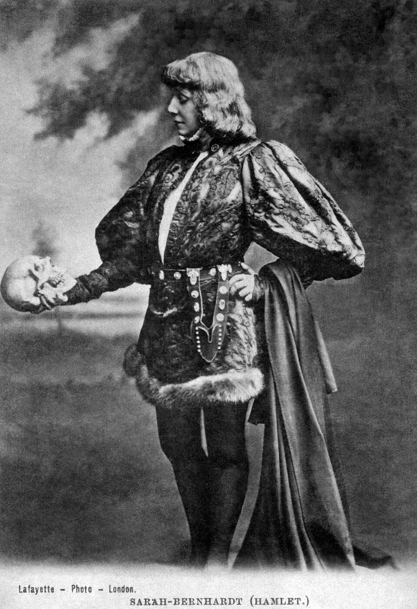
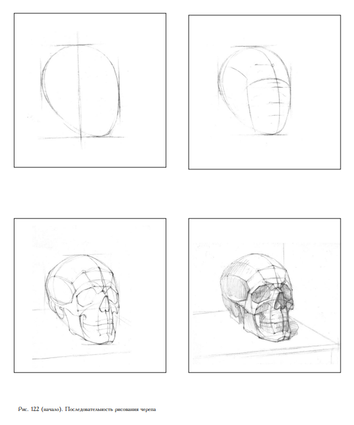
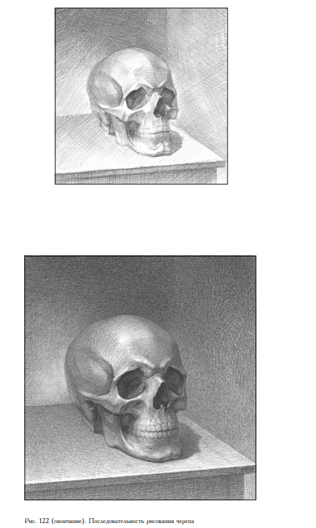
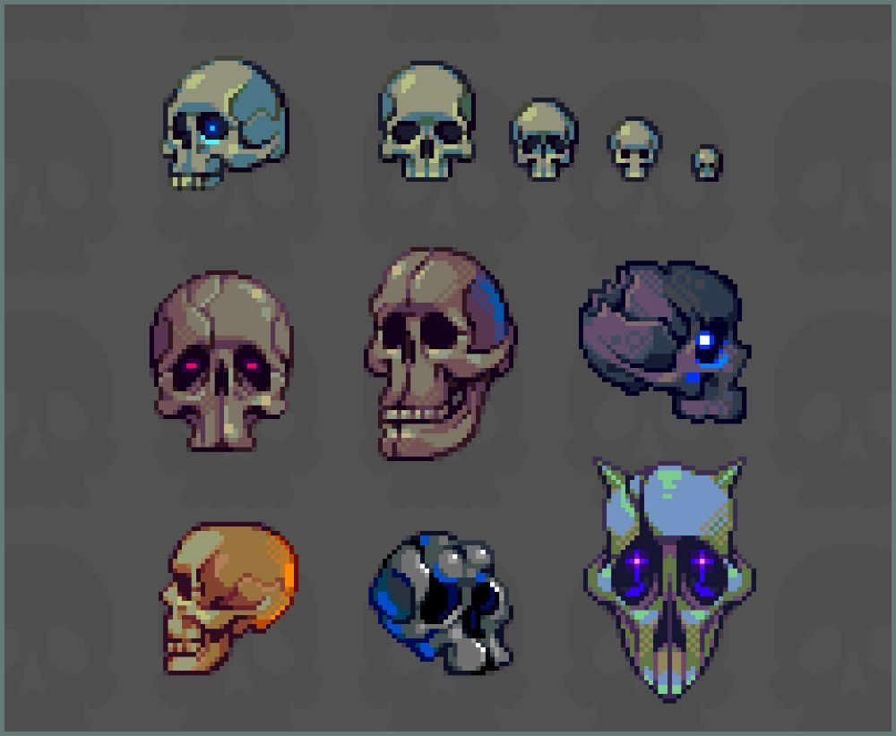
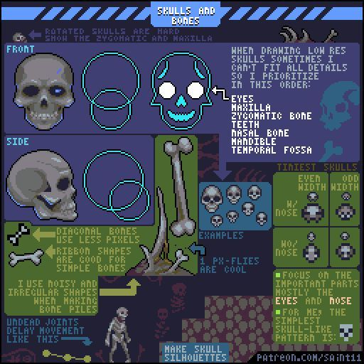
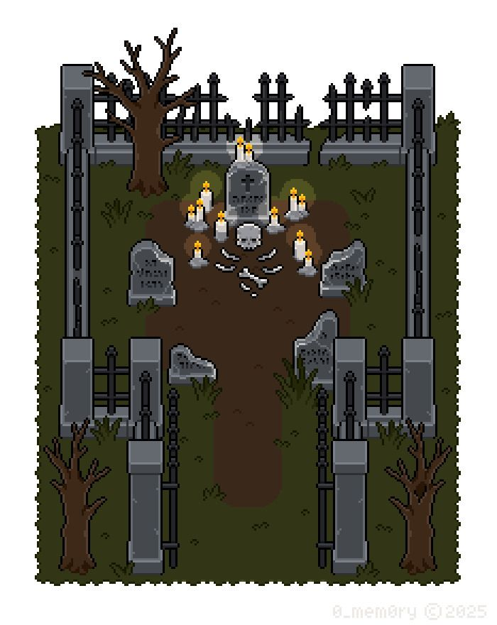
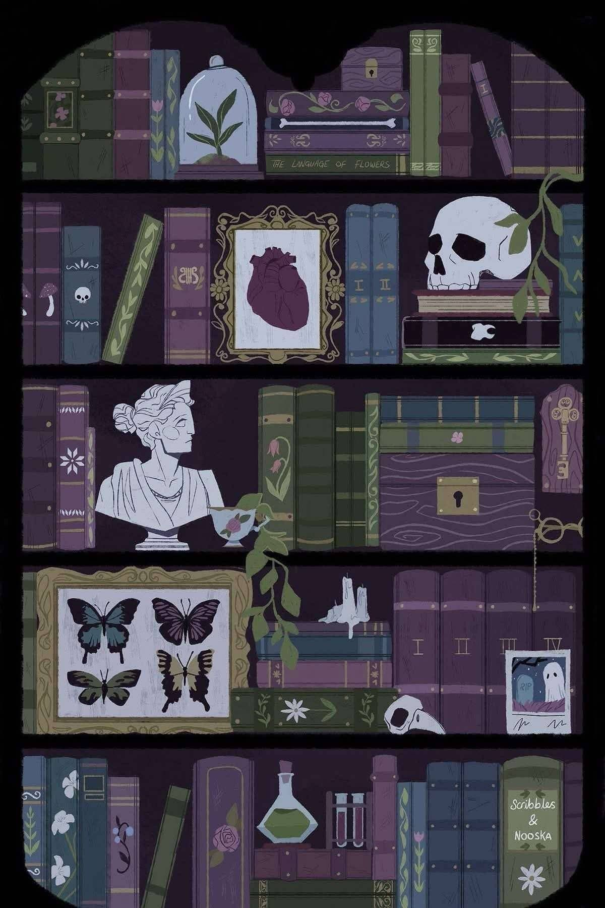

# Лабораторная работа №4

## Тема: Построение черепа и его интеграция в художественную композицию

### Цель работы

Цель данной лабораторной работы - развить навыки конструктивного рисунка, понимание формы и объёма, передачу света и тени, а также умение органично вписывать изученный объект в художественную композицию.

### Задание

На основе предложенного визуального гайда необходимо выполнить **рисунок черепа**, последовательно проходя основные этапы построения формы:

* определение общей формы;
* построение осей;
* разбиение на основные объёмы;
* уточнение анатомической структуры;
* проработка светотени;
* завершение аккуратного итогового изображения.

После этого нужно создать **вторую работу**, в которой этот череп будет **вписан в художественное окружение или композицию**.

Это может быть:

* авторская композиция, созданная самостоятельно;
* адаптация или переработка уже существующей картины.

Допускается использование не собственной картины, однако **предпочтение отдаётся авторской композиции**, так как это лучше показывает творческий подход, чувство среды и умение включать объект в целостное художественное решение.

### Технические требования

Если работа выполняется в одной из цифровых техник:

* raster;
* vector;
* pixel art.

Для **любой** выбранной техники **разбивка на слои является обязательной**.

#### Обязательное требование по слоям:

* в **raster** все основные этапы и элементы должны быть разнесены по отдельным слоям;
* в **vector** объекты должны быть логически организованы по отдельным слоям или группам;
* в **pixel art** основные элементы также должны быть разделены по слоям.

Слои должны быть названы понятно и аккуратно. Например:

* sketch;
* line;
* base;
* shadows;
* lights;
* background;
* details.

### Что нужно выполнить

В рамках лабораторной работы студент должен создать **две итоговые работы**:

1. **Чистовое изображение черепа по гайду** - без окружения, с акцентом на построение формы, объём и светотень.
2. **Композицию с черепом** - тот же объект, но уже встроенный в окружение, сцену или картину.

### Итог сдачи

Студент должен прислать:

* **изображение черепа, выполненного по гайду**;
* **финальную работу с черепом в окружении или в составе композиции**;
* **слои по отдельности**;
* **две финальные картинки с понятными названиями файлов**.

#### Важно:

Файлы должны быть названы так, чтобы было понятно, где какая версия. Например:

* `Surname_Name_skull_study`
* `Surname_Name_skull_composition`

Если слои экспортируются отдельно, их названия также должны быть понятными и соответствовать их содержанию.

### Рекомендуемые этапы работы

1. Изучить последовательность построения черепа по гайду.
2. Выполнить начальный конструктивный набросок.
3. Уточнить пропорции и основные плоскости.
4. Проработать форму и анатомические особенности.
5. Добавить светотень и довести череп до законченного состояния.
6. Создать композицию, в которую будет встроен череп.
7. Подготовить отдельные слои и финальные изображения к сдаче.

<!--### Критерии оценивания

При проверке будут учитываться:

* правильность построения формы;
* понимание объёма и конструкции;
* аккуратность проработки светотени;
* качество интеграции черепа в композицию;
* целостность художественного решения;
* грамотная организация слоёв;
* аккуратность оформления файлов и итоговой сдачи.-->
