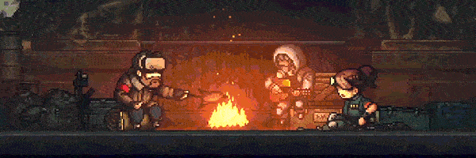
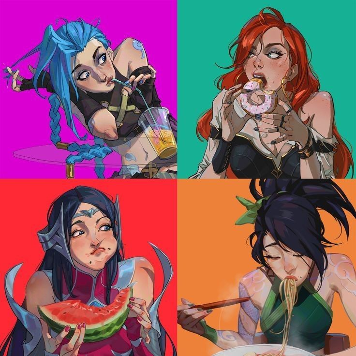
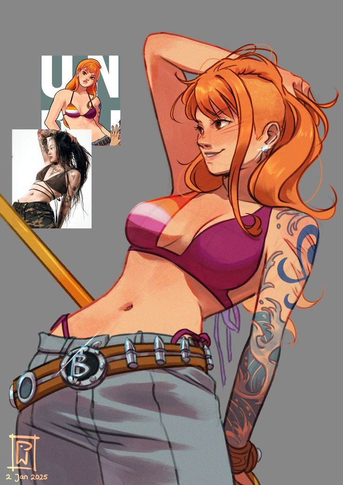

# Лабораторная работа 5: создание персонажа и анимации

## Задание: создание персонажа и анимации

### Цель задания
Создать оригинального персонажа (человека, животное, существо, объект и т.п.), продумать его характер и позу, а затем выполнить для него набор статичных поз и короткую анимацию с элементами актёрской игры.

### Требования к персонажу
- Персонаж может быть любым: реалистичным, стилизованным, карикатурным, фантастическим, техногенным и т.д.  
- Важно, чтобы у персонажа читались:
  - силуэт;
  - пропорции;
  - характер (через позу, мимику, детали костюма/формы).

### Статичные позы (3 изображения)
Нарисуйте или соберите персонажа в одной из трёх разных статичных поз, как например:
1. Нейтральная поза (аналог T-pose / A-pose или просто спокойная стойка лицом к зрителю).  
2. Поза, отражающая характер (например, геройская стойка, испуганная поза, расслабленная поза и т.п.).  
3. Поза действия (удар, прыжок, рывок, жест, подготовка к движению и т.д.).  

Требования:
- Формат: отдельные изображения или один файл с тремя позами, подписанными.

### Анимация персонажа
Создайте короткую цикличную анимацию с участием вашего персонажа.

- Тип анимации: «idle» или повседневное действие, но **сложнее, чем просто дыхание или лёгкое покачивание**.  
- Примеры допустимых вариантов:
  - персонаж закуривает и делает затяжку;  
  - персонаж рассказывает анекдот и смеётся;    
  - персонаж поправляет одежду/очки/головной убор, зевает, тянется, машет рукой и т.д.  

Требования к анимации:
- Продолжительность: 6–24 кадра, если вы работаете покадрово, или 1–3 секунды, если вы используете скелетную анимацию.  
- Анимация должна содержать несколько фаз движения, а не один повторяющийся кадр с лёгким смещением.  
- Должно быть понятно, что персонаж «что‑то делает», а не просто дышит или чуть‑чуть покачивается.

### Формат сдачи
- Анимация: видео (MP4), GIF или спрайт-лист (sprite sheet) — по требованиям вашего курса/движка.  
- Краткое текстовое описание (2–3 предложения):
  - кто ваш персонаж;
  - что за анимация выполнена и почему выбрано именно это действие.

### Критерии оценки
- Оригинальность и цельность дизайна персонажа.  
- Читаемость силуэта и поз (персонаж понятен даже по контуру).  
- Выразительность и понятность анимации (ясно, что персонаж делает).  
- Техническое качество: аккуратность рисунка/сборки, чистота анимации, отсутствие «ломающихся» частей.

### Рефы

https://pin.it/2RViIkIEf
https://pin.it/2RFJDPuEs
https://pin.it/6fLMRLE4x

Для самых продвинутых и желающих бросить себе вызов — референсы с анимацией:

https://pin.it/52RRPWDTV

