# Вводная лекция: «Цифровое искусство»
## Что такое цифровое искусство?

Цифровое искусство (digital art) - это любой вид творчества, в котором цифровые технологии выступают неотъемлемой частью художественного процесса. Проще говоря, художник использует компьютер или другие цифровые устройства как инструмент для создания произведений. Результат при этом существует в цифровой форме - например, изображение в файле, анимация, 3D-модель или интерактивная инсталляция на экране. Цифровое искусство является частью более широкой области медиаискусства, то есть современного искусства, использующего новые медиа-технологии (видео, звук, компьютеры, интерактивные устройства и т.д.) для самовыражения. Это означает, что формы цифрового искусства могут быть самыми разными: от статичных картин, созданных на графическом планшете, до сложных интерактивных объектов или даже визуальных эффектов в кино.

Важно подчеркнуть: цифровое искусство находится на пересечении искусства и технологий. Этим оно отличается от традиционной живописи или скульптуры - здесь в качестве «кисти и холста» выступают *программы, код и электронные устройства.* При этом совсем не обязательно быть художником в классическом понимании, чтобы заниматься digital art. Многие известные цифровые художники пришли из технических сфер. Исторически первые эксперименты в области компьютерного искусства делали вовсе не профессиональные живописцы, а инженеры и математики.
Цифровое искусство - демократичная сфера: каждый, кто имеет доступ к цифровым инструментам и желание творить, может попробовать себя в роли художника. Это одна из причин, почему наш курс открыт для студентов без художественной подготовки - умение академически рисовать не является обязательным. Если у вас есть интерес к визуальному мышлению и творческий настрой, цифровые инструменты помогут воплотить идеи, даже если вы раньше не держали кисть.

## Где применяется цифровое искусство?

Цифровое искусство зародилось как авангардное направление, но сегодня его проявления можно встретить повсюду — в кино, на телевидении, в рекламе, видеоиграх и даже на городских улицах (на цифровых экранах и медиафасадах). Рассмотрим несколько ключевых областей, где используются технологии digital art:

**Видеоигры:** 

Индустрия игр полностью опирается на цифровое искусство. Художники придумывают и рисуют персонажей, окружение, предметы, создают концепт-арты миров, которые затем воплощаются в игре. Также сюда относится 3D-моделирование героев и уровней, создание текстур, анимации и визуальных эффектов в играх. Практически всё, что вы видите на экране в компьютерной игре - результат работы digital-художников. 
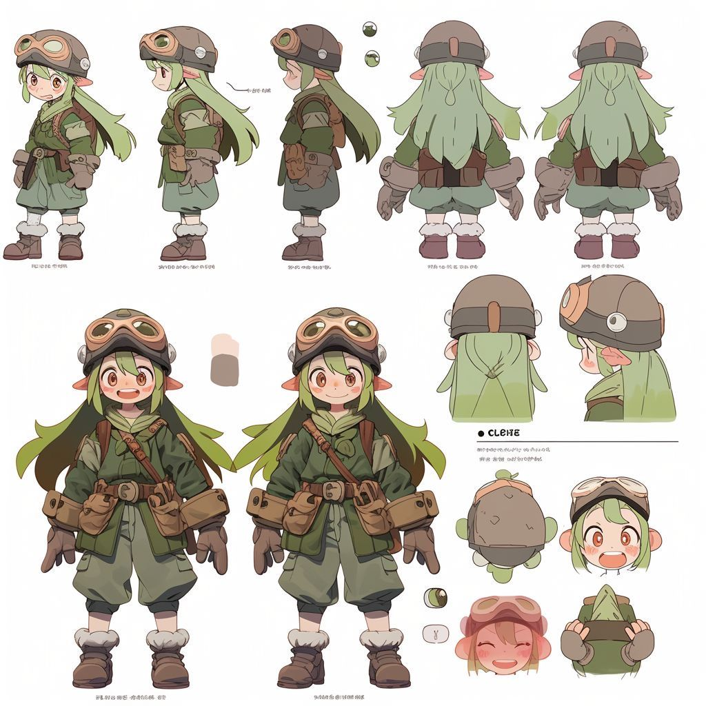

**Кино и анимация:** Современное кино широко использует компьютерную графику (CG). Специальные эффекты, трёхмерная анимация, виртуальные декорации - все это создаётся художниками на компьютерах. Полностью 3D-анимационные фильмы (например, мультфильмы Pixar) - тоже продукт цифрового искусства. Художники работают над каждым кадром: моделируют персонажей, прорисовывают фон, накладывают эффекты. Без digital art сейчас не обходится ни один крупный фантастический или приключенческий фильм. 
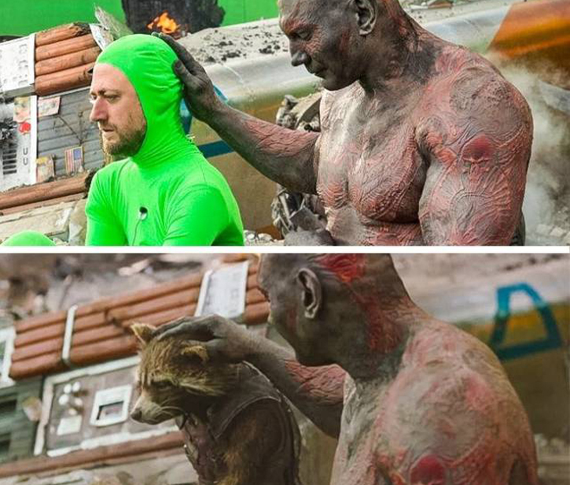

**Веб-дизайн и UX/UI:** В сфере дизайна интерфейсов сайтов и приложений цифровое искусство проявляется через создание привлекательного и удобного визуального оформления. UX/UI-дизайнеры используя графические редакторы разрабатывают макеты сайтов, иконки, иллюстрации для веб-страниц, анимации в приложениях. Здесь digital art служит практическим целям - сделать цифровой продукт эстетичным и понятным. Например, отрисовка элементов интерфейса, подбор цветовой палитры, дизайн персонажей или иллюстраций для обучающих экранов - все это задачи цифровых художников в сфере дизайна.
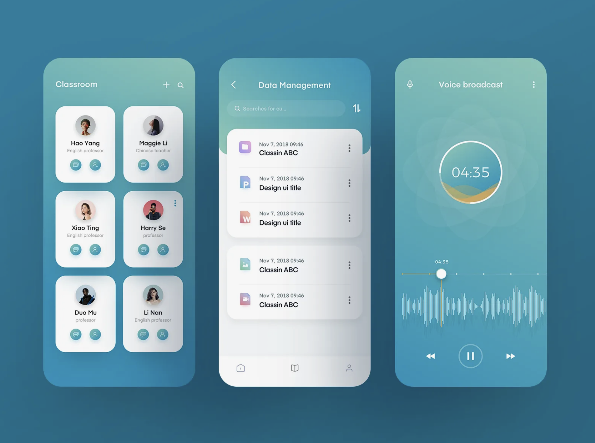

**Наука и образование:** В научной сфере цифровое искусство используется для визуализации данных и создания наглядных моделей. Научные иллюстраторы с помощью цифровых инструментов рисуют схемы, графики, модели молекул или архитектурные чертежи. Также создаются 3D-визуализации - например, реконструкция динозавра по костям или симуляция работы сердца - которые одновременно являются научными и художественными работами. Такие визуализации помогают лучше понять сложные концепции и делают науку более доступной. В образовании и медиа часто используют инфографику - красиво оформленные диаграммы и иллюстрации, созданные цифровыми художниками, чтобы объяснить факты и цифры. 
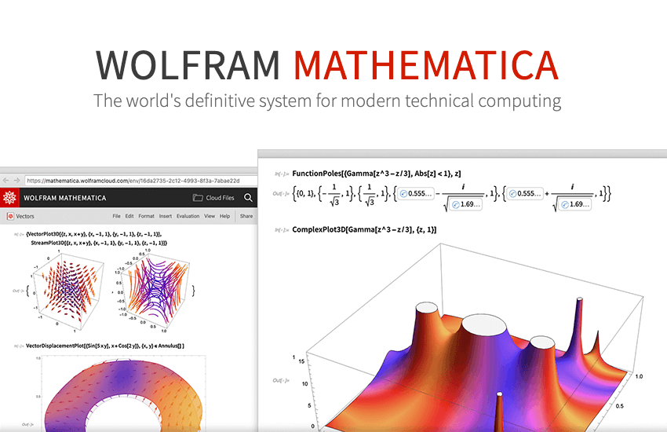

**Медиа и реклама:** Цифровые художники востребованы в рекламной индустрии и медиа. Создание плакатов, баннеров, цифровых иллюстраций для статей, обложек журналов - всё это работа в графических редакторах. В рекламе широко применяется фотомонтаж и цифровая ретушь - когда из фотографий и нарисованных элементов компонуется эффектное изображение. На телевидении и в интернете digital art используется для анимированной графики - заставок, титров, рекламных роликов. Также цифровое искусство проявляется в городском пространстве: медиа-арт инсталляции на зданиях, интерактивные экраны, световые шоу - это новые формы искусства, ставшие возможными благодаря компьютерной графике. Современный медиа-художник может создавать проекты, которые видит массовая аудитория, даже не подозревая, что это произведения искусства 
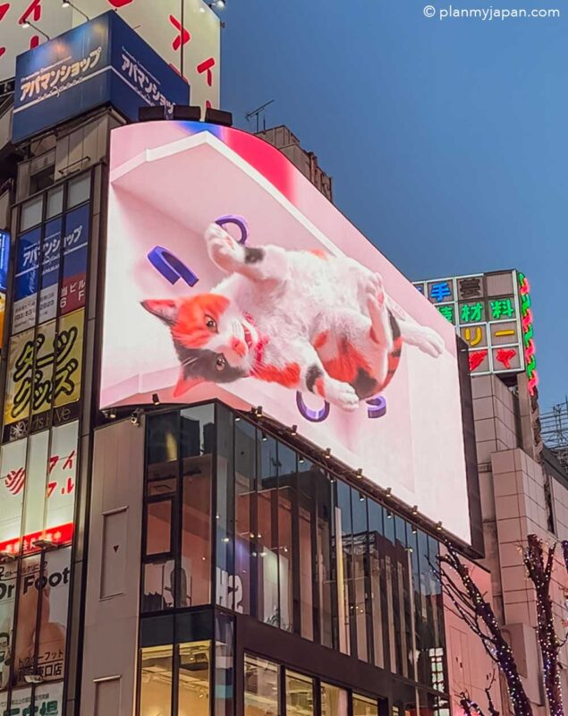

Как видно, диапазон применения цифрового искусства **чрезвычайно широк**. От развлечений (игры, кино) до просветительских проектов (научные визуализации) - везде нужны люди, умеющие сочетать творчество и технологии. Мы с вами ежедневно сталкиваемся с плодами цифрового арта: играя в игры, смотря фильмы, пользуясь приложениями или просматривая рекламу. Освоив основы digital art, вы сможете понимать, как создаются эти визуальные миры, а в перспективе - участвовать в их создании сами.

## Инструменты цифрового искусства (в рамках курса)

Существует множество программ и платформ для создания цифровых произведений. В нашем курсе мы будем знакомиться с разными категориями графических инструментов. Каждый студент сможет выбрать те инструменты, которые ему ближе - мы не ограничиваемся одной программой. Ниже перечислены основные виды программ, доступные вам, и примеры таких инструментов.

**Растровые графические редакторы** - программы для рисования и обработки изображений на основе пиксельной сетки. Растровое изображение состоит из отдельных точек (пикселей), как мозаика. Чем выше разрешение, тем более детальным и гладким выглядит рисунок, но при сильном увеличении появляются видимые квадратики. В растровых редакторах удобно делать цифровую живопись, схожую с традиционной: можно смешивать цвета как краски, прорисовывать тени, выполнять тонкую детализацию. Также они подходят для редактирования фотографий, коллажей, создания текстур. 

**Примеры:** свободно распространяемая программа **Krita** и промышленный стандарт индустрии - **Adobe Photoshop**. Krita позволяет рисовать от руки с помощью графического планшета, имеет множество кистей и полностью бесплатна. Photoshop - мощный коммерческий редактор, широко используемый в дизайне и фотоманипуляциях. 

**Векторные графические редакторы** - программы, где изображения создаются не пикселями, а при помощи математических кривых и фигур. Векторная графика основана на формулах: линии, заливки и контуры описываются уравнениями (сплайнами, кривыми Безье). За счёт этого векторные изображения масштабируются без потери качества - их можно увеличивать до любого размера, края останутся четкими и гладкими, в отличие от растра, который при увеличении пикселизуется. Векторные инструменты идеальны для создания логотипов, иконок, схематичных иллюстраций, чертежей - всего, где важна четкость линий и возможность легко править элементы. 

**Примеры:** бесплатный **Inkscape** и популярный профессиональный пакет **Adobe Illustrator**. Эти программы позволяют рисовать формы, кривые, работать с текстом, раскрашивать области однородными цветами или градиентами. Векторные редакторы обычно предпочитают дизайнеры и иллюстраторы, создающие графику для печати или веба, где требуется гибкость масштабирования.

**Инструменты для пиксель-арта** - специализированные редакторы для создания пиксельных изображений низкого разрешения. **Пиксель-арт** - это стиль цифрового рисунка, намеренно ограниченный маленьким размером, чтобы каждый пиксель был видимым элементом картинки. Такой стиль был характерен для ретро-игр 1980-90-х годов и ныне переживает возрождение как отдельное направление творчества. Пиксель-арт ценится за свою стилизованную, «квадратную» эстетику и требует внимательного ручного труда - художник буквально раскрашивает изображение по пикселям. 

Для работы с пиксель-артом существуют программы как **Aseprite** (очень популярная среди пиксель-художников благодаря удобным инструментам анимации и палитрам) или свободные аналоги вроде **GraphicsGale**, **PiskelApp** и даже простейший **Microsoft Paint**. Конечно, и в Photoshop можно рисовать пиксельно, отключив сглаживание кисти, но специальные инструменты упрощают процесс (например, отображают сетку пикселей, палитры ограниченных цветов и пр.). Пиксель-арт может пригодиться вам, если вы захотите создать спрайты для игр, ретро-иллюстрацию или просто увлекаетесь эстетикой старых игр.

**3D-графика и анимация** - инструменты для создания трёхмерных моделей и сцен. 3D-графика позволяет создавать объекты в виртуальном трёхмерном пространстве, задавая их форму (модель), текстуру поверхности, материалы, освещение и т.д. Результат можно визуализировать (рендерить) в виде изображения или анимации, а можно использовать в играх, VR/AR-приложениях. 

В нашем курсе основным инструментом для 3D будет **Blender** - бесплатная и очень мощная программа с открытым кодом. Blender умеет практически всё: моделирование персонажей или архитектуры, скульптурирование (цифровая лепка), настройку материалов, рендеринг изображений, а также создание анимации и даже простейшие эффекты. Несмотря на то, что интерфейс Blender'а сложнее, чем у 2D-редакторов, его возможности огромны - а главное, он доступен каждому студенту без лицензий. В индустрии также используются коммерческие пакеты (**3ds Max, Maya, Cinema 4D и др.**), но освоив базовые принципы 3D-моделирования на Blender, вы получите фундаментальные навыки, применимые в любой программе. 3D-инструменты особенно понравятся тем, кто мыслит пространственно и любит создавать именно объекты и сцены, а не плоские изображения. Даже если вы не умеете рисовать от руки, вы можете «лепить» цифровые скульптуры и строить миры из примитивов в трехмерном пространстве.

**Генеративная графика (программирование)** - особое направление цифрового искусства, где изображения или анимации создаются при помощи кода и алгоритмов. Вместо того чтобы рисовать каждый элемент вручную, художник-программист задаёт правила, пишет программу, которая сама генерирует визуальный результат. Например, это могут быть фрактальные узоры, процедурные орнаменты, случайно создающиеся ландшафты или интерактивные графические эксперименты. Генеративное искусство объединяет навыки программирования и эстетическое чувство: вы продумываете алгоритм, а компьютер рисует за вас (подчиняясь вашим алгоритмическим замыслам). 

Инструменты для генеративной графики разнообразны - от специальных библиотек (например, **Processing**, созданная специально для художников и дизайнеров, или её аналог **p5.js** для веб-браузера) до обычных языков программирования (Python с библиотеками вроде **Turtle**, или JavaScript с использованием **Canvas/SVG**). Даже в среде разработки игр можно генерировать арт - например, с помощью **шейдеров или скриптов**. Генеративный подход особенно привлекателен тем, у кого склонность к логике и экспериментам: он снимает ограничение «не умею рисовать рукой» - вместо этого вы «рисуете разумом и кодом». 

**Minecraft как творческая платформа** - возможно, самый необычный пункт в списке. Мы привыкли думать о Minecraft как об игре, но в контексте цифрового искусства его можно рассматривать как цифровой конструктор и среду для творчества. В Minecraft вы строите мир из блоков - по сути, создаете объемные пиксельные картины и архитектурные объекты. Многие энтузиасты реализуют в Minecraft масштабные художественные проекты: от воссоздания реальных городов и памятников до создания фантастических ландшафтов, скульптур и даже интерактивных механизмов с помощью редстоун-механики. Почему мы включаем Minecraft в инструментарий курса? Потому что он дает еще один путь проявить визуальное мышление, особенно тем, кто любит играть и экспериментировать. Построив что-то своими руками в виртуальном мире, вы осваиваете понятия формы, объема, композиции - все это элементы художественного мышления. Кроме того, совместные творческие проекты в Minecraft могут стать веселым групповым опытом. Поэтому **вы можете**, например, выполнить творческое задание курса **в виде постройки в Minecraft** - это будет считаться полноценной работой в жанре цифрового искусства!

**Обратите внимание, что список инструментов не ограничивается перечисленным.** Существует еще множество программ и подходов: от 2D-анимации (Synfig, Adobe After Effects) до цифровой скульптуры (ZBrush) или фотограмметрии и VR-рисования. Наш курс дает свободу выбора - вы можете пробовать различные средства. Важнее принципиально понимать, что разные инструменты подходят для разных задач и стилей: где-то нужны пиксели, а где-то кривые; кому-то ближе код, а кому-то - игровой движок или виртуальные блоки. Мы поддерживаем любой выбор, который поможет вам раскрыть свой творческий потенциал.

## Свобода выбора инструментов и отказ от шаблонов

Одной из ключевых идей нашего курса является свобода творческого выражения. Это означает, что вы сами решаете, какими инструментами и в каком стиле выполнять задания, исходя из своих интересов и сильных сторон. Нет единственно правильной программы или техники - достичь впечатляющего результата можно разными путями. Кто-то предпочтет рисовать от руки в Krita, кто-то моделировать в 3D, а кто-то - генерировать изображения кодом или складывать их из блоков. Все эти подходы приветствуются. В рамках лабораторных работ мы можем давать общую тему или задачу, но вы вправе выбрать тот инструмент, который считаете наиболее подходящим для решения задачи или который хотите освоить. Более того, нет ничего страшного в том, чтобы комбинировать инструменты: например, нарисовать фон в Photoshop, поверх вставить 3D-объект из Blender и доработать все это фильтрами. Цифровое искусство тем и замечательно, что предоставляет неограниченные возможности для экспериментов.

Свобода творчества также предполагает отказ от жёстких шаблонов. Мы не будем заставлять всех студентов делать один и тот же типовой рисунок по шагам. Наоборот, даже выполнив одинаковое задание, каждый сможет представить **уникальный результат**, отражающий индивидуальный взгляд. В традиционном обучении искусству новичков иногда пугает, что их работы «не похожи на образец». В digital art мы хотим сломать этот страх: образца как такового нет, есть лишь общие критерии и цели задания, а путь их достижения - ваш собственный. Например, тема задания может быть «создать фантастический пейзаж». Один студент нарисует его акварельными мазками в растровом редакторе, другой - построит в Minecraft плавающий остров, третий - напишет код, который сгенерирует фрактальные горы. И все эти решения будут ценны, если в них вложена творческая мысль.

Важно понимать, что в цифровой среде вы защищены от многих неудач, которые бывают в традиционном искусстве. **Ошибка всегда поправима:** достаточно нажать Ctrl+Z (отменить действие) или удалить неудачный слой и попробовать заново. Такое «право на ошибку» очень освобождает творчески - вы смелее пробуете новое, зная, что можете откатиться. Пользуйтесь этим преимуществом цифровых инструментов! Также помните, что цифровое творчество часто нелинейно: **вы можете бесконечно редактировать, улучшать работу,** пробовать разные варианты в копиях файла. Поэтому не бойтесь экспериментов, отходите от шаблонов. 

В итоге цель этого курса - помочь вам найти свой собственный стиль и удобные инструменты, а не загнать всех в единые рамки. Будьте готовы учиться друг у друга: у каждого из вас может быть разный опыт - кто-то программирует, кто-то увлекается играми, кто-то фотографирует - объединяя эти навыки, вы обогатите свое понимание цифрового искусства. Мы, со своей стороны, будем рады консультациям по любому инструменту, который вы решите освоить в рамках заданий. Главное - проявляйте инициативу и креативность.

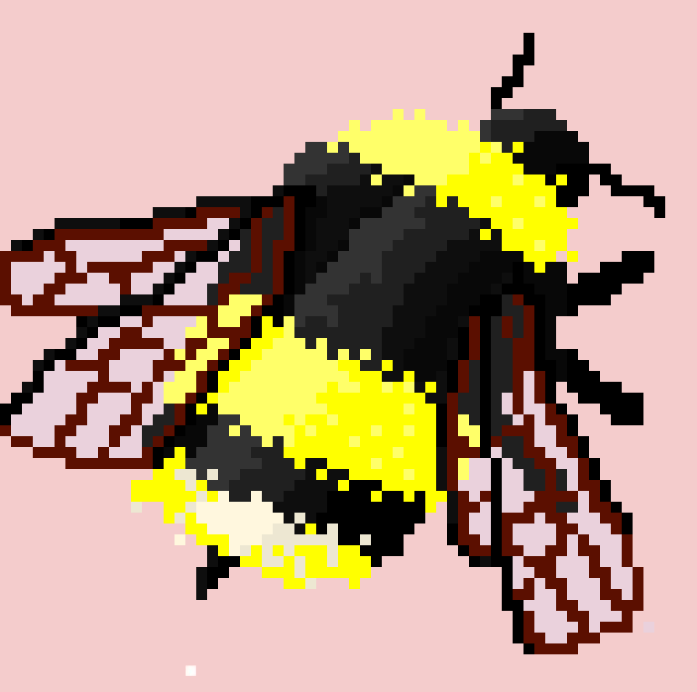
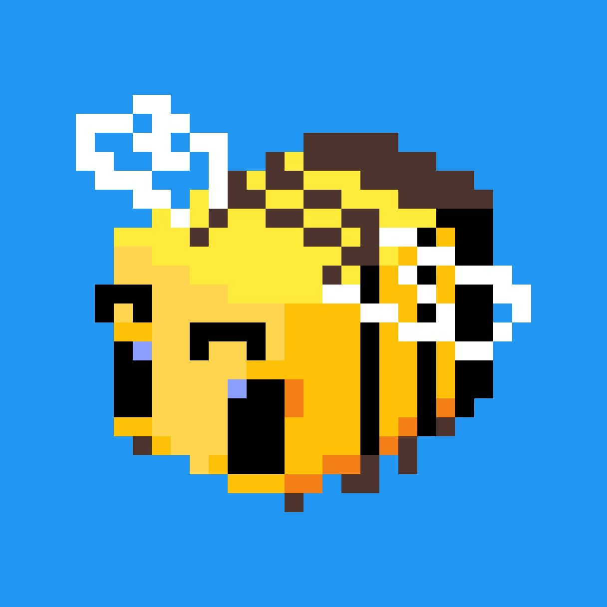

## Формат работ и система оценивания

Теперь обсудим, какая работа предстоит в течение семестра и как она будет оцениваться. Курс сочетает практические задания (лабораторные работы), индивидуальный творческий проект и аттестации, а завершается экзаменом. Оценивание построено таким образом, чтобы поощрять равномерную работу весь семестр и финальное обобщение знаний на экзамене. Формула расчета итоговой оценки следующая:

Итоговый балл = ((средний балл за лабораторные работы + балл за индивидуальную работу) + балл за аттестацию 1 + балл за аттестацию 2) / 3 × 0.6 + балл за экзамен × 0.4.

Несколько практических моментов:

Лабораторные работы обычно выполняются на занятиях или в виде небольших домашних заданий каждую неделю. Старайтесь делать их вовремя - во-первых, это тренирует ваши навыки последовательно, во-вторых, хороший средний балл за лабораторные заметно повысит вашу итоговую оценку (ведь он войдет в те 60%).

Индивидуальный проект - шанс проявить себя в полной мере. Позже я выдам вам темы на выбор. Это может быть ваша авторская работа в любом жанре цифрового искусства, объединяющая те умения, что вы получили. Отнеситесь к проекту серьезно: его результат также войдет в средний балл. Рекомендую не откладывать его на последний момент, а продумать идею заранее и понемногу ее реализовывать по мере освоения новых инструментов.

Аттестации - обязательные контрольные точки. Они помогут вам понять свой прогресс. Первая аттестация (примерно середина семестра) может быть ориентирована на базовые понятия и навыки (например, проверка знания терминов - что такое растр и вектор, и/или демонстрация небольших работ). Вторая аттестация - ближе к концу курса - оценит готовность к заключительному проекту и экзамену (возможно, нужно будет представить черновик проекта или пройти опрос по более продвинутым темам). Обе аттестации важны: даже если у вас не всё получится идеально, они покажут, над чем подтянуть знания к экзамену.

Экзамен - финальное испытание. Формат экзамена будет объявлен дополнительно (это может быть тест или практическое задание). Экзамен покрывает все основные темы курса, но помните: он формирует лишь 40% оценки. Если вы добросовестно работали весь семестр, набрали высокий средний балл, то экзамен станет возможностью закрепить результат или улучшить его. И наоборот, если семестровая работа была слабой, даже отлично сданный экзамен даст только 40% успеха. Поэтому нацеливаем вас трудиться постепенно.

Наконец, о формате представления работ. Лабораторные задания вы будете сдавать, в виде файлов (изображений, скриншотов, проектов) через систему электронного обучения . Индивидуальный проект может включать презентацию результатов показ вашей работы на последнем занятии, рассказ о замысле и инструментах. Мы также поощряем портфолио - собирайте свои цифровые работы в течение курса, чтобы к концу у вас была подборка, которую можно показать. Это не только для оценки, но и для вас самих - увидеть свой прогресс. Одной из частей курса будет также рисование 1 объекта полноценно в начале и в конце семестра - это позволит вам наглядно увидеть, как изменились ваши навыки и стиль.

## История цифрового искусства 

На первый взгляд цифровое искусство - очень современное явление, напрямую связанное с развитием компьютеров и программ. Однако его история уходит корнями глубже, чем появление персональных компьютеров. Давайте совершим краткий экскурс в прошлое, чтобы понять, как цифровое искусство развивалось и пришло к тем формам, которые мы видим сейчас.

*1950-е - зарождение идей.* Одним из первых художников, работавших с электронным изображением, считается американец Бенджамин Фрэнсис Лапоски. В 1950 году, используя осциллограф (устройство с электронно-лучевой трубкой), он создавал абстрактные световые узоры и фигуры, манипулируя сигналами - по сути, «рисовал» электрическим лучом. Эти завораживающие изображения Лапоски фотографировал со экрана осциллографа и называл «электрическими композициями». Так появилось одно из первых направлений цифрового (электронного) абстрактного искусства. Примерно в те же годы в Европе художник и ученый Герберт Франке также экспериментировал с осциллографом, подключая к нему простейшие вычислительные машины, чтобы получать сложные геометрические паттерны. Эти пионерские работы были больше научным любопытством, чем искусством в глазах современников, но задали тон: техника стала инструментом творчества.

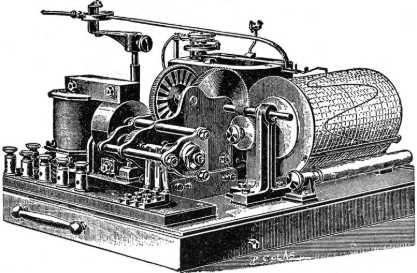
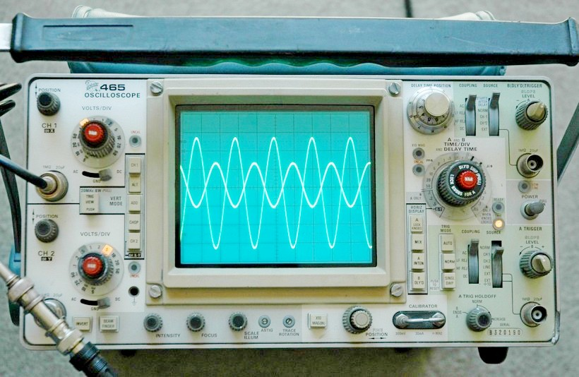

*1960-е - первые компьютерные художники.* В 1960-х появились настоящие примеры искусства, полностью созданного компьютером. Большинство компьютеров того времени были огромными и находились в университетах или корпорациях, поэтому и первые цифровые художники часто были инженерами или учеными, имевшими к ним доступ. В 1965 году прошли первые выставки компьютерного искусства: в Германии (Штутгарт) и в США (Нью-Йорк) почти одновременно были показаны абстрактные графические изображения, сгенерированные компьютерами. На этих выставках работы представили такие пионеры, как Георг Нис (немецкий математик, программировавший генеративные рисунки) и А. Майкл Нолл (инженер из Bell Labs, создававший компьютерные картины в стиле Мондриана). Появился и термин computer art - компьютерное искусство, хотя поначалу оно воспринималось скорее как технические эксперименты.

К концу 60-х энтузиасты начали объединяться: в 1967 году в Нью-Йорке основана организация E.A.T. (Experiments in Art and Technology) - *«Эксперименты в искусстве и технологиях»*, целью которой было сблизить художников и инженеров для совместного творчества. Это дало толчок множеству коллабораций. В 1968 прошла знаковая выставка Cybernetic Serendipity в Лондоне, показавшая широкой публике произведения, созданные с помощью машин и алгоритмов - для многих зрителей это стало первым знакомством с компьютерным искусством. Так цифровое искусство постепенно выходило из научных лабораторий в арт-пространство.

*1970-е - развитие технологий и искусственный интеллект.* По мере миниатюризации компьютеров и роста их мощности художников, работающих с ними, становилось больше. В начале 1970-х Харолд Коэн, художник из Калифорнии, создал программную систему AARON - одну из первых попыток научить компьютер рисовать автономно. AARON генерировал рисунки (сначала абстрактные, потом всё более узнаваемые формы) без непосредственного вмешательства человека. Это, по сути, прообраз современного искусственного интеллекта в искусстве. В 1973 году Герберт Франке (о котором мы говорили) создал работу «Цифровой Эйнштейн» - серию преобразованных компьютерных фотографий, где портрет ученого постепенно превращался в абстракцию. 

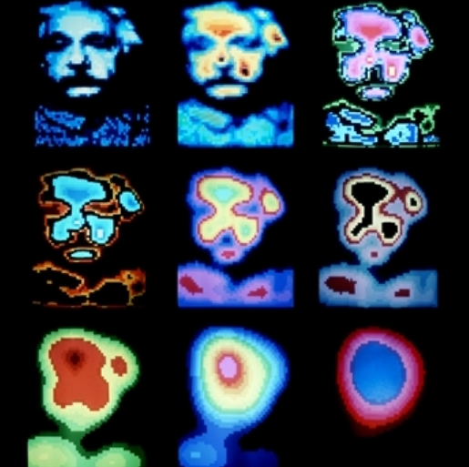

Появляются также первые эксперименты с компьютерной анимацией - хотя техника была примитивной, энтузиасты по кадрам строили движущиеся изображения. 1970-е - время, когда термин «компьютерная графика» входит в обиход, и всё больше выставок включают секции с работами, созданными алгоритмами или с помощью графических плоттеров (автоматических рисовальных машин).

*1980-е - персональные компьютеры и графические программы.* Настоящая революция произошла с появлением персональных компьютеров и доступных графических устройств. В 1980-е годы у художников в мастерской появляется ПК, а вместе с ним - первые программы для рисования. В 1984 году для компьютеров Apple вышла программа MacPaint - один из первых успешных графических редакторов с графическим интерфейсом, позволявший рисовать цифровой «кистью». В 1985 году произошел интересный случай: знаменитый художник-поп-артист Энди Уорхол воспользовался компьютером Commodore Amiga, чтобы создать цифровые картины (одна из известных работ - портрет певицы Дебби Харри, нарисованный в простом графическом редакторе). Таким образом, даже признанный мастер поп-арта вошел в ряды цифровых художников, экспериментируя с новой техникой. Эти события показали, что компьютер - это не только для ученых, но и для любого творческого человека.

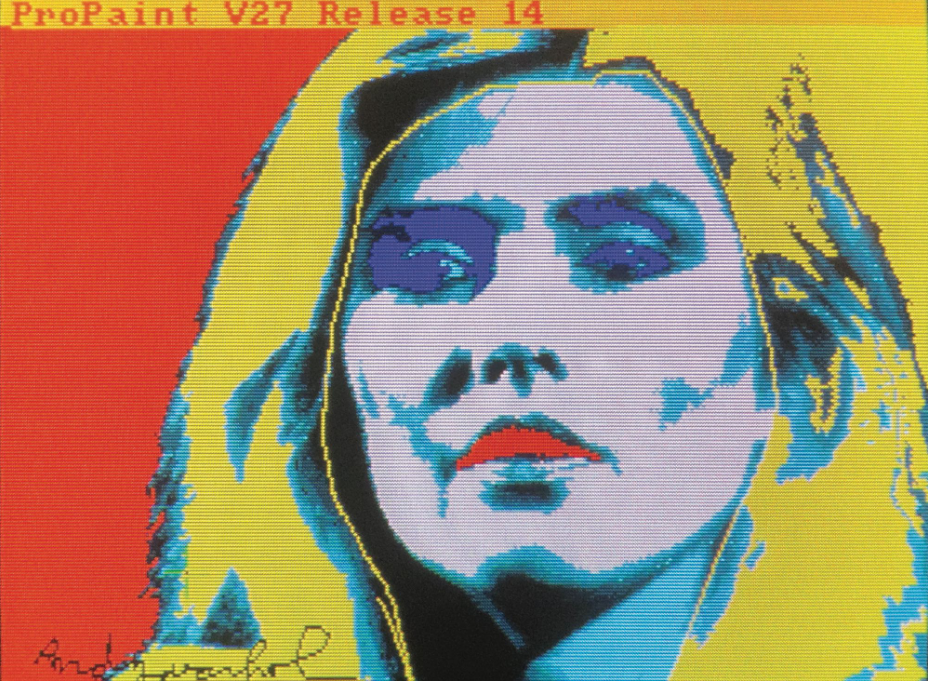

К концу 80-х появляются профессиональные графические программные продукты, заложившие основы современных инструментов. *Компания Adobe в 1987 году выпустила Illustrator (векторный редактор), а в 1990 году - первую версию Adobe Photoshop (растровый редактор для фото-редактирования и рисования)*. Photoshop 1.0 работал на Macintosh и уже имел базовые функции ретуши и рисования. Эти программы быстро стали популярными среди дизайнеров и художников, сделав цифровое рисование и фотомонтаж массовым явлением. Параллельно, 80-е - золотой век аркадных и 8-битных видеоигр, что дало миру уникальный жанр пиксель-арта. Миллионы людей ежедневно видели цифровую графику на экране игровых приставок - пусть и низкого разрешения, но это формировало визуальную культуру.

В сфере кино *в 1982 году вышел культовый фильм «Трон»*, где впервые в большом объеме использованы трехмерные компьютерные сцены - для своего времени это было прорывом. А в 1980-х же начинали работать студии вроде Pixar: в 1986 они выпустили короткометражку «Luxo Jr.» (*знаменитая прыгающая лампа*), а в 1995 году - «История игрушек», первый полнометражный мультфильм, полностью созданный на компьютере. Можете представить, какой скачок: от простых линий осциллографа за 40 лет дойти до полноцветных 3D-персонажей на большом экране!

1990-е - цифровое искусство становится повсеместным. В 90-е компьютеры стремительно проникают во все творческие отрасли. Графические редакторы совершенствуются: художники получают такие инструменты как слои, виртуальные кисти, фильтры. Появляются первые планшеты для рисования от Wacom, что дает возможность рисовать рукой прямо в компьютер. Цифровая фотография начинает развиваться, и вместе с ней - цифровая обработка фото становится обыденностью. В дизайне печатной продукции (журналы, реклама) повсеместно используют DTP (desktop publishing) - верстку и графику на компьютере. Видеоигры переходят к 3D-графике: если раньше художники рисовали спрайты, то теперь нужны 3D-моделлеры и аниматоры. Игровые движки типа Unreal Engine или Unity (зарождение в поздние 90-е - начало 2000-х) облегчают работу с графикой для разработчиков игр. Интернет тоже дает новый экран для цифровых художников: в конце 90-х появляются веб-страницы с экспериментальным интернет-артом, интерактивные проекты, Flash-анимации в сети.

2000-е - 2010-е - расцвет и новые направления. В 21-м веке digital art стал поистине мейнстримом. Почти каждый художник или дизайнер хотя бы частично перешел на цифровые инструменты. Формируется понятие концепт-арта - быстрых цифровых эскизов, которые художники делают для кино и игр на планшете (значительно ускоряя процесс по сравнению с традиционным рисованием). Графические планшеты становятся доступнее, а затем появляются и планшетные компьютеры (iPad и аналоги) с чувствительными к стилусу экранами - теперь художник может рисовать цифровую картину прямо как в блокноте. Визуальные эффекты в кино достигли высокого фотореализма: с помощью CGI можно создать на экране все, что угодно, и зритель порой не отличит, где реальность, а где компьютер. Анимация переживает подъем - 3D мультфильмы выходят ежегодно, а также развивается ниша 2D цифровой анимации, где все кадры рисуются на компьютере.

Появляются новые формы цифрового искусства: VR-арт (рисование и скульптура в виртуальной реальности, где художник надевает VR-гарнитуру и рисует в 3D-пространстве руками), AR-арт (дополненная реальность - наложение цифровых объектов на реальный мир, например, фильтры в Instagram, AR-инсталляции на улицах). Интерактивные инсталляции с датчиками движения, камеры и проекторы - еще одна форма digital art, популярная в музеях современного искусства. Кроме того, возникает феномен социальных сетей: многие цифровые художники демонстрируют свои работы онлайн (ArtStation, DeviantArt, Behance, Instagram и т.д.), создаются глобальные сообщества, где новички учатся у профессионалов через туториалы, стримы рисования и др. Цифровое искусство становится частью жизни даже тех, кто о нем специально не задумывается - достаточно посмотреть на красивые иллюстрации в новостных лентах, обложки альбомов, игровые ролики.

2020-е - новые рубежи: NFT и нейросети. Совсем недавно появились направления, о которых постоянно говорят в медиа. Во-первых, NFT-искусство: в 2021 году прогремел бум невзаимозаменяемых токенов, когда цифровые изображения стали продаваться с использованием блокчейн-технологий для подтверждения уникальности. По сути, это явление не про творчество как таковое, а про способ продажи и коллекционирования digital art, но оно привлекло внимание к сфере - цифровые художники внезапно получили возможность монетизировать свои JPG-файлы как уникальные арт-объекты. Во-вторых, стремительно развиваются генеративные искусственные интеллекты для создания изображений. В 2022-2023 годах такие модели, как DALL-E, Midjourney, Stable Diffusion, вышли на уровень, где по текстовому описанию генерируют вполне качественные картины. Теперь любой желающий, даже не умея рисовать, может получить картинку, написав запрос вроде «космический город в стиле Ван Гога». С одной стороны, это новый творческий инструмент для художников (можно использовать ИИ для вдохновения, быстрых набросков идей), с другой - вызов традиционному труду (много дискуссий, могут ли нейросети заменить художников). Мы не будем глубоко уходить в эту тему на вводной лекции, но важно осознавать: цифровое искусство - динамичная область, где технологии постоянно подкидывают новые возможности. Через 5-10 лет, возможно, появятся еще более удивительные средства самовыражения.

Чтобы вы окончательно поняли широту явления, приведем неполный список направлений, существующих сейчас в digital art. Современное цифровое искусство охватывает практически любые форматы визуального творчества: это и цифровая живопись, и цифровая фотография, коллаж, интернет-арт, интерактивные инсталляции, пиксель-арт, GIF-анимация, 3D-скульптура, видео-арт, и многое другое. Сюда же можно отнести и смежные области - например, компьютерная музыка (создание звуков и композиций электронными средствами) или цифровая литература (гипертекстовые истории, генерируемые тексты). Все это говорит о том, что границы искусства расширились: теперь не так важно, умеете ли вы маслом по холсту - важно, можете ли вы выразить идею средствами, которые дают вам современные технологии.

Для нас, как для начинающих цифровых художников, история digital art ценна тем, что показывает: не бывает «нехудожественных» инструментов. Лазерный осциллограф, печатный плоттер, примитивный 8-битный компьютер или нейросеть - все это может стать кистью в руках творца. В конечном счете, искусство определяется не инструментом, а замыслом художника. Надеемся, этот экскурс вдохновил вас и избавил от мысли «я не принадлежу к миру искусства». Как видите, цифровое искусство создавали люди самых разных профессий и навыков, и оно постоянно развивается. 

Теперь предлагаю рубрику **"открытый микрофон"** - если у вас есть вопросы по истории цифрового искусства, или вы хотите поделиться своими мыслями о том, какие направления вам кажутся наиболее интересными, пожалуйста, не стесняйтесь. Это может быть также поводом для обсуждения того, какие инструменты и стили вы хотели бы попробовать в рамках курса, поэтому жду ваших комментариев и вопросов!