# Стилизация и рисование персонажей

## Парадигма стилизации как система решений

### Что такое стилизация в рисунке персонажа

**Стилизация** — это управляемое преобразование реальности в визуальный язык проекта: часть признаков **убирается** (упрощение), часть **усиливается** (акцент), часть **перекодируется** в форму/линию/цвет ради характера и читаемости. Важно: стилизация работает лучше всего, когда опирается на понимание конструкции и «законов наблюдения» (объём, перспектива, свет, анатомические причины движений). 

Надёжная ментальная модель: **стилизация = компрессия информации + приоритеты**. Вы как дизайнер решаете:
- что зритель должен понять **первым** (силуэт, роль, темперамент);
- что должно считываться **вторым** (пол/возраст/физика/социальный статус);
- что можно оставить как «вкус» (детали, орнаменты, текстуры).

### Управляющие оси стиля

Чтобы стиль не «плавал», полезно описывать его через несколько осей (как через настройки):

**Цель (подтема: основы стилизации).** Задать повторяемые правила дизайна, чтобы персонажи выглядели «из одного мира» и одинаково хорошо читались в позах/ракурсах.   

**Основные понятия.**  
- *Язык форм (shape language)*: базовые геометрии и их психологическая ассоциация (условно: округлое — мягкость/; угловатое — жёсткость/опасность).   
- *Силуэт и отрицательные формы*: понятность контура без внутренних деталей.  
- *Иерархия*: где контраст, где акцент, где «тишина», чтобы глаз не терялся.   
- *Аппил (appeal)* как принцип: персонаж должен быть приятен для восприятия и выразителен даже в простых формах.   

**Советы по стилизации.**  
- Сначала фиксируйте **силуэт/большие массы**, затем переводите «анатомические истины» в простые блоки и только после — украшайте.   
- Делайте «таблицу допусков»: насколько можно растягивать/сжимать формы лица, рук, торса (особенно если ориентируетесь на анимацию).   

**Примеры референсов.** Как источник концептуальной дисциплины — учебники по дизайну персонажей и визуальному сторителлингу.   

_Схема связей между темами_

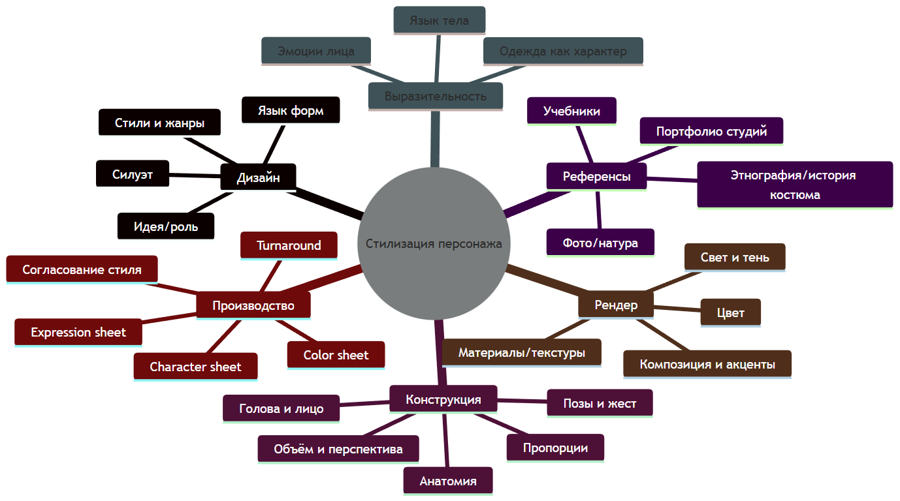

## Голова и лицо: объём, плоскости, пропорции и выразительность

### Конструкция головы: от «мягкого куба» к плоскостям

Ваш черновик вводит удачную педагогическую метафору **Soft Cube Theory («мягкий куб»)**: голова как компромисс между шаром (сфера) и кубом (плоскости), чтобы одновременно чувствовать объём и проще размечать оси/плоскости для черт лица. 

Эта идея хорошо стыкуется с классическими подходами «сфера + срезы + лицевая плоскость»: сначала задаётся общий объём черепа, затем — боковые плоскости, наклон/поворот, и только потом «крепятся» черты. 

**Цель (подтема: конструкция головы).** Научиться строить голову так, чтобы она:
- оставалась трёхмерной в любом ракурсе;
- сохраняла стиль при изменении пропорций;
- позволяла быстро переставлять черты лица без потери объёма.  

**Основные понятия.** Центр‑линия, линия уровня глаз, «лицевая плоскость», плоскости света/тени.   

**Советы по стилизации.**  
- В мульт‑стиле допустимо сильнее упрощать череп, но **обязательны** читаемые повороты (центр‑линия, боковая плоскость), иначе любая эмоция будет «плыть».   
- В «плоскостной» стилизации (planar style) усиливайте границы плоскостей — это проще связать со светом и характером.   

**Примеры референсов.** Планарные модели головы (в духе «Planes of the Head») как инструмент понимания света на форме.   

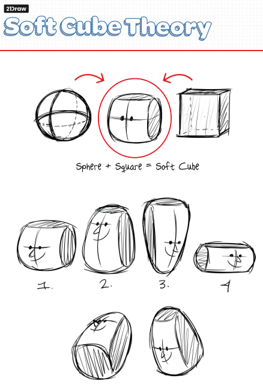
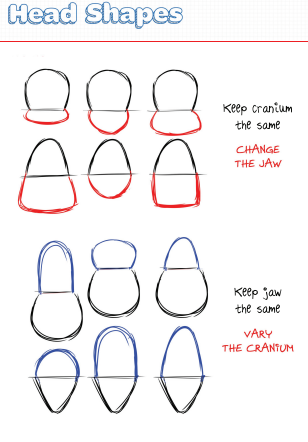


### Глаза: сфера, веки, зрачок и перспектива

Ключевая проблема стилизованных глаз: **зрачки и радужка не могут оставаться «фронтальными кружками», если глаз повернут** — они становятся эллипсами и смещаются по поверхности глазного яблока. 

Это напрямую следует из конструкции глаза: глазное яблоко — **сфера**, а радужка/роговица — формы, «сидящие» на сфере; круг на сфере в перспективе читается как эллипс при отведении взгляда.

**Цель (подтема: глаза).** Добиться того, чтобы взгляд работал как «двигатель характера»: направление внимания, эмоция, степень энергии/усталости, ощущение интеллекта или наивности.  

**Основные понятия.**  
Глаз как сфера; посадка в глазнице; плоскости века; эллипс радужки; соотношение «белка» и века; бровь как часть надбровной дуги.  

**Советы по стилизации.**  
- Выразительность чаще рождается не из увеличения глаз, а из **контраста, угла плоскостей века, ритма линий** и точного акцента в радужке/брови.   
- Для мульт‑стиля полезно думать «маской вокруг глаз» (eye mask) — единым пластом, внутри которого живут веки и брови; это помогает анимировать эмоции без распада формы.   

**Примеры референсов.** Анатомически ориентированные разборы строения глаза и его упрощения в базовые формы.   

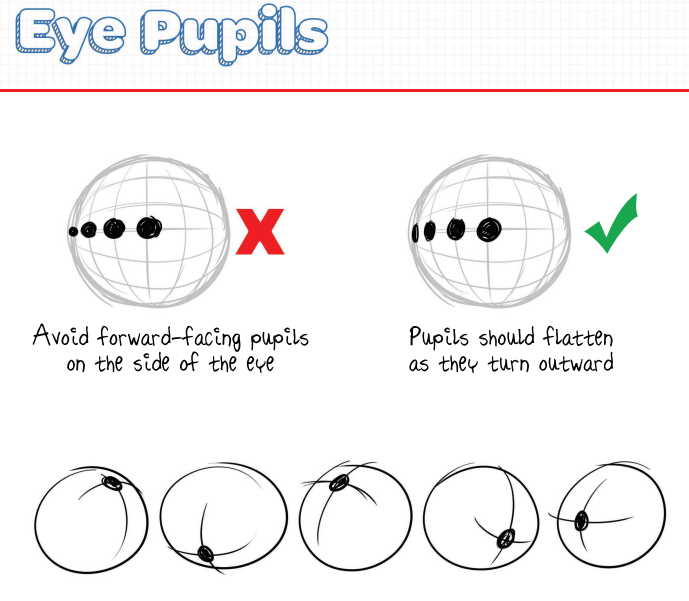

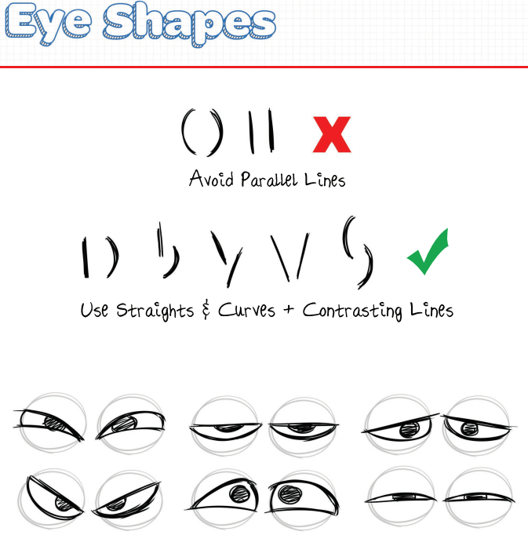

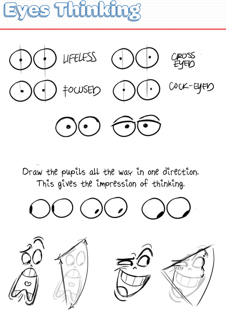

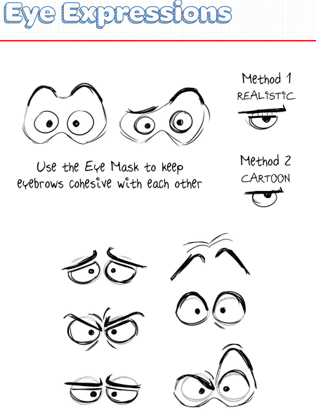

### Нос, рот, губы, щёки: «узлы» стилизации

Черновик предлагает конструктивные метафоры, которые полезно сохранить как лекционные модели:
- нос: **база‑форма + вариации в деталях** (клин/капля/блок → разные характеры);  
- рот: как **«сложенный лист»** (перегиб), который раскрывается на плоскости при открывании;  
- зубы: дуга‑«подкова» как объёмная направляющая ряда;  
- щёки: одна линия может резко менять характер, если она «мягкая»/«колючая»/«поднятая».  

**Цель (подтема: средняя и нижняя часть лица).** Управлять «голосом лица»: возрастом, темпераментом, речевой пластикой, комизмом/серьёзностью — через простые формы, не перегружая деталями.  

**Основные понятия.**  
Плоскости носа (спинка/крылья/кончик), объём рта как формы, толщина губ, углы рта как рычаг эмоции, скуловая зона как «рамка» для мимики.  

**Советы по стилизации.**  
- В комедийной стилизации усиливайте «рычаги» (углы рта, наклон складки, асимметрию), но оставляйте понятной конструкцию челюсти.  
- В более «милом» стиле щёки и губы часто работают как **пятно‑формы**, а не контур: мягкие границы + группировка света/тени.   

**Примеры референсов.** Для системного понимания мимики полезны анатомически основанные системы описания движений лица (FACS) и их применение в анимации.   

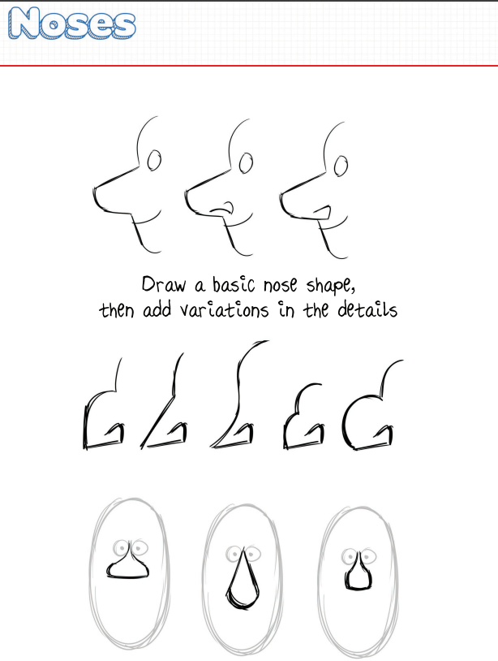
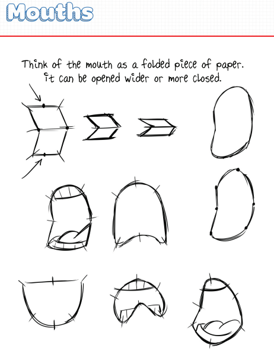
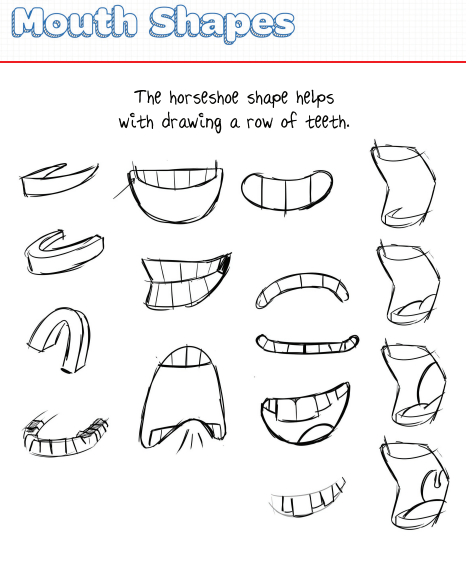
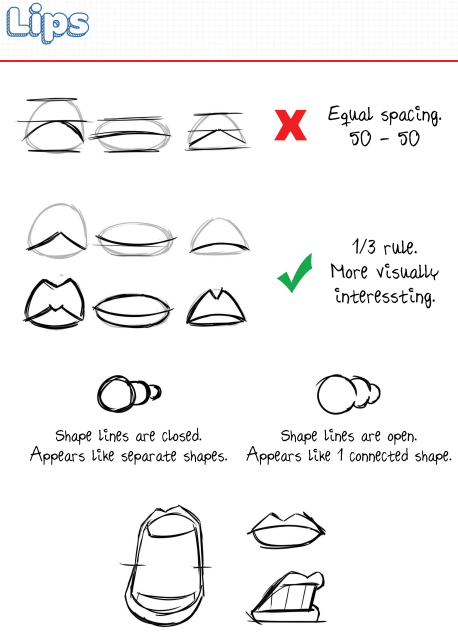
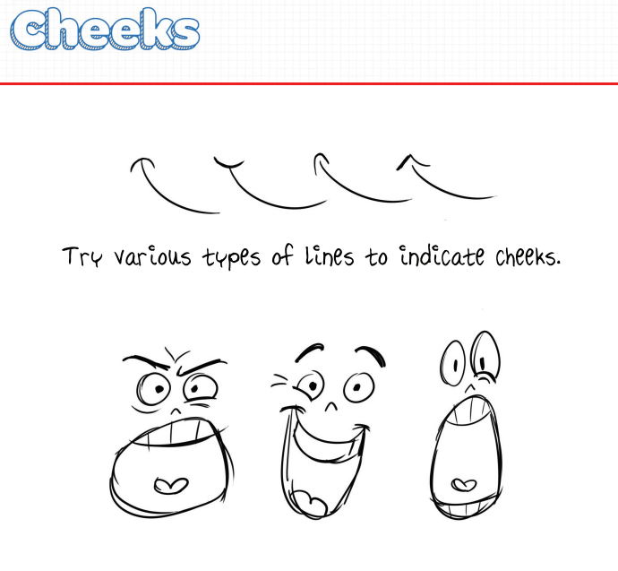

### Уши, волосы и «читаемость контура»

Ваш черновик правильно выносит уши в отдельный блок: ухо легко «ломает» конструкцию головы, если рисовать его плоско или допускать **tangents** — касания линий, которые создают пространственную двусмысленность и «сплющивают» рисунок.  

**Цель (подтема: уши и волосы).** Сделать второстепенные элементы (ухо, волосы) конструктивными: они должны усиливать объём головы и характер, а не превращаться в «наклейку».  

**Основные понятия.**  
- тангенсы и перекрытия (overlap) как средство глубины;  
- большие массы волос → детализация прядей позже (ваш черновик это фиксирует явно).  

**Советы по стилизации.**  
- Стилизация волос работает через **силуэт и ритм масс**: одна крупная масса задаёт характер сильнее, чем десять «вермишелей‑прядей».  

**Примеры референсов.** Планарные подходы к голове, где волосы и уши рассматриваются как продолжение крупных плоскостей. 

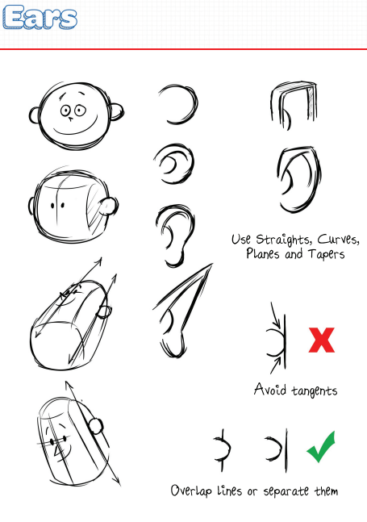
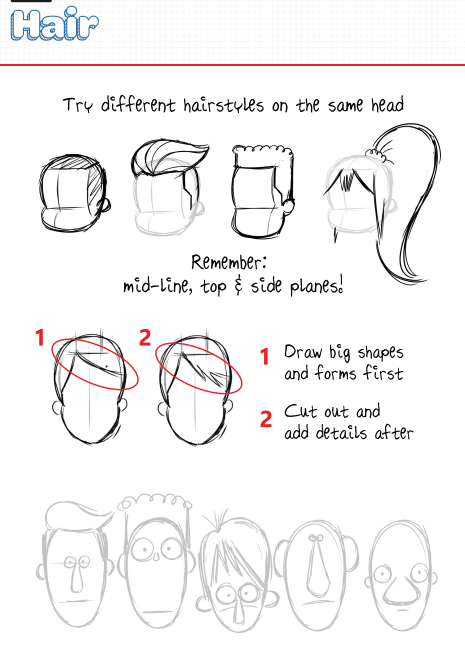

## Тело персонажа: анатомия, пропорции, поза и жест

### Анатомия как база стилизации

Стилизация тела почти всегда строится на двух слоях:
1) **жест/движение (gesture)** — «жизнь» позы;  
2) **конструкция/анатомия** — «скелет» формы (массы грудной клетки, таза, конечностей).   

Анатомия в персонажке нужна не для «медицинской точности», а для **правдоподобия причин**: где тело сгибается, где растягивается, где масса давит и как меняется силуэт при повороте. 

**Цель (подтема: анатомия).** Понимать «опорные точки» тела и закономерности масс, чтобы уверенно менять пропорции и стиль без потери убедительности.   

**Основные понятия.**  
Линия действия (line of action), крупные массы (грудная клетка/таз), ось плеч/таза, опорная нога, центр тяжести, ритмы и асимметрия.     

**Советы по стилизации.**  
- В мульт‑пластике усиливайте жест **до** построения объёма: сначала энергия и направление, затем массы. Это повышает выразительность при любых пропорциях.   
- В «полуреализме» держите жест менее карикатурным, но всё равно избегайте «вялой» вертикали без напряжения/контрнапряжения.   

**Примеры референсов.** Курсы и разборы по жесту, где линия действия рассматривается как фундамент выразительной позы.  

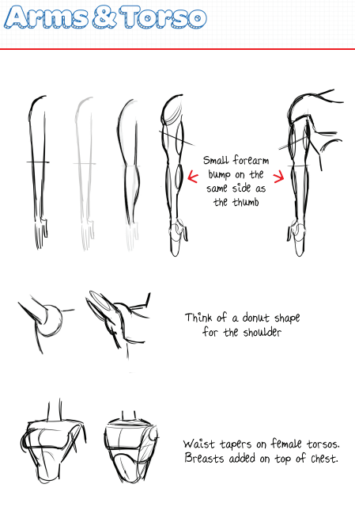
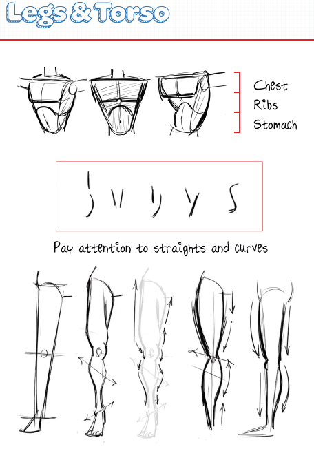
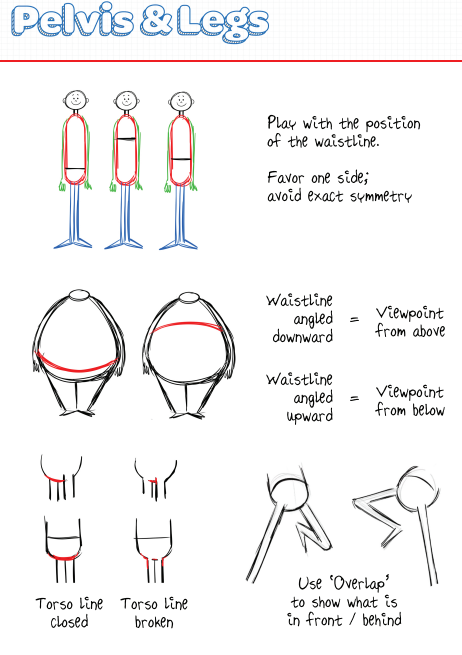
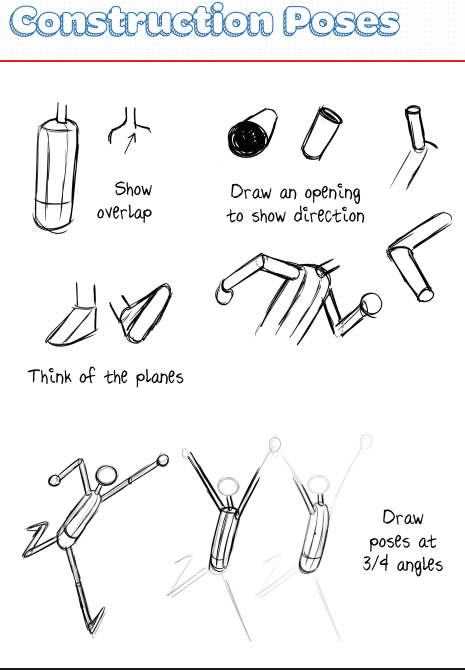

### Пропорции: дизайн‑решение, а не «таблица истин»

Пропорции в персонажном дизайне — это **инструмент характера**. Даже если вы стартуете от условных «средних» пропорций, дальше пропорции становятся выразительной настройкой:  
- короткие ноги/крупная голова → детскость/комизм;  
- длинные конечности/узкий торс → изящество/нервозность;  
- массивный таз/плечи → тяжесть/сила.   

При этом важно помнить: пропорция должна быть **конструктивно возможной** в выбранном стиле, иначе поза ломается при поворотах и в динамике.

**Цель (подтема: пропорции).** Осознанно кодировать роль, возраст и темперамент через соотношения масс, сохраняя воспроизводимость (для пакета персонажа).   

**Основные понятия.** «Большая‑средняя‑мелкая» (иерархия размеров), контраст пропорций внутри одной группы персонажей (каст), единые правила роста/масштаба.   

**Советы по стилизации.** Делайте пропорции частью «конституции мира»: одинаковые правила роста/деформации для всего проекта. 

**Примеры референсов.** Производственные character sheets/модельные листы как эталон пропорций и допуска деформаций. 

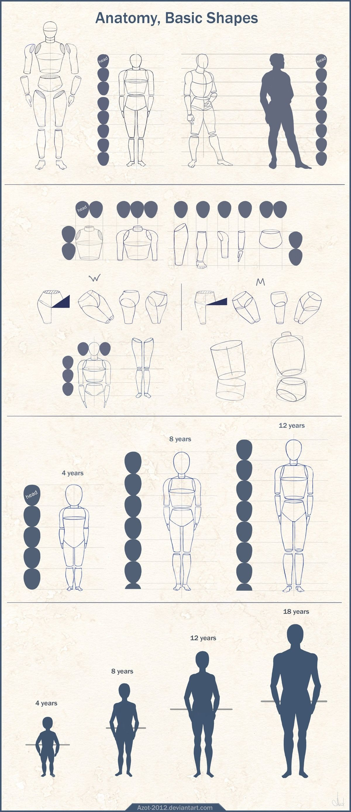

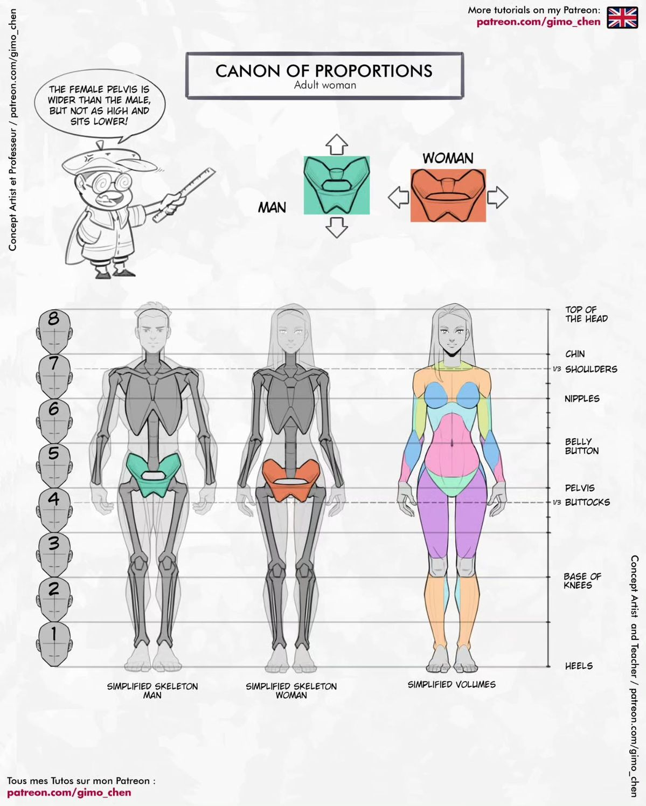


## Одежда, свет, цвет, материалы и композиция

### Одежда как продолжение формы и характера

Одежда в персонажке работает на трёх уровнях:
1) **силуэт** (форма и узнаваемость);  
2) **социальный код** (профессия, эпоха, статус);  
3) **пластика материала** (как ткань реагирует на движение тела).

Ключевая идея для лекции: складки и драпировки — не «узор», а **следствие сил**: натяжение, сжатие, точки закрепления, трение и движение. Именно это подчёркивается в описании подхода к складкам как к результату действий фигуры и поведения материала.  

**Цель (подтема: одежда).** Научиться проектировать костюм, который усиливает характер и читаемость движения, а не маскирует конструкцию тела.  

**Основные понятия.**  
Силуэт костюма, зоны натяжения/сжатия, опорные точки (плечи, локти, колени, пояс), функциональность деталей (карманы, ремни, застёжки).  

**Советы по стилизации.**  
- В мульт‑стиле чаще работают **крупные складки‑сигналы** (пара сильных заломов), чем «реалистическая ткань».  

**Примеры референсов.** Учебники по драпировке и динамике складок, где складки объясняются через силы и точки закрепления.  

### Свет и цвет: группировка значений и «логика освещения»

Свет читается убедительно, когда художник мыслит **плоскостями и группами**: объединяет светлые плоскости в одну группу, теневые — в другую, и уже внутри группы вводит уточнения (рефлексы, полутона, акценты). В планарных упражнениях по голове прямо подчеркивается фокус на ясных плоскостях и группировке света/тени.   

Понятия **терминатора** (граница света и собственной тени) и **ядра тени (core shadow)** полезны как общая «терминология контроля»: вы понимаете, где форма «переворачивается» из света в тень и почему иногда самая тёмная зона — не терминатор, а контактная тень или глубокая «щель» (occlusion).  

**Цель (подтема: свет и цвет).** Связать стиль рендера с конструкцией: чтобы любой материал (кожа, металл, ткань) выглядел убедительно в рамках выбранной стилизации.  

**Основные понятия.**  
Группы света/тени, терминатор, контактные тени, рефлексы и их падение, тёплый/холодный сдвиг света и тени как следствие источников освещения.  

**Советы по стилизации.**  
- Чем более мульт‑стиль, тем важнее **крупные массы света и тени** и понятный «ключевой источник»; детали — позже и дозированно. 

**Примеры референсов.** Русское издание учебника по цвету и свету как системная база для работы в любых техниках.  

### Материалы и текстуры: художественная «физика» как инструмент

Даже если вы рисуете в 2D, материал лучше ощущается, когда вы понимаете его «параметры»:  
- **шероховатость (roughness)** влияет на ширину/резкость блика;  
- **металличность** влияет на характер отражения;  
- **эффект Френеля (Fresnel)** объясняет, почему поверхности становятся более отражающими на «скользящих» углах;  
- **подповерхностное рассеивание (SSS)** объясняет мягкость переходов на коже/воске/листьях.

Эти параметры полезны как язык: вы можете стилизовать (упростить) материал, но при этом сохранить его узнаваемость — например, оставить один «правильный» блик и правильную потерю контраста на тени у кожи.  

**Цель (подтема: материалы и текстуры).** Делать материалы узнаваемыми минимальными средствами и не разрушать стиль лишней «шумной» детализацией.  

**Основные понятия.** Roughness/metallic как метафоры, Fresnel как «усиление края», SSS как «мягкость кожи».  

**Советы по стилизации.**  
- У материалов оставляйте **один главный идентификатор** (тип блика/кромка/Fresnel/просвет) и подчиняйте ему остальное.  

**Примеры референсов.** Документация по PBR и студийные заметки о физически основанном шейдинге как «словарь» поведения материалов.  

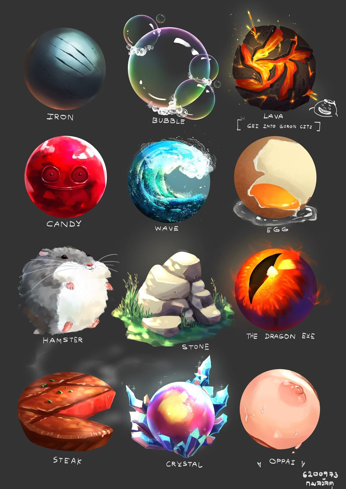

## Стили и жанры: сравнительный разбор и практические выводы

Ниже — аналитическая таблица семейств стилей (не «единственно верная», а рабочая для лекции): она помогает понять, **что именно меняется** при переходе от реализма к условности: пропорции, контур, деформация, рендер, детализация, допустимая асимметрия. В производственной практике важен не «ярлык стиля», а его **ограничения и стандарты** (чтобы персонаж был on‑model).  

```text
Легенда: "деформация" — насколько можно растягивать/сжимать формы без потери стиля.
```

| Семейство стиля | Визуальные признаки | Сильные стороны | Риски | Когда выбирать |
| Реализм/академическая фигура | правдоподобные пропорции, сложные полутона, правдоподобная анатомия | высокая убедительность, тонкая актёрская игра | высокая цена ошибки: малейшая неточность выглядит «нечеловечно» | портрет, реалистичная иллюстрация, «серьёзные» сюжеты |
| Полуреализм/концепт‑арт | упрощённая анатомия + выразительный дизайн; контролируемая детализация | баланс читабельности и правды, гибкость | «середина без решения»: можно потерять стиль, если нет правил | игры/кино‑концепт, фэнтези/сай‑фай персонажи |
| Мульт/карикатура | крупная форма головы/черепа, сильный контур, упрощение плоскостей, высокая деформация | мгновенная читабельность и эмоция, сильный силуэт | риск «плоской наклейки», если нет объёма и осей | анимация, комикс, детские проекты |
| Аниме/манга‑ориентация | выразительные глаза и графика лица, условная анатомия, характерный ритм линий | сильная эмоция и стильность, ясная графика | легко уйти в клише; важна согласованность пропорций в ракурсах | сериальная графика, манга/аниме‑проекты |
| Chibi/SD | экстремально большая голова, упрощённое тело, минимальный рендер | «милота», мерч‑ориентированность, быстрый пайплайн | ограниченная выразительность сложных действий | стикеры, мерч, UI‑персонажи |

**Как адаптировать стиль под жанр.** Жанр (фэнтези, техно‑сай‑фай, нуар, комедия) чаще задаёт не «как рисовать», а **какие акценты** усиливать: материалность, силуэт, культурные коды костюма, контраст света/тени, степень гротеска. Это удобно формализовать как набор ограничений проекта и закрепить в style guide/character bible. 

## Процесс создания персонажа и работа с референсами

### Производственный процесс: от брифа к character sheet

Процесс полезно формализовать как «воронку»: от широких вариантов к стандартизированному пакету. В производстве анимации и игр характер персонажа фиксируется документацией (model sheets/character sheets), чтобы разные художники могли сохранять единый вид (on‑model).  

**Цель (подтема: процесс).** Получить персонажа, который:
- соответствует задаче истории/мира;
- воспроизводим (turnaround, выражения, позы);
- имеет ясный рендер‑код (цвет, материалы);
- надежно читается в кадре (силуэт, композиция).

**Основные понятия.** Brief, исследование, thumbnails, silhouette pass, construction pass, style guide, character sheet, turnaround, expression sheet, color sheet. 

**Советы по стилизации.**  
- «Стиль» фиксируйте не лозунгом, а **набором допусков**: какие деформации разрешены, какая линия допустима, какой диапазон деталей.  

**Примеры референсов.** Стандарты character sheets как индустриальный формат.  

### Таблица этапов процесса персонажа

| Этап | Вход | Выход | Критерий качества | Типичный риск |
| Бриф и роль | логлайн/сеттинг/задача | список требований к персонажу | роль ясна: функция в истории/геймплее | рисовать «красиво», но не по задаче |
| Исследование и референсы | темы, эпоха, профессия | moodboard/пакет референсов | референсы про форму, материал, костюм, эмоции | копирование 1‑в‑1 без анализа |
| Силуэты и крупные формы | reserach‑пакет | 10–30 силуэтов | читается роль без деталей | шумный силуэт, равные массы |
| Конструкция и пропорции | выбранный силуэт | «скелет» персонажа (массы/оси) | устойчивость в 3D‑ракурсе | плоское построение |
| Лицо и актёрство | конструкция головы | диапазон эмоций/мимики | эмоции строятся на рычагах лица | «стикер‑эмоции» без формы |
| Костюм и материалы | конструкция + роль | финальный костюм‑дизайн | костюм усиливает характер и силуэт | складки «ради складок» |
| Цвет и световой код | финальный дизайн | палитра/ключевой свет | иерархия внимания, читаемость | цвет вместо света |
| Production‑пакет | финал | character sheet + turnaround + expression/color | воспроизводимость (on‑model) | нет стандарта для повторения |

_Диаграмма процесса создания персонажа_

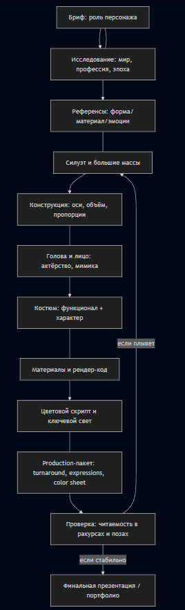

### Референсы: как использовать этично и эффективно

Референсы — это не «костыль», а способ:  
- проверить конструкцию и свет на реальности;  
- понять механику эмоций (мышечные действия);  
- уточнить материальность и поведение ткани.   

Важно помнить и правовой/этический слой: например, индустриальные model sheets обычно являются охраняемыми материалами студий и не являются общественным достоянием; использовать их следует корректно (как учебные ориентиры, а не как копирование дизайна).

**Цель (подтема: референсы).** Переводить наблюдение в правила: «что делает форму такой» и «какие признаки можно стилизовать».   

**Основные понятия.** Анализ плоскостей, поиск причин складок, разложение эмоций на элементы (в духе FACS).  

**Советы по стилизации.** Делайте референс‑пакет по слоям: форма → анатомия → эмоция → костюм → материал → свет.

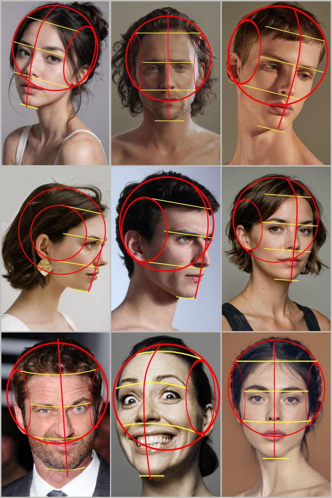
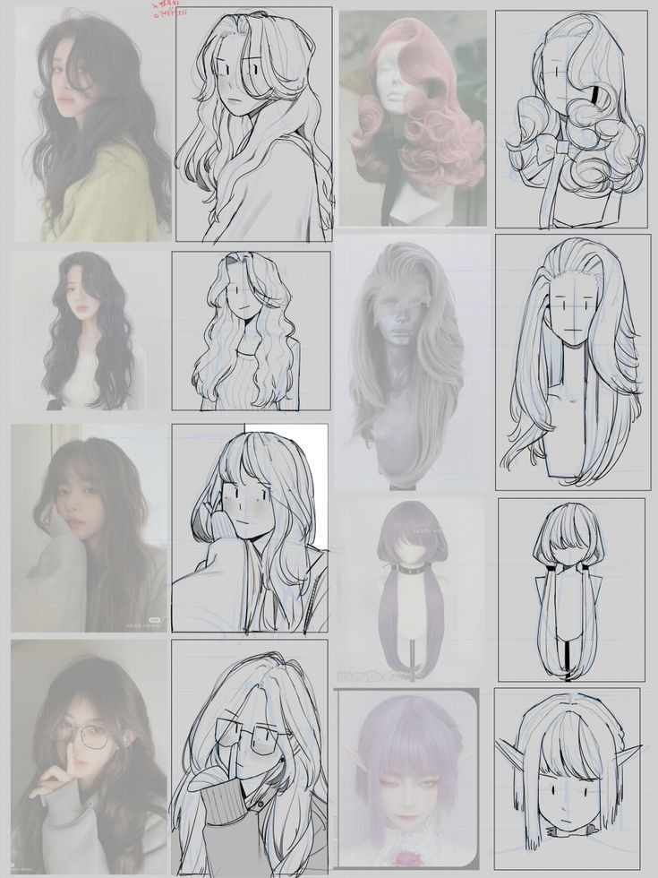

## Рекомендации по развитию навыков 

### Принцип построения практики

Практика эффективнее всего, когда она:
- короткая, но регулярная (ритм важнее «редких марафонов»);
- разделена на **конкретные навыки** (жест, конструкция, свет, материал, композиция);  
- имеет понятный критерий оценки («что стало лучше»).  

### Практические упражнения по темам

**Блок головы и лица (адаптация вашего черновика).**   
- Конструкция «мягкого куба»: серия быстрых построений головы в разных ракурсах с обязательными осями (центр‑линия + линия глаз).  
- Зрачки и перспектива: лист глаз в поворотах; контролировать эллипс радужки и смещение зрачка по сфере.  
- Формы глаз и контраст линий: вариации верхнего/нижнего века (сочетание прямых/кривых, избегание параллелей).  
- Eye mask и выражения: один базовый «пласт» вокруг глаз, внутри которого меняется наклон/высота бровей; отдельно — симметричные и асимметричные эмоции.  
- Носы: один базовый «блок», затем серия характеров через кончик/крылья/спинку.  
- Рты: серия состояний от закрытого к открытым; держать идею «перегиба» + объём челюстной дуги («подкова» зубов).  
- Щёки: один базовый череп/голова, серия характеров сменой одной‑двух линий щёк (мягко/жёстко/пухло/худо).  
- Губы: серия вариантов с правилом неравного деления (ваше 1/3), плюс проба «замкнутых» и «разомкнутых» контуров.  
- Уши: отдельный лист ушей с задачей убрать тангенсы и сделать перекрытия/плоскости.
- Волосы: 3–5 причёсок на одной голове: сначала масса, потом «вырез» и детализация (как в вашем черновике). 

**Блок тела и поз.**  
- Жест (gesture): быстрые позы с акцентом на линию действия и распределение веса. 
- Конструкция поверх жеста: поверх каждого жеста — простые массы грудной клетки/таза и «шарниры» конечностей.   
- «Силуэт‑тест»: проверка читаемости персонажа без внутренних линий (черным пятном). 

**Блок одежды, света и материалов.**  
- Ткань по силам: наброски складок с обязательной разметкой точек закрепления и направлений натяжения/сжатия.
- Свет на простых формах: сфера/куб/цилиндр, контроль терминатора и ядра тени.  
- Материал‑идентификаторы: один объект в 3 материалах (матовый, глянцевый, «кожный» с мягким переходом), цель — изменить поведение блика и мягкость тени.  

### План развития с прогрессией

| Недели | Фокус | Ежедневный минимум | Контрольный результат недели |
|---|---|---|---|
| 1–2 | Жест и линия действия | 15–25 поз жеста + 5 упрощённых «массовых» построений | позы читаются по направлению и весу, меньше «деревянности». |
| 3–4 | Голова как объём (оси/плоскости) | 10–20 голов в разных ракурсах + 1 лист плоскостей | голова держит поворот, черты не «съезжают». |
| 5–6 | Глаза/рот/эмоции | 1 лист глаз (эллипсы радужки) + 1 лист ртов/губ | эмоции читаются без текста; взгляд «живёт». |
| 7–8 | Пропорции и тело | 10 фигурных конструкций (жест→массы) + 3 варианта пропорций | одна поза работает в 2–3 пропорциональных решениях. |
| 9–10 | Одежда и складки | 10 этюдов ткани на движении + 2 костюм‑силуэта | складки логичны по силам; костюм усиливает силуэт. |
| 11 | Свет/цвет | 7 этюдов свет‑тень + 3 палитры персонажа | аккуратная группировка света/тени, читаемый фокус. |
| 12 | Production‑пакет | 1 персонаж: turnaround + лист эмоций + цветовой лист | персонаж воспроизводим «по листам», а не только в одной иллюстрации. |

### Как проверять прогресс без «самообмана»

- **Тест ракурса:** один и тот же персонаж должен быть узнаваем в повороте и наклоне (голова, корпус, плечи/таз).  
- **Тест силуэта:** действие считывается без внутренних линий.  
- **Тест материала:** по одному блику и переходу тени должно быть понятно, «что это за поверхность».  
- **Тест тангенсов:** любые касания контуров, которые «сплющивают» форму, устраняются перекрытием или разнесением.