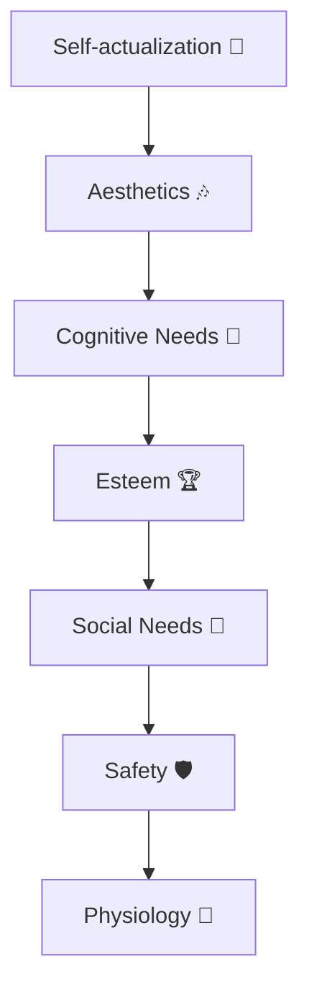
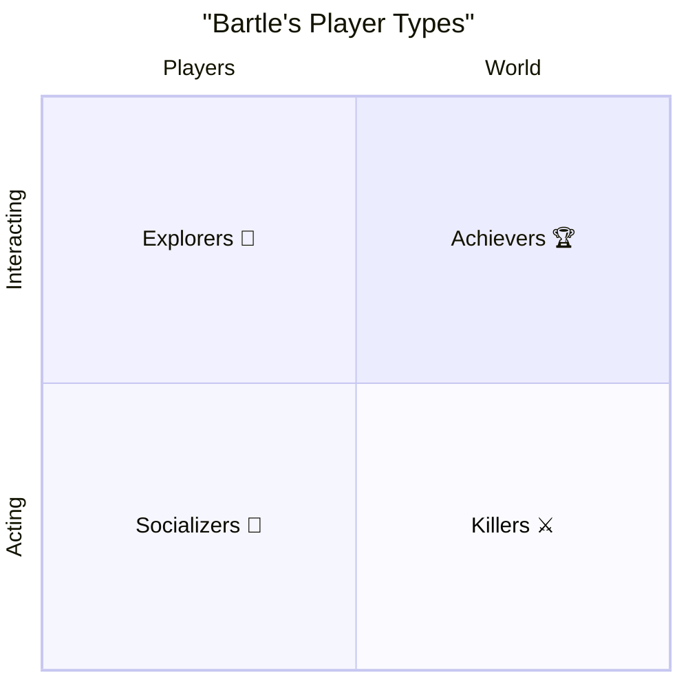

### Common Traits

Games provide emotional aspects missing from daily life, so players seek them in games.

<!-- Gender distribution statistics in games 2025: to be added -->
| Genre             | Men | Women |
|-------------------|-----|-------|

## Player Needs and Motivation
>
>[!Note]  
>**Abraham Maslow** (1908–1970) — American psychologist, one of the founders of humanistic psychology. Famous for his hierarchy of needs, describing how people move from basic physiological needs to higher motivations like self-actualization and creativity. Lower levels must be satisfied before moving up. This theory has strongly influenced psychology, sociology, management — and in recent decades, game design.

### Needs According to Maslow

In video games, Maslow’s pyramid helps explain what motivates players. At the bottom, safety and control: clear rules, save systems, predictable logic. Middle levels: social experience and esteem — team games, rankings, achievements, recognition. Higher levels: knowledge, aesthetics, self-actualization — exploring worlds, enjoying art and music, creating levels or characters. Games become a space where players can climb all steps — from control to creative expression.

1. Physiological needs: food, water, sleep, breathing, homeostasis, excretion.  
2. Safety needs: personal safety, financial stability, health, accident protection.  
3. Social needs: belonging, acceptance, mutual love.  
4. Esteem needs: self-respect, respect from others, status, recognition, power.  
5. Cognitive needs: knowledge, understanding.  
6. Aesthetic needs: beauty, balance, form.  
7. Self-actualization: problem solving, acceptance, creativity, spontaneity, lack of prejudice, acceptance of self and others.  

## Marc LeBlanc’s System of Game Pleasures
>
>[!Note]  
> **Marc LeBlanc** — American game designer and researcher, co-creator of the MDA framework (Mechanics–Dynamics–Aesthetics). He introduced the concept of “8 kinds of fun,” describing emotions and experiences games can provide. His work helps analyze why games captivate and retain players.

LeBlanc’s system expands understanding of motivation by showing that games engage not only through goals and victories but also through emotions, social ties, and aesthetics. Unlike Maslow, which looks at human needs in general, LeBlanc focuses on the types of joy and engagement unique to games: camaraderie, discovery, self-expression, fantasy. This helps developers view games as multi-layered experiences.

1. Sensation (aesthetics).  
2. Fantasy.  
3. Narrative (choice-driven).  
4. Challenge (matching skills to difficulty).  
5. Fellowship.  
6. Discovery.  
7. Expression (level editors, character customization).  
8. Submission/immersion.  

## Bartle’s Player Types
>
>[!Note]  
> **Richard Bartle** (b. 1960) — British researcher and game designer, famous for his work on MMORPGs. In 1996, he introduced a player taxonomy with four categories: Achievers, Socializers, Explorers, Killers. It explains motivations and preferences in virtual worlds and has deeply influenced online game design.

Bartle’s model divides players along two axes: “acting ↔ interacting” and “players ↔ world,” forming four groups:

- **Killers** focus on acting against others. They want dominance, PvP, power, and showing strength. They enjoy defeating rivals and ruining others’ progress.  
- **Achievers** seek progress, rewards, measurable goals. They value achievements, levels, rankings, collections. Fun comes from steady growth and overcoming challenges.  
- **Socializers** are motivated by interaction with others: friendship, teamwork, communication, community. They often become community hubs.  
- **Explorers** love studying the world: finding secrets, testing mechanics, experimenting. Their fun comes from discovery and deep understanding.  

Thus, Bartle’s model shows that audiences are diverse. Successful games balance competition, exploration, social play, and achievement.

## Additional Pleasures

- Anticipation.  
- Completion.  
- Schadenfreude (enjoying enemy punishment).  
- Gift-giving.  
- Humor.  
- Choice.  
- Pride in achievements.  
- Surprises (Easter eggs).  
- Awe (fear turned to thrill).  
- Overcoming adversity.  
- Wonder and miracles.  
- Belonging to something greater.  
- Praise and approval.  
- Recognition and revelation.  
- Empathy.  
- Philosophy and existential reflection.  
- Love and understanding.  
- Watching your own creations.

