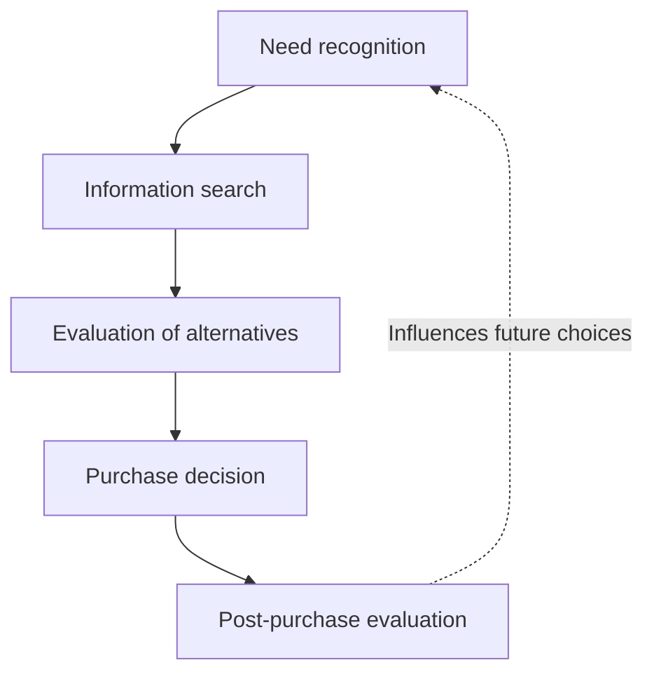
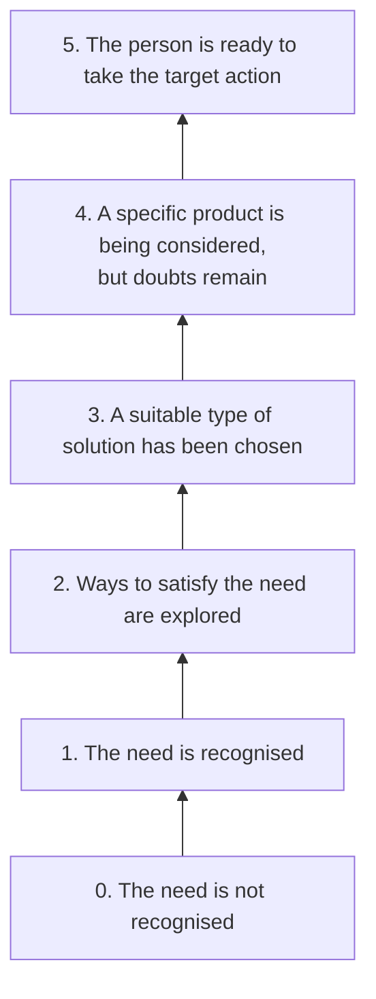
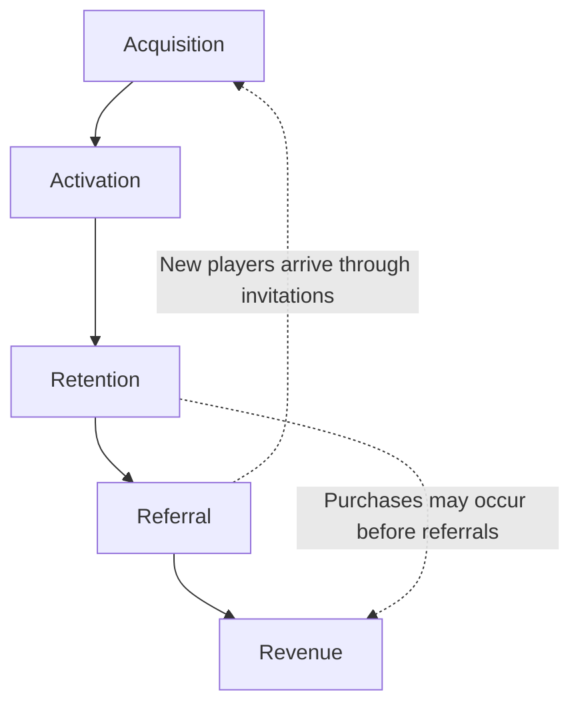

# Target Audience

>[!Note]
>The target audience is the group of people a product, service, or marketing campaign is aimed at. Understanding your audience helps companies create better strategies and offers that match their needs and preferences. In our case, this means the people who will play the game — our players.

## Age Distribution

### 0–3 Years

Infants and toddlers just starting to explore the world.  
**Leading activity type:** *object-tool*. They explore through manipulating objects. They value tangible toys like gamepads and touchscreens.

### 4–6 Years

Preschoolers developing social skills and imagination.  
First interest in games appears, often playing with parents. Cooperative play with adults starts breaking down.  
**Leading activity type:** *role-play*. They begin to understand good vs. evil, imagination develops. Story-based and role-playing games are important. They also form early symbolic thinking, imagination, and strong curiosity.

### 7–9 Years

The “why?” stage. Kids ask many questions, trying to understand the world.  
**Leading activity type:** *learning*. They develop real interest in games and start to evaluate them critically. They gain reflection skills, recognizing their own emotions, and begin theoretical and symbolic thinking.

### 10–13 Years

They can grasp more complex concepts and develop personal interests. Known as the age of obsession. Relationships shift, peer groups form based on common interests.  
**Leading activity type:** *communication*. Interest in multiplayer and team games grows. Abstract and critical thinking develops. Personal self-awareness strengthens.

*At 12–15 years, social activity expands further.*

### 13–18 Years

Teenagers prepare for adult life. Boys focus on competition and strength; girls on communication and life questions.  
They experiment with new experiences and often gain financial independence. Peer groups become central. They begin professional self-identification and acquiring knowledge and skills. Value systems form.

### 18–24 Years

Young adults. Teenage experiments end, more time and money appear.

### 25–35 Years

Time becomes valuable. Family formation. They choose games carefully to avoid wasting time. Casual games dominate. Many become hobbyist players.

### 36–50 Years

Family maturity. Many leave games behind, but often play with children, choosing family-friendly games.

### 50+ Years

Some return to games they enjoyed in youth; others seek new experiences. This group continues to grow.

## Gender Distribution

### Men

1. Mastery — enjoy learning new skills.  
2. Competition — proving superiority.  
3. Destruction — like breaking the world.  
4. Spatial puzzles.  
5. Trial and error — rarely read instructions, prefer experimenting, need simple interfaces.  
6. Strategy and building.  

### Women

1. Emotions — depth of emotional experience matters.  
2. Real world links.  
3. Caring — most healers in games are women.  
4. Dialogues and word puzzles.  
5. Learning from examples — appreciate guidance. Clear goals + micro-goals.  
6. Multitasking — women can multitask more easily than men.  
7. Hidden object games.  
8. Team games with clear rules.  

## Game Promotion and Marketing

The promotion of a game and the development of its audience can be examined from three different perspectives. The first concerns how a person decides which product to choose; the second, how aware they are of their needs and of the available offerings; and the third, what actions they take within a digital product. These questions are related, but they are not identical. For this reason, the models associated with Philip Kotler, Ben Hunt, and Dave McClure are best studied separately rather than treated as three names for the same funnel.

This lecture follows that distinction. It begins with Kotler’s model of consumer decision-making as a general theoretical foundation. It then turns to Hunt’s Awareness Ladder, which provides a more detailed account of the audience’s state of awareness before choosing a product. Finally, it examines McClure’s AARRR framework as a tool for analysing user behaviour in a digital game.

## 1. Kotler’s model: The purchase decision

### Theoretical foundation

The purchase decision process described in the work of Philip Kotler and his co-authors is based on the idea that a purchase usually has both a history and consequences. A person first recognises a need, then seeks information about ways to satisfy it, evaluates alternatives, makes a decision, and compares the outcome with their expectations after the purchase. The object of analysis is therefore not an isolated transaction but a process of consumer choice.  

This model is often represented as a funnel. Such a representation is useful in teaching, but it requires a qualification: the five stages primarily describe the logic of consumer decision-making, not a mandatory sequence of advertising encounters or a ready-made set of quantitative metrics. In practice, the search for information may be brief, some stages may be barely noticeable, and evaluation of a product may continue after a decision has been made. 

*Description of the diagram.* The solid arrows show the analytical sequence of stages, from the recognition of a need to the evaluation of a purchased product. The dotted arrow indicates that the experience does not disappear after the purchase: satisfaction or disappointment may influence the next decision. The diagram does not imply that every person necessarily passes through all the stages at the same pace. 

### The stages illustrated through a game

Imagine someone who wants to spend several evenings playing a story-driven game. At the **need recognition** stage, they identify the experience they are looking for: a narrative, a world to explore, and the opportunity to play alone. The need concerns a particular way of spending leisure time, not yet a specific game title.

During the **information search**, the potential player watches trailers, reads descriptions and reviews, or asks friends for recommendations. They then move to the **evaluation of alternatives**, comparing games by genre, length, narrative style, technical requirements, and price. The distinction is that searching expands the range of known options, whereas evaluation helps the player choose among them. 

The **purchase decision** consists of selecting and buying a particular game. In the games industry, however, this stage cannot simply be replaced with “installation”: if a game is free to play, beginning to play and making a payment are separate actions. **Post-purchase evaluation** follows acquisition: the player considers whether the mechanics, story, and quality of execution meet their expectations. This assessment may influence both their subsequent attitude towards the game and their future purchasing decisions. 

For game design and game marketing, the value of Kotler’s model lies in its emphasis on the origins of player expectations, not just on the moment of sale. If a game’s advertising promise differs substantially from the experience it delivers, attracting attention does not necessarily lead to a positive evaluation of the product.

## 2. Hunt’s Awareness Ladder: Audience awareness

### Theoretical foundation

Whereas Kotler’s model describes the structure of a decision, Ben Hunt’s Awareness Ladder focuses on another question: what does a person already know about their need, the possible ways to satisfy it, and a particular product? Their level of awareness influences which information will be relevant at a given moment. A detailed invitation to purchase may be useful to someone already comparing options, but premature for someone who has not yet considered making that choice.

Historical attribution matters here. The idea of analysing levels of audience awareness is also associated with the earlier work of Eugene Schwartz. Hunt’s ladder is therefore better understood as a later practical presentation and application of this approach, rather than the original discovery of the concept itself. Educational and professional sources differ in how they name and group the stages; the version below uses levels **0 through 5**. 

*Description of the diagram.* Moving upwards represents increasing awareness, from the absence of a clearly defined need to readiness to act. The diagram is a tool for audience segmentation, not a claim that every person must climb one step at a time. Someone may, for example, become interested in a game spontaneously, without a lengthy period of searching and comparison. 

### The stages illustrated through a game

Imagine promoting a cooperative game designed for short sessions with friends. At **level zero**, a person is not looking for a new game and has not identified a corresponding need. An advertisement describing the prices of in-game items in detail is unlikely to answer a question they have not yet asked.

At **level one**, a need emerges: the person would like to spend time with friends online, but has not decided how. At **level two**, they consider possible approaches—video calls, digital board games, or cooperative video games. At **level three**, they have decided to try short cooperative gaming sessions and begin looking for suitable options.

At **level four**, the user knows about a specific game but still has doubts: is it easy for friends to join, how long does a match take, and will there be a steep learning curve? Showing actual gameplay answers these questions more directly than an abstract promise of “unforgettable experiences.” At **level five**, the intention to act has formed. The communication task is now to remove friction: clearly show where the game is available and how to start playing. For a free-to-play game, the target action may be installation rather than purchase. 

Hunt’s ladder is useful when designing different messages for audiences with different levels of familiarity with a game. It does not, however, replace the study of actual behaviour: the fact that someone has watched a trailer does not automatically reveal which “step” they occupy.

## 3. McClure’s model: AARRR

### Theoretical foundation

The AARRR model, proposed by Dave McClure for analysing digital products, shifts attention from assumptions about how a user thinks to **observable actions and measurable transitions**. Its name is formed from five areas of analysis: *Acquisition*, *Activation*, *Retention*, *Referral*, and *Revenue*. In McClure’s original materials, the framework describes the user life cycle and encourages teams to define meaningful events and conversion measures for each area. 

AARRR is especially useful for digital games because installation, an initial rewarding experience, repeat sessions, recommendations, and revenue can be recorded as separate events. The framework was not created specifically for the games industry; the examples below adapt it to the analysis of a game product. 

*Description of the diagram.* The main chain preserves the order of the letters in AARRR. The dotted link from referral to acquisition shows how recommendations may bring in new players. The link from retention to revenue is a reminder that the diagram does not prescribe the order of every individual action: a player may make a purchase without ever inviting anyone. Moreover, some users never pay, and certain monetisation models generate revenue from sources other than direct purchases. 

### The stages illustrated through a game

**Acquisition.** A user learns about a game through an advertisement, a content creator, or a friend’s invitation and proceeds to install it. The team must decide in advance what counts as an acquisition event for its analysis: viewing the store page, installing the game, or launching it for the first time. Without a clear definition, results from different teams and campaigns will be difficult to compare.

**Activation.** The player has an initial experience that reveals the game’s value. For a cooperative game, simply opening the app and clicking through the tutorial may not be enough; completing the first mission together could be a more meaningful sign of activation. The event chosen depends on the product’s design—there is no universal “aha moment” for all games. Evaluating the quality of the first experience, rather than merely recording a visit, is central to McClure’s account of activation.

**Retention.** The player returns after the first session and continues to engage with the game. A team may analyse the proportion of users who return the next day, a week later, or after a longer period. The intervals and counting rules must be defined explicitly; otherwise, metrics with the same name may describe different things.

**Referral.** A player invites an acquaintance, sends a link, or shares the game in another way. In analysis, it is important to distinguish between sending an invitation and its outcome: did a new user actually arrive through it? McClure treats referrals as a distinct avenue of growth associated with a positive user experience. 

**Revenue.** The game generates income through user behaviour—for example, the purchase of cosmetic items, a battle pass, or a subscription. In game analytics, it is useful to distinguish a player’s first purchase from the amount of revenue generated: these measures are related but not identical. In a free-to-play game, payment is usually not a condition of entry, so it cannot be treated as equivalent to installation. 

These three models answer different research questions. Kotler explains the **structure of consumer decision-making**; Hunt addresses the **level of awareness before an action**; and McClure identifies **measurable events in the user life cycle**. Used together, they help connect a person’s expectations with their first experience of a game and their subsequent behaviour—without confusing a psychological account of choice with product analytics.