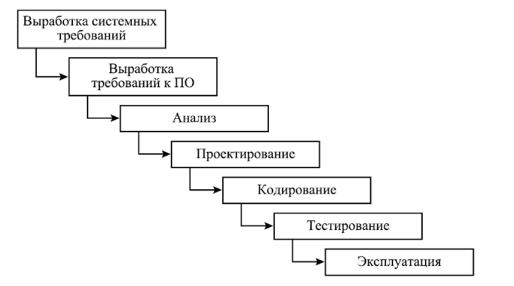
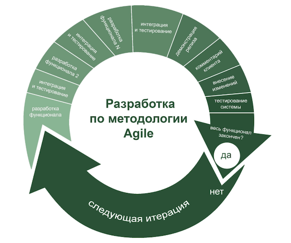
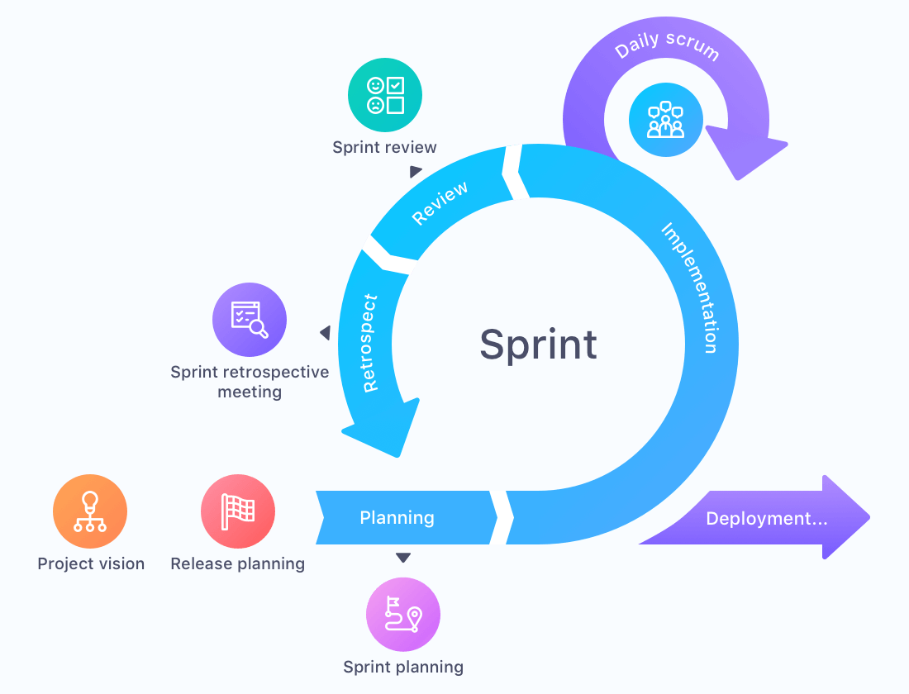
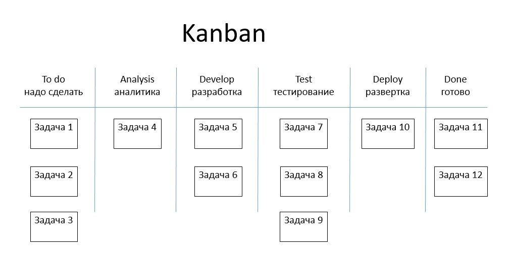
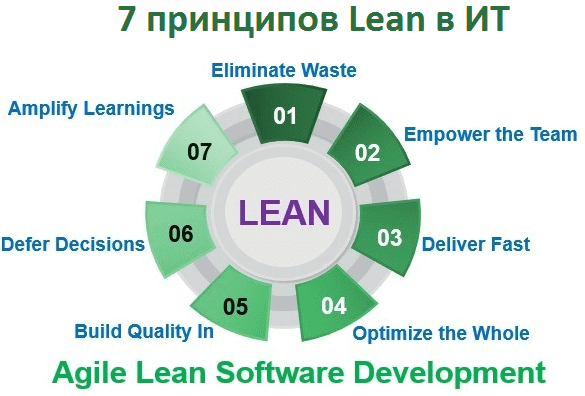
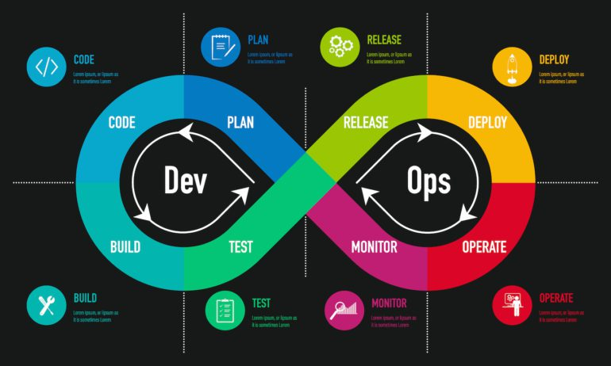
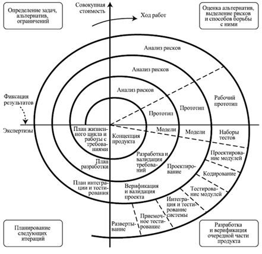
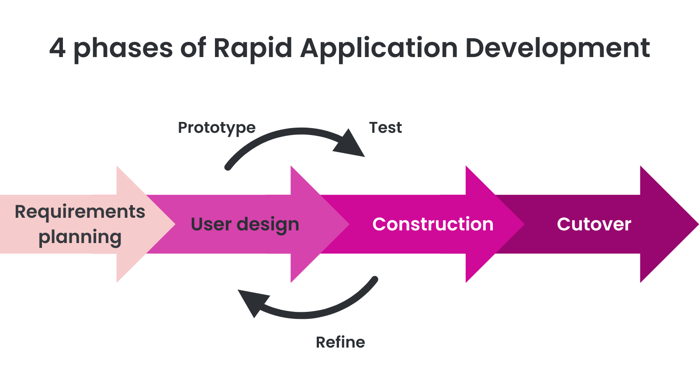
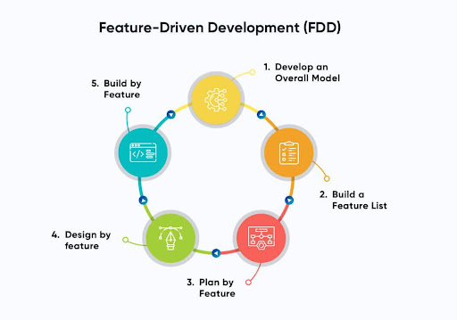
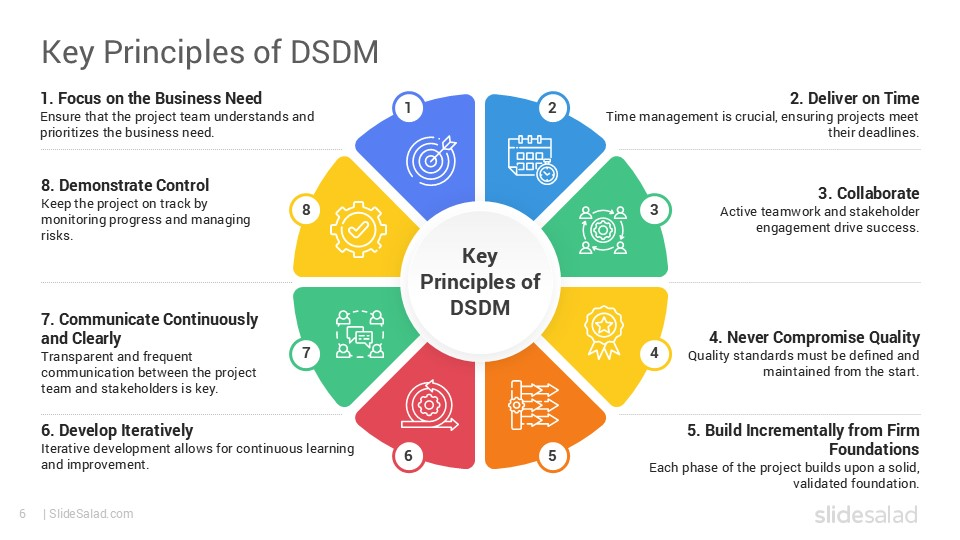

# Лекция: Основы проектирования видеоигр

## Введение

Проектирование видеоигр — это многогранный процесс, объединяющий творческое видение, технические навыки и системное мышление. Современный геймдизайн требует понимания не только игровых механик, но и принципов программного обеспечения, управления проектами и документации.

## Геймдизайн-документ (GDD — Game Design Document)

### Что такое геймдизайн-документ?

**Геймдизайн-документ (GDD)** — это центральный документ, описывающий все аспекты игры: от концепции и механик до технической реализации и художественного стиля. Это «библия проекта », которая служит единым источником истины для всей команды разработчиков, включая дизайнеров, программистов, художников, звукорежиссёров и продюсеров.

GDD эволюционирует на протяжении всего цикла разработки: начинается как краткое описание концепции и постепенно детализируется по мере принятия проектных решений. Хороший GDD должен быть достаточно подробным, чтобы любой член команды мог понять, что нужно реализовать, но при этом оставаться гибким для изменений.

### Основные разделы GDD

Геймдизайн-документ строится вокруг **четырёх основных направлений (столпов геймдизайна)**:

1. **Технология (Technology)**
2. **Механики (Mechanics)**
3. **История (Story/Narrative)**
4. **Эстетика (Aesthetics)**

Рассмотрим каждый из этих столпов подробно с подкатегориями.

## 1. Технология (Technology)

Технологический раздел описывает техническую основу игры: движок, платформы, инструменты разработки и технические ограничения.

### Подкатегории:

#### 1.1. Игровой движок и технологии
- **Выбор движка**: Unity, Unreal Engine, Godot, собственный движок
- **Версия движка** и обоснование выбора
- **Плагины и middleware**: физика (PhysX, Havok), аудио (FMOD, Wwise), анимация
- **Языки программирования**: C#, C++, Python, Lua (для скриптов)

#### 1.2. Платформы и совместимость
- **Целевые платформы**: PC (Windows, macOS, Linux), консоли (PlayStation, Xbox, Nintendo Switch), мобильные (iOS, Android), VR/AR
- **Минимальные и рекомендуемые системные требования**
- **Кроссплатформенность**: поддержка мультиплеера между платформами
- **Особенности платформ**: управление, производительность, ограничения

#### 1.3. Сетевая архитектура (для онлайн-игр)
- **Тип сети**: P2P, клиент-сервер, авторитативный сервер
- **Протоколы**: TCP/UDP, WebSocket
- **Серверная инфраструктура**: облачные решения (AWS, Azure, Google Cloud)
- **Масштабируемость**: обработка пиковых нагрузок, матчмейкинг

#### 1.4. Инструменты разработки
- **Системы контроля версий**: Git, Perforce, SVN
- **Инструменты для дизайнеров**: редакторы уровней, диалоговые редакторы, визуальные скрипты
- **CI/CD пайплайны**: автоматизированная сборка, тестирование, деплой
- **Профилирование и отладка**: инструменты для анализа производительности

#### 1.5. Технические ограничения и риски
- **Бюджет производительности**: FPS, потребление памяти, время загрузки
- **Ограничения хранения**: размер билда, патчи, DLC
- **Технические риски**: зависимость от сторонних SDK, лицензирование

## 2. Механики (Mechanics)

Механики — это правила и системы, определяющие взаимодействие игрока с игровым миром. Это правила игры на фундаментальном уровне.

### Подкатегории:

#### 2.1. Основные игровые механики (Core Mechanics)
- **Действия игрока**: движение, атака, взаимодействие, строительство, исследование
- **Цикл игры (Game Loop)**: что игрок делает каждую секунду, минуту, час
- **Прогрессия**: как игрок становится сильнее/умнее (уровни, навыки, снаряжение)
- **Обратная связь**: как игра реагирует на действия игрока (визуально, аудио, тактильно)

#### 2.2. Боевая система (если применимо)
- **Тип боя**: ближний, дальний, магический, стелс
- **Баланс**: урон, здоровье, защита, кулдауны
- **ИИ противников**: поведение, паттерны атак, адаптивность
- **Комбо и специальные приёмы**: цепочки действий, бонусы за мастерство

#### 2.3. Экономика и ресурсы
- **Валюты**: золото, кристаллы, очки опыта, энергия
- **Источники ресурсов**: награды, торговля, крафт, фарм
- **Траты ресурсов**: улучшения, покупка предметов, ускорение прогресса
- **Инфляция и баланс**: предотвращение эксплойтов, поддержание ценности

#### 2.4. Система прогрессии
- **Уровни и опыт**: формулы получения XP, требования к уровням
- **Навыки и перки**: деревья навыков, выбор специализации
- **Достижения и трофеи**: цели для долгосрочной мотивации
- **Ранги и лидерборды**: соревновательный элемент

#### 2.5. Физика и взаимодействие с миром
- **Физический движок**: гравитация, коллизии, разрушаемость
- **Интерактивные объекты**: двери, сундуки, переключатели, транспорт
- **Экологические механики**: погода, время суток, стихии

#### 2.6. Социальные механики
- **Мультиплеер**: кооператив, PvP, массовые сражения
- **Гильдии и кланы**: групповая прогрессия, общие цели
- **Торговля между игроками**: аукционы, прямой обмен
- **Социальные функции**: чат, друзья, приглашения

## 3. История (Story/Narrative)

История создаёт эмоциональную связь игрока с миром и персонажами, придавая смысл игровым действиям.

### Подкатегории:

#### 3.1. Сюжет и структура повествования
- **Основной сюжет (Main Quest)**: центральная история, арка героя
- **Побочные квесты**: дополнительные истории, раскрывающие мир
- **Структура**: линейная, нелинейная, ветвящаяся, открытая
- **Темп повествования**: баланс между экшеном и сюжетными моментами

#### 3.2. Мир и лор (World-Building)
- **Сеттинг**: фэнтези, научная фантастика, исторический, постапокалипсис
- **География**: карты, регионы, ключевые локации
- **История мира**: прошлые события, мифология, легенды
- **Культуры и фракции**: народы, организации, их мотивы и конфликты

#### 3.3. Персонажи
- **Протагонист**: предыстория, мотивация, характер, развитие
- **Антагонист**: цели, философия, связь с героем
- **Второстепенные персонажи**: союзники, наставники, комические рельефы
- **NPC**: диалоги, расписания, отношения с игроком

#### 3.4. Диалоги и нарративные техники
- **Формат диалогов**: текстовые, голосовые, ветвящиеся
- **Выбор игрока**: последствия решений, моральные дилеммы, множественные концовки
- **Экспозиция**: как подавать информацию (катсцены, записи, диалоги, окружение)
- **Показ, а не рассказ (Show, Don't Tell)**: использование окружения для повествования

#### 3.5. Тон(жанр) и темы
- **Тон(жанр)**: серьёзный, комедийный, мрачный, сатирический
- **Темы**: дружба, предательство, искупление, свобода, судьба
- **Целевая аудитория**: возрастной рейтинг, культурные особенности

## 4. Эстетика (Aesthetics)

Эстетика определяет визуальный и аудиальный стиль игры, создавая атмосферу и эмоциональный отклик.

### Подкатегории:

#### 4.1. Визуальный стиль (Art Direction)
- **Художественный стиль**: реализм, стилизация, пиксель-арт, cel-shading, low-poly
- **Цветовая палитра**: доминирующие цвета, настроение через цвет
- **Освещение**: дневное, ночное, атмосферное, динамическое
- **Постобработка**: фильтры, эффекты (bloom, motion blur, depth of field)

#### 4.2. Дизайн персонажей
- **Стиль персонажей**: пропорции, детализация, униформа/одежда
- **Анимация**: движения, боевые анимации, эмоции, липсинк
- **Кастомизация**: возможность изменения внешности, снаряжения
- **Иконки и портреты**: UI-элементы для персонажей

#### 4.3. Дизайн окружения (Environment Art)
- **Архитектура**: стили зданий, интерьеры, экстерьеры
- **Природа**: ландшафты, растительность, вода, небо
- **Детализация**: декор, Props, атмосферные элементы
- **Навигация**: как игрок ориентируется в пространстве

#### 4.4. Пользовательский интерфейс (UI/UX)
- **HUD**: здоровье, мана, мини-карта, цели
- **Меню**: главное меню, инвентарь, карта, настройки
- **Иконки и символы**: понятность, стиль, консистентность
- **Анимации UI**: переходы, уведомления, обратная связь

#### 4.5. Звуковой дизайн (Audio Design)
- **Музыка**: основной саундтрек, боевая музыка, исследование, эмоциональные моменты
- **Звуковые эффекты**: шаги, выстрелы, магия, окружение, UI-звуки
- **Озвучка**: главные герои, второстепенные персонажи, нарратор
- **Аудио-микширование**: баланс между музыкой, эффектами и диалогами
- **Пространственное аудио**: 3D-звук, направление, расстояние

#### 4.6. Атмосфера и настроение
- **Общее настроение**: эпическое, мрачное, весёлое, напряжённое
- **Атмосферные эффекты**: туман, частицы, погода, время суток
- **Эмоциональные пики**: кульминационные моменты, катсцены

## Дополнительные разделы GDD

Помимо четырёх основных столпов, полноценный геймдизайн-документ включает:

### 5.1. Концепция и видение
- **High Concept**: одно-два предложения, описывающих суть игры
- **Unique Selling Points (USP)**: что делает игру уникальной
- **Целевая аудитория**: демография, предпочтения, платформы
- **Референсы**: похожие игры, вдохновение

### 5.2. Геймплейные режимы
- **Одиночная кампания**: структура, длительность, сложность
- **Мультиплеер**: режимы, карты, баланс
- **Дополнительные режимы**: аркада, выживание, спидран

### 5.3. Монетизация (для коммерческих проектов)
- **Модель**: покупка, F2P, подписка, гибридная
- **Микротранзакции**: косметика, ускорители, лутбоксы
- **DLC и расширения**: планируемый контент после релиза
- **Этика монетизации**: избегание predatory practices

### 5.4. Маркетинг и запуск
- **Платформы релиза**: где и когда
- **Промо-материалы**: трейлеры, скриншоты, пресс-кит
- **Сообщество**: соцсети, Discord, ранний доступ
- **Пост-релизная поддержка**: патчи, контент, события

### 5.5. Приложения и приложения
- **Концепт-арты**: персонажи, окружение, ключевые сцены
- **Диаграммы**: схемы механик, карты мира, деревья навыков
- **Таблицы**: баланс, статистика, формулы
- **Глоссарий**: термины, аббревиатуры, имена

## Создание программного обеспечения для игр

Разработка игрового программного обеспечения — это сложный процесс, требующий координации между дизайнерами, программистами, художниками и другими специалистами. Выбор методологии разработки напрямую влияет на эффективность команды, качество продукта и способность адаптироваться к изменениям.

### Виды методологий разработки ПО

Существует множество подходов к разработке программного обеспечения. Ниже приведён краткий список основных методологий:

- **Водопад (Waterfall)**
- **Гибкая разработка (Agile)**
- **Scrum**
- **Kanban**
- **Lean**
- **DevOps**
- **Spiral**
- **Rapid Application Development (RAD)**
- **Feature-Driven Development (FDD)**
- **Dynamic Systems Development Method (DSDM)**

Рассмотрим подробно четыре наиболее распространённые методологии, используемые в игровой индустрии.

### 1. Водопад (Waterfall)

**Водопад** — это классическая линейная методология разработки, в которой проект разбивается на последовательные этапы, каждый из которых должен быть полностью завершён перед переходом к следующему.

#### Характеристика:
- **Чёткий план, этапы, сроки**: проект делится на фиксированные фазы (анализ требований, дизайн, реализация, тестирование, внедрение, поддержка), каждая со своими целями и дедлайнами
- **Документоориентированность**: каждый этап сопровождается подробной документацией, которая служит основой для следующего этапа
- **Минимальные изменения**: требования фиксируются в начале и не меняются в процессе

#### Подходит для:
- Проектов с **ясными, неизменными требованиями**
- Команд, работающих над **предсказуемыми задачами** (например, портирование, поддержка legacy-кода)
- Ситуаций, где **контрактные обязательства** требуют фиксированного объёма работ

#### Плюсы:
- Простота планирования и управления
- Чёткое понимание прогресса
- Хорошая документация

#### Минусы:
- **Сложно вносить изменения**: любое изменение требований требует пересмотра всего плана
- **Риск ошибок на поздних этапах**: баги, обнаруженные на этапе тестирования, могут потребовать переделки дизайна или кода
- **Отсутствие гибкости**: игрок не видит продукт до конца разработки, что увеличивает риск несоответствия ожиданиям
- **Длительный цикл обратной связи**: фидбек от тестировщиков или заказчиков приходит слишком поздно

#### Пример использования в геймдеве:
Водопад может применяться для небольших проектов с фиксированным дизайном (например, мобильные казуальные игры) или для этапов портирования игры на новую платформу, где требования уже определены.

### 2. Гибкая разработка (Agile)

**Agile** — это не конкретная методология, а философия или набор принципов, описанных в Agile Manifesto. Agile делает акцент на гибкости, итеративности и постоянной обратной связи.

#### Характеристика:
- **Итеративный процесс**: работа разбивается на короткие циклы (итерации или спринты), по итогам которых создаётся рабочая версия продукта
- **Частые релизы**: каждая итерация заканчивается потенциально готовым к релизу инкрементом
- **Адаптивность**: требования могут меняться даже на поздних стадиях разработки
- **Клиентоориентированность**: постоянная обратная связь от заказчика или стейкхолдеров

#### Подходит для:
- Проектов с **изменяющимися требованиями**
- Команд, работающих в **быстро меняющейся среде** (стартапы, инди-разработка)
- Ситуаций, где **важно быстро получить MVP** (Minimum Viable Product) и тестировать гипотезы

#### Плюсы:
- Гибкость и адаптивность к изменениям
- Раннее обнаружение проблем
- Постоянная обратная связь
- Высокая вовлечённость команды

#### Минусы:
- **Требует высокой дисциплины**: без самоорганизации команда может потерять фокус
- **Может быть хаотичной без хорошего управления**: отсутствие чёткого плана приводит к расползанию скоупа (scope creep)
- **Сложность оценки сроков**: трудно предсказать, когда проект будет завершён
- **Требует постоянного вовлечения заказчика**: если стейкхолдеры недоступны, процесс замедляется

#### Принципы Agile (кратко):
1. Люди и взаимодействие важнее процессов и инструментов
2. Работающий продукт важнее исчерпывающей документации
3. Сотрудничество с заказчиком важнее согласования условий контракта
4. Готовность к изменениям важнее следования плану

#### Пример использования в геймдеве:
Большинство современных игровых студий используют Agile-подход, особенно на ранних этапах разработки, когда дизайн ещё формируется через прототипирование и тестирование.

### 3. Scrum

**Scrum** — это конкретный фреймворк, реализующий принципы Agile. Scrum добавляет структуру через чёткие роли, события (ритуалы) и артефакты.

#### Характеристика:
- **Подвид Agile с чёткими ролями и ритуалами**: Scrum определяет, кто что делает и когда
- **Спринты**: фиксированные итерации (обычно 2–4 недели), в течение которых команда работает над определённым набором задач
- **Роли**:
  - **Product Owner (Владелец продукта)**: представляет интересы заказчика, управляет бэклогом продукта
  - **Scrum Master**: фасилитирует процесс, устраняет препятствия, следит за соблюдением Scrum-практик
  - **Команда разработки**: кросс-функциональная группа (программисты, дизайнеры, художники), создающая продукт
- **Ритуалы**:
  - **Sprint Planning**: планирование задач на спринт
  - **Daily Standup**: ежедневные 15-минутные встречи для синхронизации
  - **Sprint Review**: демонстрация результатов спринта стейкхолдерам
  - **Sprint Retrospective**: анализ процесса и поиск улучшений

#### Подходит для:
- Команд, которые хотят **структурировать Agile**
- Проектов, где важна **прозрачность и предсказуемость**
- Ситуаций, когда нужно **балансировать между гибкостью и дисциплиной**

#### Плюсы:
- Чёткая структура и ответственность
- Регулярная обратная связь
- Возможность адаптации между спринтами
- Высокая прозрачность прогресса

#### Минусы:
- **Накладные расходы на ритуалы**: много встреч может замедлять работу
- **Требует зрелой команды**: неопытные команды могут формально следовать Scrum, не получая преимуществ
- **Product Owner должен быть доступен**: если PO не вовлечён, бэклог размывается
- **Сложность масштабирования**: Scrum сложно применять на больших проектах с множеством команд (требуются фреймворки типа SAFe, LeSS)

#### Пример использования в геймдеве:
Scrum широко используется в средних и крупных игровых студиях, где нужно координировать работу нескольких команд (геймплей, графика, звук, QA).

### 4. Kanban

**Kanban** — это методология визуального управления работой, пришедшая из производственной системы Toyota. В разработке ПО Kanban фокусируется на непрерывном потоке задач и ограничении работы в процессе (WIP — Work In Progress).

#### Характеристика:
- **Визуализация задач на доске**: задачи представлены карточками, перемещающимися по колонкам (To Do, In Progress, Testing, Done)
- **Непрерывный поток работы**: нет фиксированных итераций, задачи берутся по мере освобождения ресурсов
- **Ограничение WIP**: каждая колонка имеет лимит на количество задач в работе, что предотвращает перегрузку команды
- **Pull-система**: команда «забирает » следующую задачу, когда готова, а не получает её по расписанию

#### Подходит для:
- Команд с **постоянным потоком задач** (поддержка, багфиксинг, контент-обновления)
- Ситуаций, где **приоритеты часто меняются**
- Проектов, где важна **быстрая реакция на запросы**

#### Плюсы:
- Гибкость: можно менять приоритеты в любой момент
- Визуальная прозрачность: все видят статус задач
- Отсутствие накладных расходов на спринты
- Фокус на завершении задач, а не начале новых

#### Минусы:
- **Отсутствие временных рамок**: без дедлайнов задачи могут затягиваться
- **Требует дисциплины**: команда должна сама ограничивать WIP
- **Сложность планирования**: трудно предсказать, когда конкретная задача будет завершена
- **Меньше структуры, чем в Scrum**: может быть недостаточно для больших проектов

#### Пример использования в геймдеве:
Kanban часто используется для пост-релизной поддержки игр (багфиксинг, балансировка, контент-обновления), а также в инди-командах с небольшим количеством участников.

## Другие методологии разработки (кратко)

### 5. Lean
- **Фокус**: устранение потерь, максимизация ценности для клиента
- **Принципы**: сокращение излишней документации, оптимизация процессов, непрерывное улучшение
- **Применение**: стартапы, проекты с ограниченными ресурсами

### 6. DevOps
- **Фокус**: интеграция разработки (Development) и эксплуатации (Operations)
- **Инструменты**: CI/CD, автоматизация, мониторинг, инфраструктура как код
- **Применение**: проекты с частыми релизами, облачные сервисы, live-сервисы

### 7. Spiral
- **Фокус**: итеративная разработка с акцентом на управление рисками
- **Структура**: каждый цикл включает планирование, анализ рисков, разработку, оценку
- **Применение**: крупные проекты с высокими рисками (военные, медицинские, космические системы)

### 8. Rapid Application Development (RAD)
- **Фокус**: быстрая разработка через прототипирование и инкрементальную доставку
- **Инструменты**: low-code/no-code платформы, визуальные конструкторы
- **Применение**: проекты с жёсткими дедлайнами, MVP, внутренние инструменты

### 9. Feature-Driven Development (FDD)
- **Фокус**: разработка, ориентированная на функции (фичи)
- **Процесс**: моделирование, составление списка фич, планирование по фичам, дизайн по фичам, сборка по фичам
- **Применение**: крупные проекты с чётко определённым функционалом

### 10. Dynamic Systems Development Method (DSDM)
- **Фокус**: быстрая доставка при фиксированных времени и бюджете
- **Принципы**: активное вовлечение пользователей, частые релизы, интегрированное тестирование
- **Применение**: проекты с жёсткими ограничениями по времени

## Выбор методологии для игрового проекта

Выбор методологии зависит от множества факторов:

| Фактор | Водопад | Agile/Scrum | Kanban |
|--------|---------|-------------|--------|
| **Размер команды** | Малые команды | Средние и крупные | Любые |
| **Ясность требований** | Высокая | Средняя/низкая | Низкая/меняющаяся |
| **Гибкость** | Низкая | Высокая | Очень высокая |
| **Документация** | Подробная | Минимальная | Минимальная |
| **Релизный цикл** | Один большой релиз | Частые инкременты | Непрерывный поток |
| **Управление рисками** | Реактивное | Проактивное | Проактивное |

### Рекомендации:
- **Инди-разработка**: Agile или Kanban для гибкости
- **AA/AAA студии**: Scrum для структуры и координации команд
- **Мобильные F2P игры**: Kanban для постоянных обновлений
- **Портирование/ремастеры**: Водопад для предсказуемости
- **Стартапы**: Lean + Agile для быстрого MVP

## Советы и заметки (Tips & Notes)

> [!TIP]
- **Начинайте GDD с High Concept**: одно-два предложения, которые продают идею игры
- **Используйте визуализации**: диаграммы, концепт-арты и схемы понятнее текста
- **Держите GDD живым**: обновляйте документ по мере развития проекта
- **Избегайте излишней детализации на ранних этапах**: фокусируйтесь на core mechanics
- **Вовлекайте команду**: GDD должен быть понятен всем, а не только дизайнеру

> [!NOTE]
- GDD не должен быть статичным документом — это инструмент коммуникации
- В Agile-проектах GDD может быть заменён на бэклог задач в Jira/Trello
- Для небольших проектов достаточно краткого GDD (5–10 страниц)
- Для AAA-проектов GDD может достигать сотен страниц с приложениями

> [!WARNING]
- Не пишите GDD «в стол » — документ должен использоваться командой
- Избегайте противоречий между разделами (например, механики vs. история)
- Не перегружайте документ техническими деталями на этапе концепта

> [!IMPORTANT]
- Используйте шаблоны GDD для структурирования
- Версионируйте документ (v1.0, v1.1, v2.0)
- Храните GDD в доступном месте (Confluence, Notion, Google Docs)
- Связывайте GDD с задачами в трекере (Jira, Asana)

## Заключение

Геймдизайн-документ и правильный выбор методологии разработки — это фундамент успешного игрового проекта. GDD обеспечивает общее видение и координацию команды, а методология разработки определяет, насколько эффективно это видение будет реализовано.

Современная игровая индустрия тяготеет к гибким подходам (Agile, Scrum, Kanban), позволяющим адаптироваться к изменениям и быстро реагировать на фидбек игроков. Однако в некоторых ситуациях традиционные методы (Водопад) остаются актуальными.

Ключ к успеху — понимание сильных и слабых сторон каждой методологии и выбор подхода, соответствующего конкретному проекту, команде и контексту.

## Дополнительные ресурсы

- **Книги**:
  - «The Art of Game Design: A Book of Lenses » — Jesse Schell
  - «Level Up! The Guide to Great Video Game Design » — Scott Rogers
  - «Agile Game Development » — Clinton Keith

- **Онлайн-ресурсы**:
  - Unity Learn, Unreal Online Learning
  - Game Design Dojo, Game Maker's Toolkit (YouTube)

- **Шаблоны GDD**:
  - Unity GDD Template
  - Unreal Engine Documentation Templates
  - Open-source GDD на GitHub
