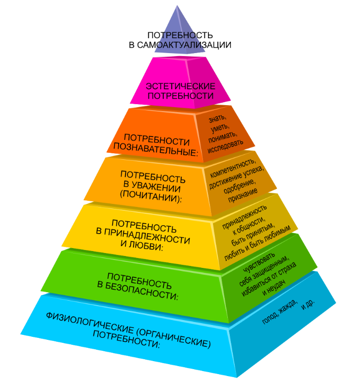
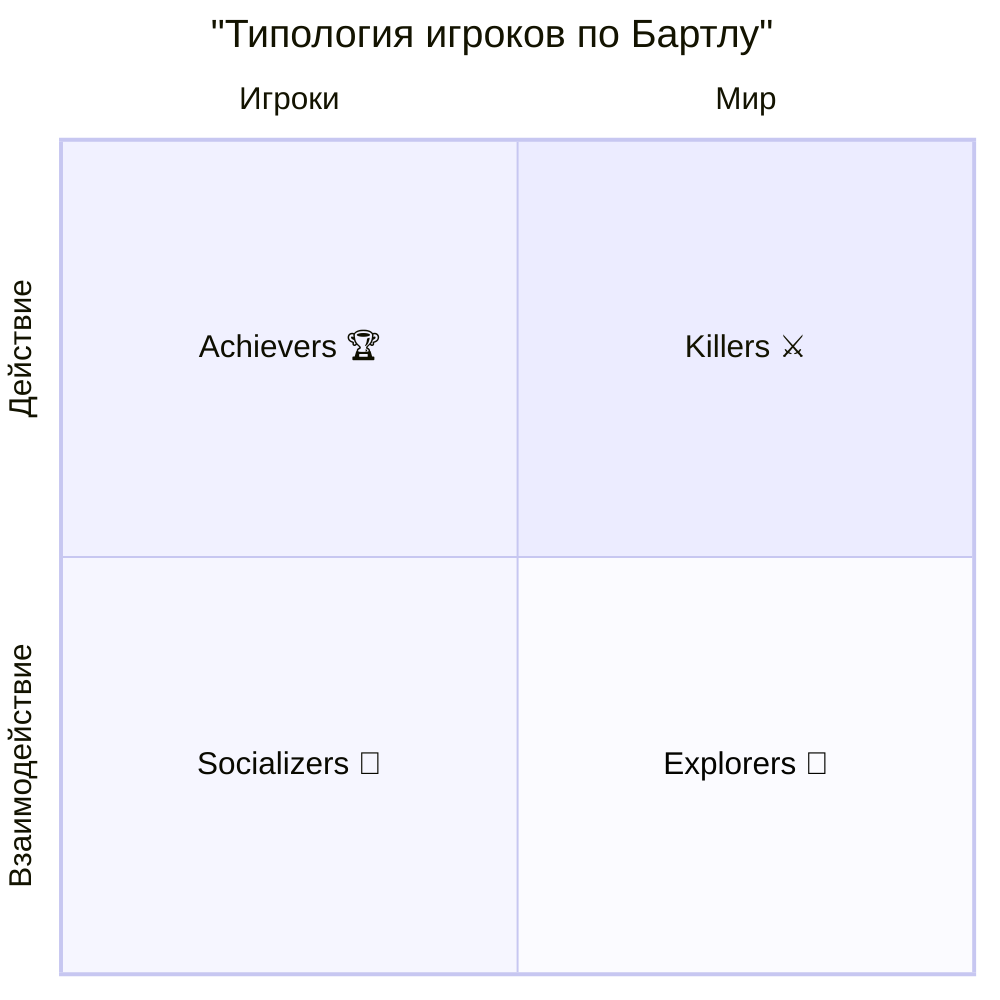
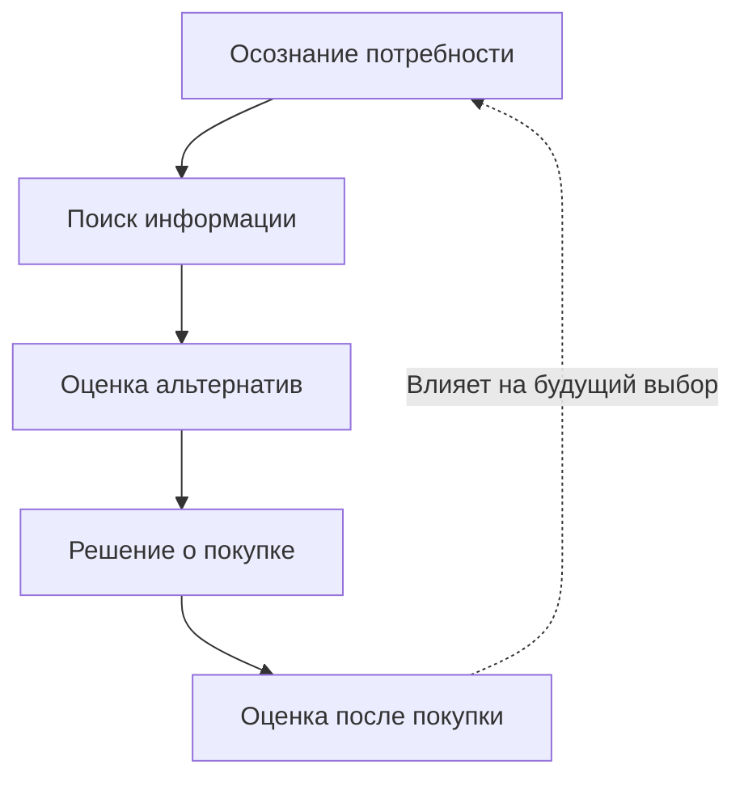
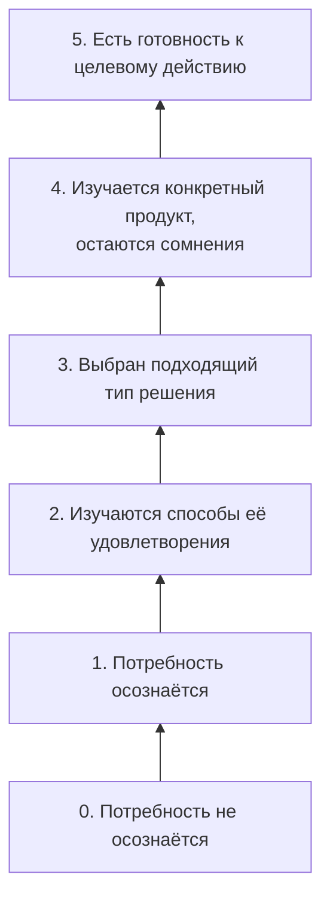
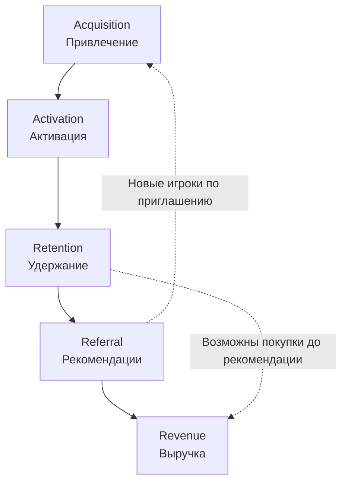

## Потребности и мотивация игроков

>[!Note]
>**Абрахам Маслоу** (1908–1970) — американский психолог, один из основателей гуманистической психологии. Он известен созданием иерархии потребностей, которая описывает, как люди постепенно переходят от удовлетворения базовых физиологических нужд к более высоким формам мотивации, таким как самоактуализация и творчество. Согласно Маслоу, потребности образуют пирамиду: нижние уровни должны быть в достаточной мере удовлетворены, прежде чем человек сможет двигаться к более высоким. Теория Маслоу оказала большое влияние на психологию, социологию, менеджмент и — в последние десятилетия — на геймдизайн.

### Потребности по Маслоу

В контексте видеоигр пирамида Маслоу помогает понять, какие мотивы побуждают игроков взаимодействовать с игровым миром. На нижних уровнях мы видим стремление к безопасности и контролю — игроку нужны понятные правила, возможность сохранений и предсказуемая логика. Средние уровни отражаются в социальном опыте и уважении: это командные игры, рейтинги, достижения, признание другими. На верхних уровнях находятся познание, эстетика и самоактуализация: исследование миров, наслаждение художественным стилем и музыка, создание собственных уровней или персонажей. Таким образом, игры становятся пространством, где человек может пройти через все ступени потребностей — от базового чувства контроля до реализации собственного творческого потенциала.

1. Физиологические потребности
    - Еда
    - Вода
    - Сон
    - Дыхание
    - Гомеостаз
    - Выделение
2. Потребности в безопасности
    - Личная безопасность
    - Финансовая безопасность
    - Здоровье и благополучие
    - Безопасность от несчастных случаев/катастроф
3. Социальные потребности
    - Принадлежность к общности
    - Потребность в принятии
    - Необходимость во взимной любви
4. Потребности в уважении
    - Самоуважение
    - Уважение со стороны других
    - Статус
    - Признание
    - Сила
5. Потребности позновательные
    - Потребность в знаниях
    - Потребность в понимании
6. Эстетические потребности
    - Красота
    - Баланс
    - Форма
7. Потребности в самоактуализации
    - Решение проблем
    - Принятие фактов
    - Творчество
    - Способность быть спонтанным
    - Отсутствие предрассудков
    - Принятие себя и других

### Система игровых удовольствий Ле бланка
>
>[!Note]
> **Марк Ле Бланк** — американский геймдизайнер и исследователь, один из авторов MDA-фреймворка (Mechanics–Dynamics–Aesthetics), разработанного в начале 2000-х годов. Его вклад особенно связан с концепцией “8 видов удовольствия от игр”, которая помогает описать, какие эмоции и опыт получают игроки от игрового процесса. Ле Бланк предложил рассматривать игру не только как набор правил и механик, но и как источник эмоционального отклика: фантазии, вызова, дружбы, открытия и самовыражения. Его подход широко используется в теории и практике геймдизайна для анализа, почему игры увлекают и удерживают людей.

Система игровых удовольствий Ле Бланка расширяет понимание мотивации игроков, показывая, что игры воздействуют не только через цели и победы, но и через эмоции, социальные связи и эстетику. В отличие от Маслоу, где речь идёт о потребностях человека в целом, Ле Бланк описывает, какие именно формы радости и вовлечённости игра способна подарить: от товарищества и открытия нового до самовыражения и фантазии. Это позволяет разработчикам видеть игру как многоуровневый опыт, где разные типы удовольствий сочетаются и усиливают друг друга, формируя уникальный игровой процесс.

1) Основные ощущения (эстетика)
2) Фантазия
3) Повествование (возможность выбора)
4) сложность (соответствие навыкам аудитории)
5) Товарищество
6) Открытие
7) Самовыражение (редактор уровня, персонажа, лобби)
8) Принятие

### Система игровых удовольствий по Бартлу*
>
>[!Note]
> **Ричард Бартл** (род. 1960) — британский исследователь и геймдизайнер, известный своей работой в области многопользовательских онлайн-игр (MMORPG). В 1996 году он разработал типологию игроков, классифицируя их на четыре основные категории: Ачиверы (достигатры), Социальщики, Исследователи и Убийцы (гриндеры). Эта классификация помогает понять различные мотивации и предпочтения игроков в виртуальных мирах. Работа Бартла оказала значительное влияние на дизайн игр, особенно в контексте создания более увлекательных и разнообразных игровых опытов для разных типов игроков.

Типология Бартла делит игроков по осям «действие ↔ взаимодействие» и «игрок ↔ мир», формируя четыре группы.

- Killers (Убийцы) ориентированы на действие против других игроков. Им важно доминирование, PvP, контроль и демонстрация силы. Они получают удовольствие от победы над соперниками и разрушения чужих успехов.

- Achievers (Достигаторы) стремятся к прогрессу, наградам и измеримым целям. Для них важны ачивки, уровни, рейтинги и коллекции. Удовольствие — в систематическом росте и преодолении вызовов.

- Socializers (Социальщики) находят главный интерес в взаимодействии с другими игроками. Для них ценны дружба, командная игра, коммуникация и комьюнити. Они часто становятся связующим звеном в игровом сообществе.

- Explorers (Исследователи) увлекаются изучением мира: они ищут секреты, тестируют механики, пробуют нестандартные пути. Их удовольствие — в открытии нового и глубоком понимании устройства игры.

Таким образом, модель Бартла помогает разработчикам понять, что аудитория неоднородна, и успешная игра должна учитывать интересы разных типов игроков, создавая баланс между соревнованием, исследованием, социальным опытом и прогрессом.

### Дополнительные Удовольствия*

- Ожидание
- Завершение
- Радость от чужого горя (наказание противника)
- Дарение (подарки приносят радость)
- Юмор
- Возможности (выбор)
- Гордость от достижения цели
- Сюрпризы (пасхалки)
- Трепет (страх - смерть = положительный трепет)
- Победа над обстоятельствами
- Удовольствие от созерцания чуда
- причастность к чему-то большему
- Похвала и одобрение
- Узнавание и приоткрытие занавеса
- Сопереживание
- Философия (экзистенциальные вопросы)
- Любовь, достижение любви и понимания
- Созерцание своих трудов

## Продвижение и маркетинг игры

Продвижение игры и развитие её аудитории можно рассматривать с трёх разных исследовательских позиций. Первая связана с тем, **как человек принимает решение** о выборе продукта; вторая — с тем, **насколько он осознаёт свою потребность и знаком с предложением**; третья — с тем, **какие действия он совершает внутри цифрового продукта**. Эти вопросы близки, но не тождественны. Поэтому модели Филипа Котлера, Бена Ханта и Дэйва Макклюра полезно изучать по отдельности, а не представлять как три названия одной воронки.

В лекции выбран следующий порядок: сначала модель потребительского решения Котлера как общая теоретическая основа, затем лестница осведомлённости Ханта, уточняющая состояние аудитории до выбора продукта, и, наконец, AARRR Макклюра как инструмент анализа поведения пользователя цифровой игры.

## 1. Модель Котлера: решение о покупке

### Теоретическая основа

Модель процесса принятия решения о покупке, представленная в работах Филипа Котлера и его соавторов, исходит из того, что приобретение продукта обычно имеет предысторию и последствия. Человек сначала обнаруживает потребность, затем получает информацию о возможностях её удовлетворения, оценивает альтернативы, принимает решение и после покупки соотносит полученный результат со своими ожиданиями. Таким образом, предметом анализа становится не отдельная транзакция, а процесс потребительского выбора. [worldsupporter](https://www.worldsupporter.org/en/summary/summary-principles-marketing-kotler-15th-edition-40203)

Эту модель нередко изображают в виде воронки. Такое изображение удобно для преподавания, однако требует оговорки: пять стадий описывают прежде всего **логику решения потребителя**, а не обязательную последовательность рекламных касаний или набор готовых количественных метрик. В действительности поиск информации может быть кратким, некоторые стадии — почти незаметными, а оценка продукта способна продолжаться и после принятого решения. 

*Описание схемы.* Сплошные стрелки обозначают аналитическую последовательность стадий: от возникновения потребности до оценки приобретённого продукта. Пунктирная стрелка показывает, что опыт не исчезает после покупки: удовлетворённость или разочарование могут повлиять на следующий выбор. Схема не утверждает, что каждый человек обязательно проходит все стадии с одинаковой длительностью. 

### Разбор стадий на примере игры

Представим человека, который хочет провести несколько вечеров за сюжетной игрой. На стадии **осознания потребности** он формулирует желаемый опыт: ему нужны история, исследование мира и возможность играть одному. Предметом потребности здесь выступает не конкретное название, а определённый способ проведения досуга.

На стадии **поиска информации** потенциальный игрок смотрит трейлеры, читает описания, изучает отзывы или спрашивает совета у знакомых. Затем наступает **оценка альтернатив**: он сопоставляет игры по жанру, продолжительности, стилю повествования, техническим требованиям и цене. Различие между этими двумя стадиями состоит в том, что поиск расширяет круг известных вариантов, а оценка помогает выбрать между ними. 

**Решение о покупке** выражается в выборе и приобретении конкретной игры. Однако для игровой индустрии этот пункт нельзя без оговорок заменить словом «установка»: если игра распространяется бесплатно, начало игры и платёж оказываются разными действиями. После приобретения начинается **оценка опыта** — игрок выясняет, соответствуют ли механики, сюжет и качество исполнения сформированным ожиданиям. Эта оценка может отразиться на его дальнейшем отношении к игре и будущих решениях о покупке. 

Ценность модели Котлера для геймдизайна и игрового маркетинга состоит в том, что она заставляет изучать не только момент продажи, но и происхождение ожиданий игрока. Если рекламное обещание и реальный игровой опыт существенно расходятся, успешное привлечение внимания ещё не означает положительной оценки продукта.

## 2. Лестница Ханта: осведомлённость аудитории

### Теоретическая основа

Если модель Котлера описывает структуру решения, то лестница Бена Ханта фокусируется на другом вопросе: **что человек уже знает о своей потребности, возможных способах её удовлетворения и конкретном продукте?** Уровень этой осведомлённости влияет на то, какая информация окажется для него своевременной. Подробное предложение приобрести продукт может быть полезным человеку, который уже сравнивает варианты, но преждевременным для того, кто ещё даже не задумывался о таком выборе.

С исторической точки зрения важно соблюдать точность атрибуции. Представление об уровнях осведомлённости аудитории связано также с более ранними работами Юджина Шварца; поэтому лестницу Ханта корректнее рассматривать как одно из последующих практических изложений и применений этой логики, а не как первоначальное открытие самой идеи. В учебных и профессиональных материалах встречаются разные способы именования и группировки ступеней; ниже используется вариант с уровнями **от 0 до 5**.

*Описание схемы.* Движение снизу вверх показывает увеличение осведомлённости: от отсутствия сформулированного запроса до готовности действовать. Схема служит для **сегментации аудитории**, а не для утверждения, что каждый человек обязательно поднимается по одной ступени за раз. В частности, интерес к игре может возникнуть спонтанно, без длительного поиска и сравнения. 

### Разбор ступеней на примере игры

Представим продвижение кооперативной игры, рассчитанной на короткие совместные сессии. На **нулевой ступени** человек не ищет новую игру и не формулирует соответствующую потребность. Рекламное сообщение, подробно описывающее стоимость внутриигровых предметов, едва ли отвечает на вопрос, которого у него пока нет.

На **первой ступени** появляется запрос: человек хотел бы проводить время с друзьями онлайн, но ещё не определился, каким способом. На **второй** он рассматривает возможные решения — видеозвонки, настольные игры в цифровом формате, кооперативные видеоигры. На **третьей** он уже решил попробовать именно короткие кооперативные игровые сессии и начинает искать подходящие варианты.

На **четвёртой ступени** пользователь знаком с конкретной игрой, но сомневается: удобно ли подключаться друзьям, сколько длится матч, потребуется ли сложное обучение? Здесь содержательный показ игрового процесса отвечает на вопрос точнее, чем абстрактное обещание «незабываемых впечатлений». На **пятой ступени** намерение сформировано, а задача коммуникации — не мешать действию: ясно показать, где доступна игра и как начать играть. В случае free-to-play-проекта таким действием может стать **установка**, а не покупка. 

Лестница Ханта полезна тогда, когда необходимо проектировать разные сообщения для аудиторий с разным уровнем знакомства с игрой. Вместе с тем она не заменяет исследование реального поведения: из факта просмотра трейлера нельзя автоматически заключить, на какой именно «ступени» находится человек.

## 3. Модель Макклюра: AARRR

### Теоретическая основа

Модель AARRR, предложенная Дэйвом Макклюром для анализа цифровых продуктов, переносит акцент с предполагаемого процесса размышления пользователя на **наблюдаемые действия и измеримые переходы**. Её название образовано начальными буквами пяти направлений: *Acquisition* — привлечение, *Activation* — активация, *Retention* — удержание, *Referral* — рекомендации и *Revenue* — выручка. В первоначальных материалах Макклюра модель описывает жизненный цикл пользователя и побуждает определить значимые события и показатели конверсии для каждого направления. 

AARRR особенно удобна для цифровых игр потому, что установка, первый положительный опыт, повторные игровые сессии, рекомендации и получение выручки могут быть зафиксированы как разные события. При этом модель **не была создана специально для игровой индустрии**: игровые примеры ниже представляют её адаптацию к анализу игрового продукта. 

*Описание схемы.* Основная цепочка сохраняет порядок букв в названии AARRR. Пунктирная связь от рекомендаций к привлечению показывает возможный приток новых игроков. Связь от удержания к выручке напоминает, что диаграмма не задаёт обязательный порядок каждого индивидуального действия: игрок может совершить покупку, ни разу никого не пригласив. Более того, некоторые пользователи не платят вовсе, а отдельные модели монетизации получают выручку не только от прямых покупок. 

### Разбор этапов на примере игры

**Acquisition — привлечение.** Пользователь узнаёт об игре через рекламу, публикацию автора контента или приглашение друга и переходит к её установке. Здесь важно заранее определить, что именно проект считает событием привлечения: просмотр страницы магазина, установку или первый запуск. Без такого определения данные разных команд и кампаний будет трудно сопоставлять.

**Activation — активация.** Игрок получает первый опыт, в котором становится понятна ценность игры. Например, недостаточно просто запустить приложение и пролистать обучение: для кооперативной игры более содержательным признаком активации может быть завершение первого совместного задания. Выбор такого события зависит от устройства конкретного продукта; универсального «aha-момента» для всех игр не существует. Идея оценивать качество первого опыта, а не только факт посещения, занимает важное место в описании активации у Макклюра. 

**Retention — удержание.** Игрок возвращается после первой сессии и продолжает взаимодействовать с игрой. Команда может анализировать долю пользователей, вернувшихся на следующий день, через неделю или позже, однако выбранные интервалы и правила подсчёта необходимо явно фиксировать. Иначе одинаково названные показатели могут описывать разные явления.

**Referral — рекомендации.** Игрок приглашает знакомого, отправляет ссылку или делится игрой иным способом. При анализе важно различать сам факт отправки приглашения и результат: пришёл ли по нему новый пользователь. Макклюр рассматривает рекомендации как отдельное направление роста, связанное с положительным пользовательским опытом. 

**Revenue — выручка.** Игра получает доход от поведения пользователей: например, от продажи косметических предметов, боевого пропуска или подписки. В игровом анализе полезно различать саму первую покупку и размер выручки: это взаимосвязанные, но не одинаковые показатели. В free-to-play-игре платёж обычно не является условием входа в продукт, поэтому его нельзя механически приравнять к установке. 

Эти три модели отвечают на разные исследовательские вопросы. Котлер объясняет **структуру потребительского решения**, Хант — **уровень осведомлённости перед действием**, Макклюр — **измеримые события жизненного цикла пользователя**. Их совместное применение помогает связать ожидания человека с его первым игровым опытом и дальнейшим поведением, не смешивая психологическое объяснение выбора с продуктовой аналитикой.

### Психологические триггеры, которые заставляют геймеров платить
- *FOMO (Страх упущенной выгоды):* Ограниченные по времени события (ивенты) или сезонные боевые пропуска заставляют заходить в игру каждый день и совершать импульсивные покупки, пока товар не исчез.
- *Эффект обладания (Endowment Effect):* Чем больше времени игрок тратит на прокачку персонажа или обустройство виртуальной базы, тем выше ценность этой игры для него. Ему становится психологически сложно бросить игру, и он легче тратит деньги.
- *Кастомизация и самовыражение:* Покупка скинов (одежды, оружия) не дает преимуществ в игре, но закрывает социальную потребность «выделиться в толпе» и показать свой уникальный стиль.
- *Жажда дофамина (Эффект казино):* Лутбоксы (коробки со случайным призом) используют механику переменного вознаграждения. Ожидание редкого приза вызывает мощный всплеск дофамина, побуждая покупать еще.

