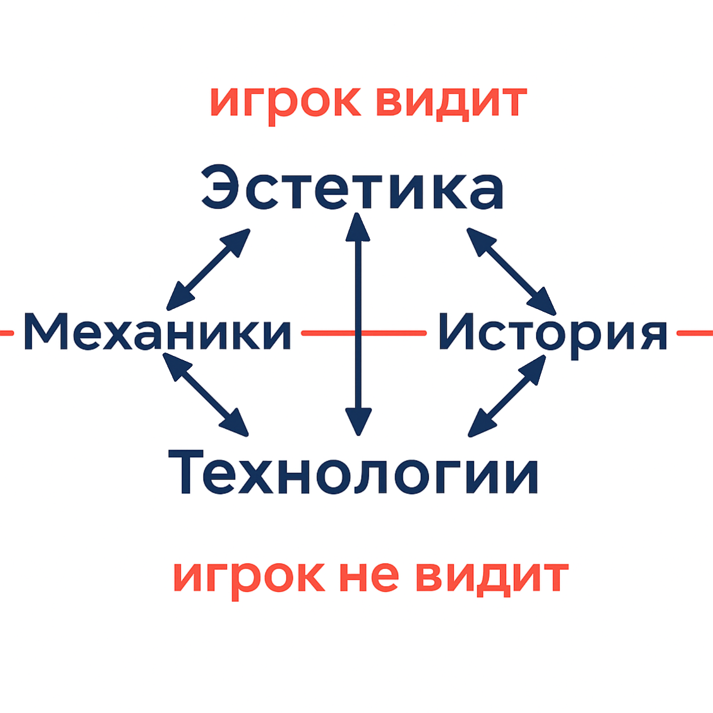

# Game Design

**Game design** is the process of creating a game, which includes developing rules, structure, goals, and gameplay mechanics. Its main task is to create an experience that engages players emotionally, keeps their interest, and makes them want to return to the game.

## Role of the **Game Designer**

A game designer is a specialist who makes decisions not only about the rules of the game, but also about its aesthetics, dynamics, controls, and even the business model. They are responsible for balancing artistic vision, technical possibilities, and commercial goals.

> [!Note]
> **Gameplay experience** is the set of emotions and impressions a player receives while interacting with the game. This is the ultimate goal of design.

## Core Competencies of a Game Designer

### 1. Management and Communication Skills

* Organizing processes (planning, task management, brainstorming).
* Presenting ideas clearly (public speaking, clear communication).

**Why it matters:**
Without these skills, ideas stay on paper. Game designers often act as the bridge between programmers, artists, and managers.

> [!Tip]
> The ability to present ideas is crucial: it’s not enough to come up with a fun mechanic, you also need to convince the team that it’s worth building.

### 2. Artistic Disciplines

* Basics of visual art (sketching, 3D modeling).
* Understanding animation and interface design.
* Drawing inspiration from literature, film, and music.

**Why it matters:**
A game is a visual and audio work. Atmosphere and aesthetics directly affect how emotionally invested the player becomes.

> [!Important]
> Even a simple mechanic can shine when presented in an expressive artistic form. Example: “Flappy Bird” — a minimalist game with basic mechanics but striking visual and audio presentation.

### 3. Humanities and Social Sciences

* Psychology (motivation, player behavior).
* Anthropology and ethnography (understanding cultural differences).
* Philosophy and logic (building coherent systems).
* Economics and business (monetization, project sustainability).

**Why it matters:**
Games reflect society and culture. Understanding people and their motivations helps create not just mechanics, but entire worlds players want to live in.

### 4. Technical Foundation

* Knowledge of game engines (Unity, Unreal, Godot).
* Basics of programming (to understand the team’s limits).
* Technical documentation (Game Design Document, technical requirements).
* Prototyping (testing ideas before implementation).

**Why it matters:**
Even the most creative idea is worthless if it can’t be implemented. A technical foundation lets a designer propose realistic solutions.

> [!WARNING]
> Lack of technical knowledge often leads to “impossible” ideas and conflicts within the team.

### 5. Scientific Knowledge

* Math and statistics — balancing, probabilities, random event generation.
* Physics, chemistry, biology — creating believable worlds.
* Geography and astronomy — understanding space, important for maps and universes.

**Why it matters:**
Even fictional worlds must follow internal logic, otherwise players won’t believe in them.

> [!Tip]
> In the “Minecraft” series, block physics are simplified, but internally consistent. This makes the world convincing.

### 6. Creativity and Personal Experience

* Creativity (combining familiar elements into something new).
* Originality (creating entirely new ideas).
* Wide gaming literacy (genres, mechanics, traditions).
* Personal life experience.

**Why it matters:**
Game design is art as much as it is engineering. Creativity and lived experience make a game stand out from hundreds of others.

> [!Important]
> The player’s experience is the ultimate result of the game designer’s work. All knowledge and skills serve this purpose.

## Summary

Game designer competencies can be grouped into six blocks:

1. Management and communication skills.
2. Artistic disciplines.
3. Humanities and social sciences.
4. Technical foundation.
5. Scientific knowledge.
6. Creativity and personal experience.

**Conclusion:** a game designer is a multidisciplinary professional. They combine traits of a manager, artist, engineer, and researcher. Only such a synthesis allows the creation of games that are not just entertainment, but meaningful cultural experiences.

**Principles of Game Design:**

1. “I make games for people like me.”  
   - You can’t be sure others share your tastes.  
   - No defined target audience.  
   - The bigger the team, the harder it is to align opinions.  
     + But this allows something truly unique to be created.

2. “Personal opinion alone can’t be trusted.”  
   - Constant playtesting is impossible.  
   - You can’t please everyone.  
   - True evaluation is only possible at the end of development.  
     + This opens the door to capturing a large audience.

3. Combining both principles.  
   - Together, they balance out each other’s weaknesses.

## How to Create Game Experiences

1. Keep a personal diary and analyze:  
   - Write down emotions and impressions from real life.  
   - Analyze what exactly caused them.  
2. Add subtle atmospheric elements to games:  
   - Sounds, music, visual effects.  
   - Small details that make the world feel alive.  
   - Easter eggs, references, hidden bonuses.  
3. Pay attention to everything around you in daily life.  
4. Practice describing and recording scenes in the moment.  
5. Learn from others’ experiences:  
   - Read books, watch films, play games.  
   - Analyze what makes them engaging.

### Brainstorming

> [!Note]
> **Brainstorming** is a method of generating ideas where participants freely share any thoughts without criticism. The goal is to create as many options as possible.

*Tips for effective brainstorming:*
- Write down all ideas, even strange ones.
- Don’t criticize during the generation stage.
- Use a large sheet or board to visualize ideas.
- Make quick sketches or diagrams.  
- Use props (toys, models, figurines).  
- Change environments (outdoors, cafés).  
- Assign someone to record everything.  
- Add humor and silly ideas.  
- Look for inspiration in other fields.  
- Challenge all assumptions.  
- Mix and match categories.  
- Talk to a “smart person” (even yourself).  
- Keep team spirit high.  
- Organize sessions properly.  
- Let go of bad ideas quickly.  
- Avoid overly pedantic or narrow-minded participants.

*Filters for selecting ideas:*
- Artistic appeal (does it feel right?).  
- Technical feasibility.  
- Fit with the target audience.  
- Innovation.  
- Business and marketing value.  
- Budget and deadlines.  
- Social impact.  
- Playtesting results.

### What a Game is Made Of

> [!Note]
> **A game** is a system where the player interacts with a set of rules and mechanics to achieve goals, while also experiencing fun and emotion.

A game consists of 4 main components:
1. Technology (engine and platform)  
2. Aesthetics (graphics and design)  
3. Story (narrative)  
4. Mechanics (rules and actions)  
    

**Space Invaders** (1978) — a landmark shooter and one of the first commercially successful video games.  

*Technology*: 2D graphics, simple sound effects, joystick and button controls. It was the first game where enemies moved across the screen in formation.  

*Aesthetics*: pixel art, simple shapes and colors, minimalist design. Originally black and white, later colored overlays were added. The sound mimicked a heartbeat to build tension.  

*Story*: a short world description printed on the arcade cabinet: the player defends Earth from alien invaders. The original story was more violent, but censored.  

*Mechanics*: the player shoots aliens descending from the top. Features include shields, scoring points for kills, and increasing difficulty with each level. Losing means aliens reach and destroy Earth.
