# Target Audience
>[!Note]
>The target audience is the group of people a product, service, or marketing campaign is aimed at. Understanding your audience helps companies create better strategies and offers that match their needs and preferences. In our case, this means the people who will play the game — our players.

## Age Distribution
### 0–3 Years
Infants and toddlers just starting to explore the world.  
**Leading activity type:** *object-tool*. They explore through manipulating objects. They value tangible toys like gamepads and touchscreens.

### 4–6 Years
Preschoolers developing social skills and imagination.  
First interest in games appears, often playing with parents. Cooperative play with adults starts breaking down.  
**Leading activity type:** *role-play*. They begin to understand good vs. evil, imagination develops. Story-based and role-playing games are important. They also form early symbolic thinking, imagination, and strong curiosity.

### 7–9 Years
The “why?” stage. Kids ask many questions, trying to understand the world.  
**Leading activity type:** *learning*. They develop real interest in games and start to evaluate them critically. They gain reflection skills, recognizing their own emotions, and begin theoretical and symbolic thinking.

### 10–13 Years
They can grasp more complex concepts and develop personal interests. Known as the age of obsession. Relationships shift, peer groups form based on common interests.  
**Leading activity type:** *communication*. Interest in multiplayer and team games grows. Abstract and critical thinking develops. Personal self-awareness strengthens.

*At 12–15 years, social activity expands further.*

### 13–18 Years
Teenagers prepare for adult life. Boys focus on competition and strength; girls on communication and life questions.  
They experiment with new experiences and often gain financial independence. Peer groups become central. They begin professional self-identification and acquiring knowledge and skills. Value systems form.

### 18–24 Years
Young adults. Teenage experiments end, more time and money appear.

### 25–35 Years
Time becomes valuable. Family formation. They choose games carefully to avoid wasting time. Casual games dominate. Many become hobbyist players.

### 36–50 Years
Family maturity. Many leave games behind, but often play with children, choosing family-friendly games.

### 50+ Years
Some return to games they enjoyed in youth; others seek new experiences. This group continues to grow.

## Gender Distribution
### Men
1. Mastery — enjoy learning new skills.  
2. Competition — proving superiority.  
3. Destruction — like breaking the world.  
4. Spatial puzzles.  
5. Trial and error — rarely read instructions, prefer experimenting, need simple interfaces.  
6. Strategy and building.  

### Women
1. Emotions — depth of emotional experience matters.  
2. Real world links.  
3. Caring — most healers in games are women.  
4. Dialogues and word puzzles.  
5. Learning from examples — appreciate guidance. Clear goals + micro-goals.  
6. Multitasking — women can multitask more easily than men.  
7. Hidden object games.  
8. Team games with clear rules.  

### Common Traits
Games provide emotional aspects missing from daily life, so players seek them in games.

<!-- Gender distribution statistics in games 2025: to be added -->
| Genre             | Men | Women |
|-------------------|-----|-------|

## Player Needs and Motivation
>[!Note]  
>**Abraham Maslow** (1908–1970) — American psychologist, one of the founders of humanistic psychology. Famous for his hierarchy of needs, describing how people move from basic physiological needs to higher motivations like self-actualization and creativity. Lower levels must be satisfied before moving up. This theory has strongly influenced psychology, sociology, management — and in recent decades, game design.

```mermaid
graph TD
A[Self-actualization 🎨] --> B[Aesthetics 🎶]
B --> C[Cognitive Needs 🧠]
C --> D[Esteem 🏆]
D --> E[Social Needs 🤝]
E --> F[Safety 🛡️]
F --> G[Physiology 🍔]
```

### Needs According to Maslow

In video games, Maslow’s pyramid helps explain what motivates players. At the bottom, safety and control: clear rules, save systems, predictable logic. Middle levels: social experience and esteem — team games, rankings, achievements, recognition. Higher levels: knowledge, aesthetics, self-actualization — exploring worlds, enjoying art and music, creating levels or characters. Games become a space where players can climb all steps — from control to creative expression.

1. Physiological needs: food, water, sleep, breathing, homeostasis, excretion.  
2. Safety needs: personal safety, financial stability, health, accident protection.  
3. Social needs: belonging, acceptance, mutual love.  
4. Esteem needs: self-respect, respect from others, status, recognition, power.  
5. Cognitive needs: knowledge, understanding.  
6. Aesthetic needs: beauty, balance, form.  
7. Self-actualization: problem solving, acceptance, creativity, spontaneity, lack of prejudice, acceptance of self and others.  

## Marc LeBlanc’s System of Game Pleasures
>[!Note]  
> **Marc LeBlanc** — American game designer and researcher, co-creator of the MDA framework (Mechanics–Dynamics–Aesthetics). He introduced the concept of “8 kinds of fun,” describing emotions and experiences games can provide. His work helps analyze why games captivate and retain players.

LeBlanc’s system expands understanding of motivation by showing that games engage not only through goals and victories but also through emotions, social ties, and aesthetics. Unlike Maslow, which looks at human needs in general, LeBlanc focuses on the types of joy and engagement unique to games: camaraderie, discovery, self-expression, fantasy. This helps developers view games as multi-layered experiences.

1. Sensation (aesthetics).  
2. Fantasy.  
3. Narrative (choice-driven).  
4. Challenge (matching skills to difficulty).  
5. Fellowship.  
6. Discovery.  
7. Expression (level editors, character customization).  
8. Submission/immersion.  

## Bartle’s Player Types
>[!Note]  
> **Richard Bartle** (b. 1960) — British researcher and game designer, famous for his work on MMORPGs. In 1996, he introduced a player taxonomy with four categories: Achievers, Socializers, Explorers, Killers. It explains motivations and preferences in virtual worlds and has deeply influenced online game design.

Bartle’s model divides players along two axes: “acting ↔ interacting” and “players ↔ world,” forming four groups:

- **Killers** focus on acting against others. They want dominance, PvP, power, and showing strength. They enjoy defeating rivals and ruining others’ progress.  
- **Achievers** seek progress, rewards, measurable goals. They value achievements, levels, rankings, collections. Fun comes from steady growth and overcoming challenges.  
- **Socializers** are motivated by interaction with others: friendship, teamwork, communication, community. They often become community hubs.  
- **Explorers** love studying the world: finding secrets, testing mechanics, experimenting. Their fun comes from discovery and deep understanding.  

Thus, Bartle’s model shows that audiences are diverse. Successful games balance competition, exploration, social play, and achievement.

```mermaid
quadrantChart
    title "Bartle's Player Types"
    x-axis "Players" --> "World"
    y-axis "Acting" --> "Interacting"
    quadrant-1 "Achievers 🏆"
    quadrant-2 "Explorers 🧭"
    quadrant-3 "Socializers 💬"
    quadrant-4 "Killers ⚔️"
```

## Additional Pleasures
- Anticipation.  
- Completion.  
- Schadenfreude (enjoying enemy punishment).  
- Gift-giving.  
- Humor.  
- Choice.  
- Pride in achievements.  
- Surprises (Easter eggs).  
- Awe (fear turned to thrill).  
- Overcoming adversity.  
- Wonder and miracles.  
- Belonging to something greater.  
- Praise and approval.  
- Recognition and revelation.  
- Empathy.  
- Philosophy and existential reflection.  
- Love and understanding.  
- Watching your own creations.
