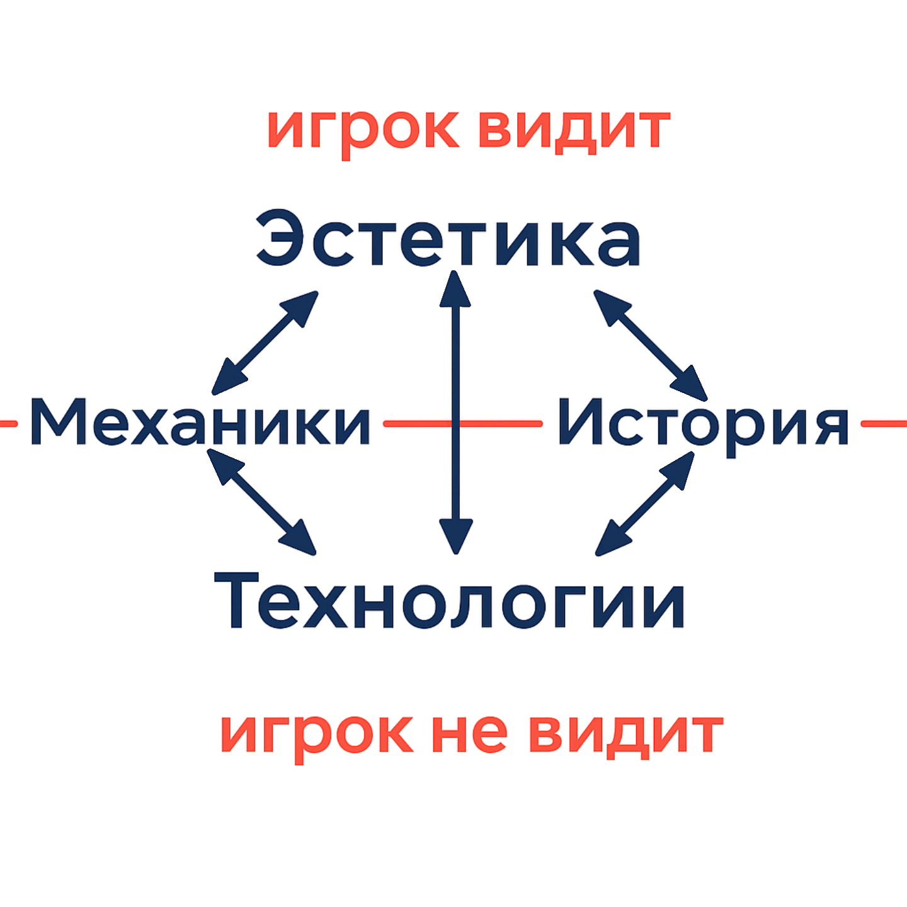

# Game Design

**Game design** — это процесс проектирования игры, включающий разработку правил, структуры, целей и игровых механик. Его главная задача — создание опыта, который вызывает у игрока эмоциональную вовлечённость, интерес и желание возвращаться в игру.

## Роль **Game Designer**

Геймдизайнер — это специалист, который принимает решения не только по поводу правил игры, но и по её эстетике, динамике, управляемости и даже по бизнес-модели. Он отвечает за баланс между художественным замыслом, техническими возможностями и коммерческими целями проекта.

> [!Note]
> **Игровой опыт** — это совокупность эмоций и впечатлений, которые получает игрок во время взаимодействия с игрой. Именно ради этого создаётся весь дизайн.

## Компетенции геймдизайнера

### 1. Управленческие и коммуникативные навыки

* Организация процесса (планирование, управление задачами, мозговые штурмы).
* Умение доносить идеи (ораторское мастерство, чёткая коммуникация).

**Почему это важно:**
Без этих навыков идеи остаются нереализованными. Геймдизайнер часто является связующим звеном между программистами, художниками и менеджерами.

> [!Tip]
> Навык презентации идей — ключевой: важно не только придумать интересную механику, но и убедить команду, что её стоит реализовать.

### 2. Художественные дисциплины

* Основы изобразительного искусства (скетчи, 3D-моделирование).
* Понимание анимации и дизайна интерфейсов.
* Использование наработок литературы, кинематографа и музыки.

**Почему это важно:**
Игра — это визуально-звуковое произведение. Атмосфера и эстетика напрямую влияют на эмоциональную вовлечённость игрока.

> [!Important]
> Даже простая механика может зацепить, если она подана в выразительной художественной форме. Пример: «Flappy Bird» — минималистичная игра с простейшей механикой, но яркой визуальной и звуковой подачей.

### 3. Гуманитарные и социальные науки

* Психология (мотивация, поведение игроков).
* Антропология и этнография (понимание культурных различий).
* Философия и логика (построение игровых систем).
* Экономика и бизнес (монетизация, устойчивость проекта).

**Почему это важно:**
Игры отражают общество и культуру. Понимание людей и их мотивации помогает создавать не просто механики, а полноценные миры, в которых игроку интересно жить.

### 4. Техническая база

* Знание игровых движков (Unity, Unreal, Godot).
* Основы программирования (чтобы понимать ограничения команды).
* Техническая документация (Game Design Document, техническое задание).
* Моделирование (тестирование идей до их реализации).

**Почему это важно:**
Даже самая креативная идея не имеет ценности, если её невозможно реализовать. Техническая база позволяет геймдизайнеру предлагать решения, которые реально воплотить в жизнь.

> [!WARNING]
> Отсутствие технических знаний у геймдизайнера приводит к «невыполнимым» идеям и конфликтам в команде.

### 5. Научные знания

* Математика и статистика — расчёт баланса, вероятностей, генерации случайных событий.
* Физика, химия, биология — основа для создания достоверных игровых миров.
* География и астрономия — понимание устройства пространства, что важно для карт и вселенных.

**Почему это важно:**
Даже вымышленные миры должны подчиняться внутренней логике, иначе игрок не поверит в них.

> [!Tip]
> В серии игр «Minecraft» физика блоков упрощена, но сохраняет внутреннюю последовательность. Это делает мир убедительным для игрока.

### 6. Творчество и личный опыт

* Креативность (соединение знакомых элементов в новое).
* Творчество (создание принципиально новых идей).
* Массовая насмотренность в играх (жанры, механики, традиции).
* Личный жизненный опыт.

**Почему это важно:**
Геймдизайн — это искусство, а не только инженерия. Опыт и креативность делают игру уникальной, отличающейся от сотен других.

> [!Important]
> Опыт игрока — главный результат работы геймдизайнера. Все знания и навыки подчинены этой цели.

## Обобщение

Компетенции геймдизайнера можно сгруппировать в шесть блоков:

1. Управленческие и коммуникативные навыки.
2. Художественные дисциплины.
3. Гуманитарные и социальные науки.
4. Техническая база.
5. Научные знания.
6. Творчество и личный опыт.

**Вывод:** геймдизайнер — это универсальный специалист, находящийся на стыке дисциплин. Он совмещает управленца, художника, инженера и исследователя. Только такой синтез позволяет создавать игры, которые становятся не просто развлечением, а значимым культурным опытом.

**Принципы геймдизайна:**

1."Я делаю игры для таких же людей, как я".
 - Нельзя быть уверенным что твои вкусы разделяют
 - Нет целевой аудитории
 - Чем больше команда тем сложнее совместить мнения
    + Возможность создать нечто уникальное

2."Личному мнению доверять нельзя".  
 - невозможно постоянно делать плейтесты
 - нельзя угодить всем
 - невозможно оценить до окончания разработки
    + Захват большой аудитории

3.Совмещение первых двух принципов.
- эти принципы вместе взаимоисключают минусы друг друга

## Как создавать игровой опыт
1. Ведение личного дневника и анализ
 - Записывать свои эмоции и впечатления в жизни
 - Анализировать что именно вызвало эти эмоции
2. Добавление в игры незаметных элементов создающих атмосферу
 - Звуки, музыка, визуальные эффекты
 - Маленькие детали которые делают мир живым
 - Пасхалки/отсылки/плюшки
3. В жизни обращать внимание на все подряд
 - Поведение людей, их реакции
4. Учится описывать и записывать сцены в текущий момент
5. Использовать чужой опыт
 - Читать книги, смотреть фильмы, играть в игры
 - Анализировать что именно в них цепляет

### Мозговой штурм

> [!Note]
> **Мозговой штурм** — это метод генерации идей, при котором участники свободно высказывают любые мысли и предложения без критики и оценки. Цель — создать как можно больше вариантов решений.

*Советы для эффективного мозгового штурма:*
- Записать все идеи, даже самые странные.
- Не критиковать и не оценивать предложения на этапе генерации.
- Большой лист бумаги или доска для визуализации идей.
- Делать быстрые наброски или схемы, скетчи
- Использовать все мягкие игрушки/модельки/фигурки для визуализации идей
- не обязательно думать в офисе, можно выйти на улицу, в парк, кафе
- Кто-то один обязательно должен все записывать
- Добавить юмор, глупые идеи
- искать вдохновение и других областях
- уничтожать все возможные утверждения
- смешивать и сочетать категории
- Разговаривать с умным человеком(самим собой)
- Поддерживать командный настрой
- Правильно организовывать сие действо
- Отпускать идеи, если они неудачные
- не брать педантичных и людей с дурным вкусом

Фильтры для отсеивания идей:
- Художественное чутье(делать что нравится)
- Техническая реализуемость
- Соответствие целевой аудитории
- Наличие инновации
- Бизнес и маркетинг
- Бюджет и сроки
- Социальный вопрос
- Плейтесты

### Из чего состоит Игра

> [!Note]
> **Игра** - это система, в которой игрок взаимодействует с набором правил и механик для достижения определённых целей, получая при этом удовольствие и эмоциональный опыт.

Игра состоит из 4 основных компонентов:
1. Технология (движок и платформа) 
2. Эстетика (графика и дизайн)
3. История (сюжет и повествование)
4. Механика (правила и действия)
    

**Space Invaders**(1978) - игра, которая положила начало жанру шутеров и стала одной из первых коммерчески успешных видеоигр. 

*Технология*: 2D графика, простые звуковые эффекты, управление с помощью джойстика и кнопок. первая игра где враги движутся по экрану, для автоматизации была сделана матрица.

*Эстетика*: пиксельная графика, простые формы и цвета, минималистичный дизайн. изначально игра была черно-белой, но были добавлены цветные фильтры, после того как на экран поклеили цветные пленки. Звук был сделан под сердцебиение, чтобы усилить атмосферу.

*История*: красткая история мира была описана сбоку автомата, игрок защищает землю от инопланетных захватчиков. Изначальная версия истории была более кровожадной, но из-за цензуры была смягчена.

*Механика*: игрок отстреливается от инопланетян, которые движутся вниз по экрану. механика щита, получение баллов за уничтожение врагов, увеличение сложности с каждым уровнем. при проигрыше пришельцы достигают земли и уничтожают её.