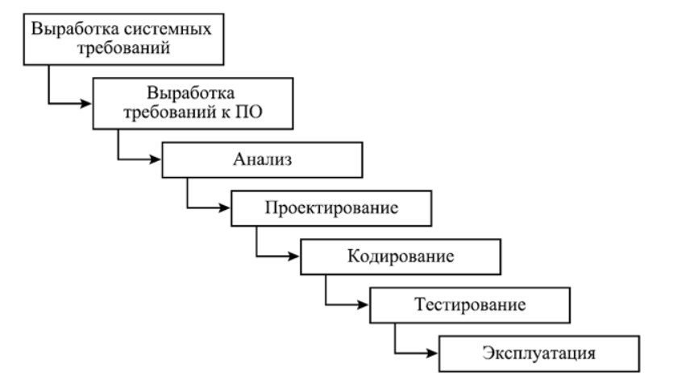
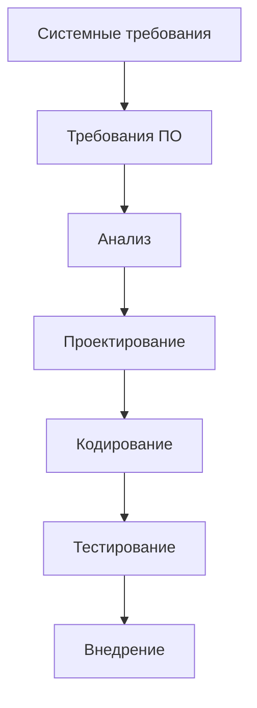
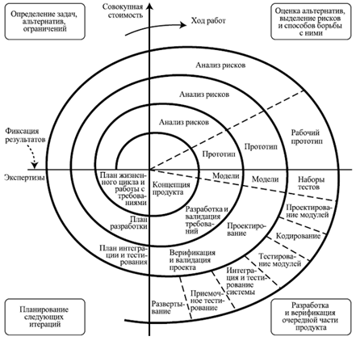
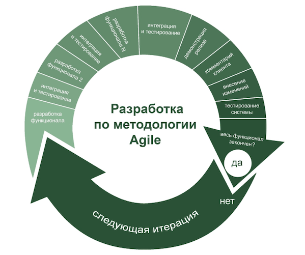

# Создание любого программного обеспечения

## Введение
Разработка программного обеспечения (ПО) — это не только написание кода, но и целая система подходов и методологий. От выбора подхода зависит эффективность команды, качество продукта и возможность адаптации к изменениям.  

Для геймдизайнера знание этих моделей важно потому, что игры разрабатываются так же, как и любое другое ПО — но с дополнительной сложностью: эмоциональным и художественным содержанием. Одни студии используют классические методологии (например, **Waterfall** в AAA-проектах), другие — гибкие (например, **Agile** в мобильных и live-service играх).  

## Виды разработки ПО:
1. **Водопад (Waterfall)**
   - Чёткий план, этапы, сроки  
   - Подходит для проектов с ясными требованиями  
   - **Минусы**: сложно вносить изменения, риск ошибок на поздних этапах  

2. **Гибкая разработка (Agile)**
   - Итеративный процесс, частые релизы  
   - Подходит для проектов с изменяющимися требованиями  
   - **Минусы**: требует высокой дисциплины, может быть хаотичной без хорошего управления  

3. **Scrum**
   - Подвид Agile, с чёткими ролями и ритуалами  
   - Подходит для команд, которые хотят структурировать Agile  

4. **Kanban**
   - Визуализация задач на доске, непрерывный поток работы  
   - Подходит для команд с постоянным потоком задач  

5. **DevOps**
   - Интеграция разработки и эксплуатации  
   - Подходит для проектов с частыми релизами и необходимостью высокой доступности  
   - **Минусы**: требует высокой автоматизации и культуры сотрудничества  

6. **Спиральная модель (Spiral Model)**
   - Риск-ориентированные итерации (циклы)  
   - Каждый цикл включает цели, анализ и снижение рисков, разработку/валидацию и планирование следующей итерации  
   - **Минусы**: сложность управления, стоимость, требуется опытная команда  

7. **RAD (Rapid Application Development)**
   - Быстрая разработка с использованием прототипов  
   - Подходит для проектов с жёсткими сроками  
   - **Минусы**: может привести к недостаточной проработке архитектуры  

## Выбор подхода
- Оценка требований проекта  
- Размер и опыт команды  
- Гибкость и адаптивность  
- Инструменты и технологии 

В этой лекции подробно разберём **Водопад**, **Спиральную модель** и **Agile**.

## Водопад (Waterfall)

> [!NOTE]
> Водопад — традиционная модель, где процесс делится на последовательные этапы. Каждый этап должен быть завершён до начала следующего. Возврат назад минимален.

**Этапы водопада:**
1. Системные требования — определение функциональных и нефункциональных требований, документирование.  
2. Требования ПО — анализ требований, создание спецификаций.  
3. Анализ — архитектура системы, дизайн интерфейсов.  
4. Проектирование — создание прототипов, разработка архитектуры.  
5. Кодирование — написание кода, юнит-тестирование.  
6. Тестирование — интеграционное, системное и приёмочное.  
7. Внедрение — развёртывание, обучение пользователей.  

Пример из игровой индустрии:
Ранние практики Blizzard (например, «Diablo II») — объёмная документация, длительные циклы, высокие издержки на изменения на поздних этапах.

## Спиральная модель (Spiral Model, Boehm)

>[!NOTE]
> Спиральная модель — риск-ориентированный итеративный процесс. Каждый виток спирали — это мини-проект, в котором уточняются цели, выявляются и снижаются риски (часто через прототипирование), создаётся и проверяется инкремент продукта, а затем планируется следующая итерация.

Четыре квадранта каждого витка:

1. Цели, альтернативы, ограничения — формулировка задач и критериев успеха.

2. Анализ и снижение рисков — исследование, прототип(ы), эксперименты, технические «пробы».

3. Разработка и проверка — реализация инкремента (модель/модуль/версия), тестирование и верификация.

4. Планирование следующей итерации — оценка результатов, фиксация решений, план работ и бюджета.

**Когда применять:**

- Крупные и/или долгосрочные проекты с высокой неопределённостью.

- Высокие технические риски (собственный движок, производительность, сетевой код, новая платформа).

- Жёсткие требования к качеству и безопасности, необходимость ранних прототипов.

**Артефакты:**

- Риск-реестр (Risk Log), протоколы экспериментов/прототипов, критерии выхода из итерации.

- Инкремент продукта, отчёт о верификации, план следующего витка.

**Плюсы / Минусы:**

*Плюсы:* управление рисками «сначала», раннее прототипирование, постепенная конкретизация требований.

*Минусы:* сложнее и дороже в управлении, требует зрелых процессов и экспертизы.

**Связь с геймдизайном:**
Подходит для проектов с инновационными механиками и высокой технической новизной: сначала дешёвые «пробы» (бумажные/цифровые прототипы), затем — реализация и масштабирование.

## Agile AKA Гибкая разработка
>[!Note]
> Agile (гибкая разработка) — это подход к разработке программного обеспечения, который акцентирует внимание на гибкости, сотрудничестве и быстрой доставке рабочих продуктов. Agile основывается на итеративном процессе, где работа делится на небольшие циклы (итерации), каждая из которых приводит к созданию функционального продукта.
**Микроистория Agile(2001)**
В 2001 году группа из 17 разработчиков программного обеспечения собралась в Сноумассе, штат Колорадо, чтобы обсудить альтернативные методы разработки ПО. В результате этой встречи был создан "Манифест Agile", который определил четыре ключевых ценности и двенадцать принципов для гибкой разработки.

**12 принципов Agile:**

1. Цель - удовлетворение клиента через быструю и бесперебойную поставку ПО.
2. Приветствуется изменение требований даже на поздних стадиях разработки.
3. Частая поставка рабочего ПО (от нескольких недель до нескольких месяцев).
4. Тесное общение с заказчиком на протяжении всего проекта.
5. Проектом должны заниматься мотивированные люди, которым нужно обеспечить условия и поддержку.
6. Лицо в лицо - самый эффективный и действенный способ передачи информации.
7. Рабочее ПО - основной показатель прогресса.
8. Устойчивое развитие - спонсоры, разработчики и пользователи должны быть способны поддерживать постоянный темп работы.
9. Постоянное внимание к техническому совершенству и удобному дизайну улучшает гибкость.
10. Простота - искусство максимизации объёма невыполненной работы - важна.
11. Лучшие архитектуры, требования и дизайны возникают в самоорганизующихся командах.
12. Регулярно команда должна размышлять о том, как стать более эффективной, и соответствующим образом корректировать своё поведение.

**Реализация Agile:**
1. гибкие цели(изменения на всех этапах разработки)
2. приоретизированный журнал пожеланий(функциональные и нефункциональные требования)
3. Спринты(постановка долгосрочных целей и разбивка на короткие циклы)
максимум месяц, вместо фокусировки на одной цели, процесс делится на коротки этапы.
4. Скрам-собрания(пятиминутки)
Проведение собраний ежедневно, постановка задач и отчеты о проделанной работе.
5. День демо(в конце каждого спринта)
Проведение демонстрации результатов работы команды заинтересованным сторонам.
6. Ретроспектива(в конце каждого проекта)
Обсуждение того, что прошло хорошо, что можно улучшить и какие действия предпринять в следующем проекте, поиск решений.

**Пример из игровой индустрии:**
Live-service проекты (например, «Fortnite»): частые обновления, сезонные события, быстрая реакция на метрики и обратную связь.

**Методы продуктивного прототипирования:**
1. Каждый прототип должен иметь чёткую цель и вопросы, на которые он должен ответить.

2. Забудьте о качестве

3. Никаких привязанностей

4. Расположить прототипы в порядке важности

5. Совмещать прототипы эффективно

6. Прототипы не должны быть цифровыми

7. Прототип не должен быть интерактивным

8. Редактируемый игровой движок

9. Иногда лучше сделать игрушку

10. Хватайтесь за любую возможность

*Повторить цикл*

>[!Important]
> **Правило 2 пятидесяти**:
> Планируя бюджет убедитесь что  вы можете закончить проект успешно имея лишь 50% от запланированного бюджета.
> Все основные элементы геймплея должны быть реализованы на середине проекта.

## Сравнение Waterfall, Спиральной модели и Agile

| Критерий          | Waterfall                              | Спиральная модель                              | Agile                                   |
|-------------------|----------------------------------------|------------------------------------------------|-----------------------------------------|
| Подход            | Последовательный                       | Риск-ориентированные итерации (витки): цели → анализ рисков → разработка/проверка → планирование | Итеративный, инкрементный               |
| Гибкость          | Низкая                                 | Средняя–высокая (за счёт возврата к рискам и прототипам) | Высокая                                  |
| Требования        | Фиксированные                          | Уточняются на каждом витке по результатам анализа рисков и прототипов | Меняются в процессе по приоритету бэклога |
| Контроль качества | В конце цикла                          | На каждом витке через прототипы и верификацию  | На каждом этапе                         |
| Примеры в играх   | «Diablo II» (Blizzard, 2000)           | Инновационные AAA-проекты с собственными движками (этапы R&D, вертикальные срезы) | «Fortnite» (Epic Games, 2017–…)         |
| Подходит для      | Больших проектов с чётким ТЗ           | Крупных/долгосрочных проектов с высокой неопределённостью и рисками | Live-service и инди-проектов            |

## Заключение
Выбор подхода к разработке ПО зависит от множества факторов: размера и опыта команды, требований проекта, уровня неопределённости и рисков. Понимание различных моделей позволяет геймдизайнерам эффективно взаимодействовать с командами разработки, адаптироваться к изменениям и создавать качественные игры.
