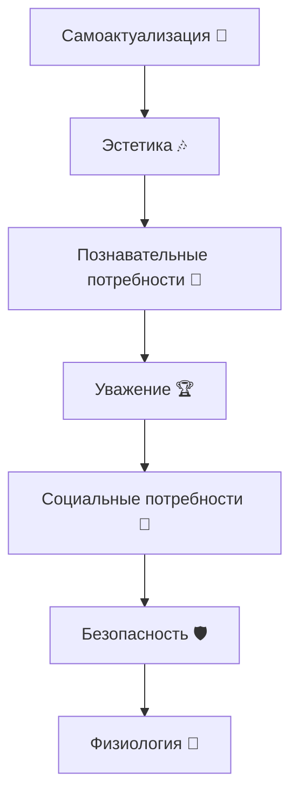
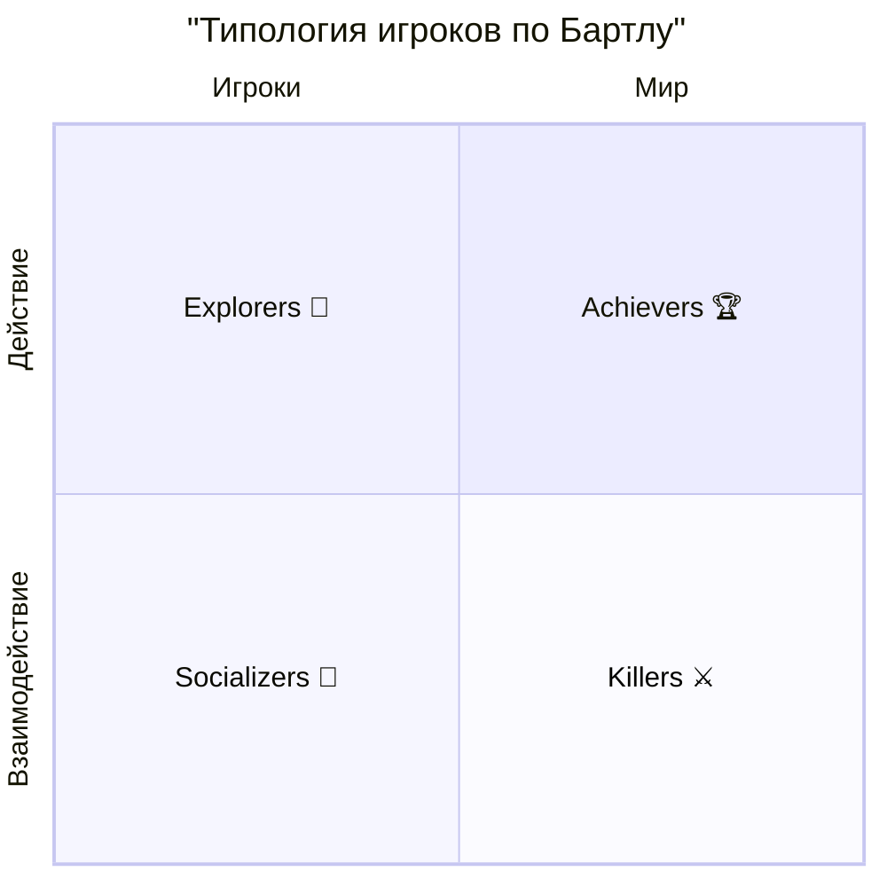

# Целевая аудитория

>[!Note]
>Целевая Аудитория - это группа людей, на которую направлен продукт, услуга или маркетинговая кампания. Понимание целевой аудитории помогает компаниям создавать более эффективные стратегии и предложения, которые лучше соответствуют потребностям и предпочтениям этой группы. В нашем конкретном случае это люди которые будут играть, наши игроки.

## Возрастное распределение

### 0-3 Годика

Младенцы и маленькие дети, которые только начинают исследовать мир.
**Ведущий тип деятельности:** *Предметно-орудийный*. Для них характерно исследование окружающего мира через манипуляции с предметами и использование орудий. соответсвенно им важнее игрушки которые можно осязать, например геймады и Touch-скрины.

### 4-6 Лет

Дети дошкольного возраста, которые начинают развивать социальные навыки и воображение.
Появляется первый интерес к играм, возможно играет с родителями, распадается совместная деятельность со взрослыми. **Ведущая тип деятельности:** *сюжетно-ролевая*. Формируется категория добра и зла,развивается воображение. Им важны игры с сюжетом, ролевые игры, игры на развитие воображения. Преодоление эгоцентризма. Формирование наглядно-образного мышления. Развито произвольное поведение. Внутренняя позиция школьника. Высокая познавательная мотивация. Знаково-символические функции сознаяния.

### 7-9 Лет

Возраст почемучек. Дети начинают задавать много вопросов и стремятся понять, как устроен мир.
**Ведущий тип деятельности:** *учебная*. Появляется полноценный интерес к играм, начинают критичеки относиться к играм. Социально они впервые начинают чувствовать свою взрослую значимость. Приобретают навык рефлексии, а именно могут отличать свои эмоции. Теоритическое и знаковое мышление.

### 10-13 Лет

Понимают более сложные концепции и начинают развивать свои собственные интересы. Возраст одержимости. Изменение отношений со всеми группами. В основном развивают отношения со сверстниками. Образование подросковых групп с общими интересами. Появляется *взрослость* и возникает собственное "я". **Ведущий тип деятельности:** *общение*. Появляется интерес к играм с друзьями, командные игры. Развивается абстрактное мышление, появляется способность к анализу и синтезу информации. Появляется критическое мышление. Активно развивается личностное самосознание.

    *12-15 лет расширение социальной активности*

### 13-18 Лет

Задача подростка подготовка ко взрослой жизни. Происходит разделение на мальчиков и девочек. Для мальчиков - соревнование и сила.
Для девочек - общение и жизненные вопросы.

Испытание нового опыта, проба всего нового. У них появляются деньги. Изменение учебной деятельности, в школу приходят пообщаться, следовательно коллектив - основной интерес. Дожны овладевать системой научных понятий. Первое профессиональное самоопределение. Начинается получение профессиональных знаний и умений, появляется система ценностных ориентаций.

### 18-24 Лет

Первая группа взрослого возраста. Заканчиваются подростковые эксперименты появляются время и деньги.

### 25-35 Лет

Появляется ценность времени. Период формирования семьи. Очень внимательное подбирают игры, чтобы не тратить время зря. основные потребители казуальных игр. Хоббисты.

### 36-50 Лет

Возраст семейной зрелости. Большинство игроков покидает игры. Очень часто играют с детьми и подбирают игры для детей, семейные игры.

### 50+ Лет

Некоторые возвращаются к играм, которые нравились в молодости. другие ищут новый опыт.
Эта группа всегда растет.

## Половое распределение

### Мужчины

1. Мастерство
Нравится осваивать новые умения и навыки.
2. Конкуренция
Элемент соревновательности, доказательство своего превосходства.
3. Разрушение
Любят рушить мир вокруг.
4. Пространственные головоломки
5. Метод проб и ошибок
Не читают инструкции, эксперимент важнее, интерфейсы должны быть проще.
6. Продумывание стратегий и строительство.

### Женщины

1. Эмоции
Важен игровой опыт на исследование глубины человеческих эмоций.
2. Реальный мир
3. Забота
Большинство хиллеров в играх - женщины.
4. Диалоги и словесные головоломки
5. Обучение на примерах
Высоко ценят руководство.
Четкая цель + микроцели.
6. Многозадачность
Женщины могут быть многозадачными мужчины нет.
7. Игры с поиском предметов
8. Командные игры приемлют с четкими правилами.

### Общие черты

Нивеллирование аспектов жизни. Все эмоциональные аспекты важны, т. к. в жизни сведены на нет, люди ждут это от игр.

<!--Статистика по половому распределению в играх 2025 найди пожалуйста-->
| Жанр               | Мужчины | Женщины |
|--------------------|---------|---------|

## Потребности и мотивация игроков
>
>[!Note]
>**Абрахам Маслоу** (1908–1970) — американский психолог, один из основателей гуманистической психологии. Он известен созданием иерархии потребностей, которая описывает, как люди постепенно переходят от удовлетворения базовых физиологических нужд к более высоким формам мотивации, таким как самоактуализация и творчество. Согласно Маслоу, потребности образуют пирамиду: нижние уровни должны быть в достаточной мере удовлетворены, прежде чем человек сможет двигаться к более высоким. Теория Маслоу оказала большое влияние на психологию, социологию, менеджмент и — в последние десятилетия — на геймдизайн.

### Потребности по Маслоу

В контексте видеоигр пирамида Маслоу помогает понять, какие мотивы побуждают игроков взаимодействовать с игровым миром. На нижних уровнях мы видим стремление к безопасности и контролю — игроку нужны понятные правила, возможность сохранений и предсказуемая логика. Средние уровни отражаются в социальном опыте и уважении: это командные игры, рейтинги, достижения, признание другими. На верхних уровнях находятся познание, эстетика и самоактуализация: исследование миров, наслаждение художественным стилем и музыка, создание собственных уровней или персонажей. Таким образом, игры становятся пространством, где человек может пройти через все ступени потребностей — от базового чувства контроля до реализации собственного творческого потенциала.

1. Физиологические потребности
    - Еда
    - Вода
    - Сон
    - Дыхание
    - Гомеостаз
    - Выделение
2. Потребности в безопасности
    - Личная безопасность
    - Финансовая безопасность
    - Здоровье и благополучие
    - Безопасность от несчастных случаев/катастроф
3. Социальные потребности
    - Принадлежность к общности
    - Потребность в принятии
    - Необходимость во взимной любви
4. Потребности в уважении
    - Самоуважение
    - Уважение со стороны других
    - Статус
    - Признание
    - Сила
5. Потребности позновательные
    - Потребность в знаниях
    - Потребность в понимании
6. Эстетические потребности
    - Красота
    - Баланс
    - Форма
7. Потребности в самоактуализации
    - Решение проблем
    - Принятие фактов
    - Творчество
    - Способность быть спонтанным
    - Отсутствие предрассудков
    - Принятие себя и других

### Система игровых удовольствий Ле бланка
>
>[!Note]
> **Марк Ле Бланк** — американский геймдизайнер и исследователь, один из авторов MDA-фреймворка (Mechanics–Dynamics–Aesthetics), разработанного в начале 2000-х годов. Его вклад особенно связан с концепцией “8 видов удовольствия от игр”, которая помогает описать, какие эмоции и опыт получают игроки от игрового процесса. Ле Бланк предложил рассматривать игру не только как набор правил и механик, но и как источник эмоционального отклика: фантазии, вызова, дружбы, открытия и самовыражения. Его подход широко используется в теории и практике геймдизайна для анализа, почему игры увлекают и удерживают людей.

Система игровых удовольствий Ле Бланка расширяет понимание мотивации игроков, показывая, что игры воздействуют не только через цели и победы, но и через эмоции, социальные связи и эстетику. В отличие от Маслоу, где речь идёт о потребностях человека в целом, Ле Бланк описывает, какие именно формы радости и вовлечённости игра способна подарить: от товарищества и открытия нового до самовыражения и фантазии. Это позволяет разработчикам видеть игру как многоуровневый опыт, где разные типы удовольствий сочетаются и усиливают друг друга, формируя уникальный игровой процесс.

1) Основные ощущения (эстетика)
2) Фантазия
3) Повествование (возможность выбора)
4) сложность (соответствие навыкам аудитории)
5) Товарищество
6) Открытие
7) Самовыражение (редактор уровня, персонажа, лобби)
8) Принятие

### Система игровых удовольствий по Барту*
>
>[!Note]
> **Ричард Бартл** (род. 1960) — британский исследователь и геймдизайнер, известный своей работой в области многопользовательских онлайн-игр (MMORPG). В 1996 году он разработал типологию игроков, классифицируя их на четыре основные категории: Ачиверы (достигатры), Социальщики, Исследователи и Убийцы (гриндеры). Эта классификация помогает понять различные мотивации и предпочтения игроков в виртуальных мирах. Работа Бартла оказала значительное влияние на дизайн игр, особенно в контексте создания более увлекательных и разнообразных игровых опытов для разных типов игроков.

Типология Бартла делит игроков по осям «действие ↔ взаимодействие» и «игрок ↔ мир», формируя четыре группы.

- Killers (Убийцы) ориентированы на действие против других игроков. Им важно доминирование, PvP, контроль и демонстрация силы. Они получают удовольствие от победы над соперниками и разрушения чужих успехов.

- Achievers (Достигаторы) стремятся к прогрессу, наградам и измеримым целям. Для них важны ачивки, уровни, рейтинги и коллекции. Удовольствие — в систематическом росте и преодолении вызовов.

- Socializers (Социальщики) находят главный интерес в взаимодействии с другими игроками. Для них ценны дружба, командная игра, коммуникация и комьюнити. Они часто становятся связующим звеном в игровом сообществе.

- Explorers (Исследователи) увлекаются изучением мира: они ищут секреты, тестируют механики, пробуют нестандартные пути. Их удовольствие — в открытии нового и глубоком понимании устройства игры.

Таким образом, модель Бартла помогает разработчикам понять, что аудитория неоднородна, и успешная игра должна учитывать интересы разных типов игроков, создавая баланс между соревнованием, исследованием, социальным опытом и прогрессом.

### Дополнительные Удовольствия*

- Ожидание
- Завершение
- Радость от чужого горя (наказание противника)
- Дарение (подарки приносят радость)
- Юмор
- Возможности (выбор)
- Гордость от достижения цели
- Сюрпризы (пасхалки)
- Трепет (страх - смерть = положительный трепет)
- Победа над обстоятельствами
- Удовольствие от созерцания чуда
- причастность к чему-то большему
- Похвала и одобрение
- Узнавание и приоткрытие занавеса
- Сопереживание
- Философия (экзистенциальные вопросы)
- Любовь, достижение любви и понимания
- Созерцание своих трудов
