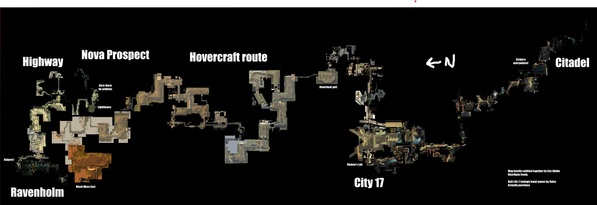

# Некоторые элементы игровой механики

> [!Note]
> Игровая механика (от греч. μηχανική — «искусство изобретать») — это совокупность правил и способов, определяющих взаимодействие игрока с игрой и ее миром. Именно механики формируют игровой процесс и определяют, как игра функционирует. В механики входят игровые системы, цели, задачи, ограничения и методы достижения успеха. Это базис игры.

## Пространство

> [!TIP]
> Пространство — игровое поле, на котором происходят действия игрока.

 Игровое пространство представляет собой так называемый «магический круг» игрового процесса. Проще говоря, это совокупность мест (локаций), в которых существует игра, и связей между ними. Пространство в терминах механики – абстрактная математическая конструкция, в которой мы на время отбрасываем эстетические детали и концентрируемся на структурных свойствах игрового мира.[1]

**Основные свойства игрового пространства:** принято выделять несколько ключевых характеристик. Во-первых, пространство может быть `дискретным` или `непрерывным` (часто также называют бесконечным в литературе). Во-вторых, оно имеет определенное число `измерений` (одно-, двух-, трехмерное и т.п.). В-третьих, игровое пространство состоит из отдельных локаций, которые могут быть связаны между собой (или изолированы) различными путями и переходами. Далее мы рассмотрим эти свойства подробно.

---

> [!TIP]
> **Бесконечное пространство** это пространство в котором важно движение героя в одном конкретном поле.
> **Дискретное пространство** это пространство в котором не важно движение в одном конкретно взятом поле, важно наличие игрока в поле.

### Дискретное и непрерывное пространство

Игровое пространство делится на `дискретное` и `непрерывное` (бесконечное). В дискретном пространстве важно нахождение объекта в конкретной ячейке или узле; перемещения внутри клетки несущественны. Классический пример – поле крестиков-ноликов: хотя игроки могут поставить крестик в любом месте клетки, значение имеет лишь выбор самой клетки (всего 9 вариантов), а не точная позиция внутри нее. Таким образом, крестики-нолики – дискретное двумерное пространство из 3×3 ячеек. Схожим образом устроено, например, поле шахмат. Напротив, в непрерывном пространстве (часто воспринимается как бесконечное в контексте игры) важно само перемещение по полю и точные координаты объекта. Пример – бильярдный стол: шар может свободно катиться куда угодно по поверхности, а его положение в любой момент может быть сколь угодно дробным по координатам. То есть между любыми двумя точками существует бесконечно много промежуточных позиций, что соответствует непрерывному пространству.

Настольная игра Monopoly предоставляет дискретное пространство в виде замкнутой последовательности клеток, а классический платформер Super Mario Bros. – дискретное пространство (каждый экранный блок имеет значение). С другой стороны, виртуальные миры вроде Minecraft или открытый мир The Witcher 3 представляют практически непрерывное пространство для перемещения персонажа (хотя их карты физически конечны, игрок воспринимает их как очень большие и без искусственных клеток). Даже реальные игры могут выступать примерами: шахматная доска – дискретна, а бильярд – непрерывное пространство.

**Пример дискретного пространства:** фрагмент поля игры «Monopoly», где движение ограничено клетками. Игроки могут перемещаться только из клетки в клетку, и точное положение фишки внутри клетки не влияет на игровой процесс.

**Пример непрерывного пространства:** сцена из «Minecraft», демонстрирующая открытый мир без видимых границ клеток. Игрок волен двигаться в любом направлении, и позиция вычисляется по непрерывным координатам.

### Измерения игрового пространства

Пространство игры может обладать разным числом измерений, что существенно влияет на геймплей и восприятие мира:

* `Одномерное пространство (1D)` – движение возможно только в одном направлении или измерении, обычно вперед-назад. Характерный пример: игры типа раннеров. Например, в Temple Run персонаж бежит по узкому коридору только вперед, а уклонения ограничены сменой полос движения (практически движение вдоль одной оси). Другой пример – падение фигурок в Tetris, где важна только вертикальная координата падающего блока. Игрок, по сути, оперирует одной измерением – временем падения и последовательностью фигур. Также сюда можно отнести музыкальные ритм-игры вроде Guitar Hero, где ноты движутся по одной линии вниз, требуя нажатия в правильный момент.

* `Двумерное пространство (2D)` – движение происходит по двум осям (плоскость X и Y). Большинство классических игр использует 2D пространство. Варианты 2D: платформеры (герой бегает и прыгает в плоскости, как в Super Mario Bros. или Hollow Knight), игры с видом сверху (например, Pac-Man или ранние The Legend of Zelda, где персонаж перемещается по двумерной карте), а также боковой скроллинг (Sonic the Hedgehog, Metroid), где мир разворачивается в ширину и высоту на экране.

* `Трехмерное пространство (3D)` – движение осуществляется по трем координатам (ширина, высота, глубина – X, Y, Z). Примеры: современные экшен-игры и шутеры: серия Grand Theft Auto (большой открытый 3D-мир), Counter-Strike (персонажи свободно перемещаются по объёмным аренам), Assassin’s Creed (герой может бегать, прыгать и лазать по трёхмерному городу). В 3D-пространстве особенно важны механики камеры и обзора, так как мир существует во всех направлениях.

Псевдо-3D (2.5D) пространство – формально двухмерное пространство, в котором создана иллюзия третьего измерения. Такие игры выглядят объёмно, но по сути их механика остаётся 2D. Примеры: ранние шутеры Doom (1993) и Wolfenstein 3D: хотя игрок видит окружение в перспективе, под капотом это двумерная карта (без свободного взгляда вверх-вниз). Другой пример – изометрические игры (Age of Empires, SimCity): мир отрисован с псевдо-объемом, однако координаты персонажей хранятся в плоскости, а «высота» – условна.

### Топология и структура пространства

> [!TIP]
> Топология — это способ организации и связи различных локаций и областей в игровом мире(не только в игровом, но и в реальном мире).

Игровое пространство может быть организовано по-разному, задавая топологию уровней и маршрутов. Основные типы организации пространства и их влияние:

* `Линейное пространство.` Игрок проходит уровень последовательно от точки А до точки Б, без возможности отклониться. Такая структура обеспечивает контролируемый нарратив и чёткую прогрессию, но ограничивает свободу. Преимущество: концентрированный сюжет и тщательно выверенный опыт – разработчики знают, в каком порядке игрок увидит события. Примеры: кампании Call of Duty, Half-Life 2 – игрок движется по коридорам уровня, фокусируясь на истории и экшене, без отвлечения на исследование.

* `Разветвлённое пространство.` Присутствует несколько путей или ответвлений, игрок может выбирать маршрут. Такое пространство повышает реиграбельность (каждый выбор открывает иной опыт) и позволяет персонализировать прохождение. Однако дизайнеру сложнее учесть все комбинации путей. Примеры: уровни в Deus Ex или Dishonored – цели можно достичь разными способами (пробраться по вентиляции, пойти через охрану или найти ключ и т.д.), что даёт ощущение свободы решений.

* `Открытое пространство (Open World).` Большой связный мир, который игрок волен исследовать в любом направлении. Задания могут выполняться в произвольном порядке, а между сюжетными точками лежит простор для побочных активностей. Преимущества: чувство свободы и погружения – игрок сам планирует маршрут и темп исследования. Недостатки: сложность разработки (надо наполнить огромный мир интересным контентом) и риск «растянутого» сюжета. Примеры: серия The Elder Scrolls (Skyrim), The Witcher 3, Breath of the Wild – игрок может пойти куда угодно, находить квесты, секреты, и формировать историю в своём порядке.

* `Узловое (хабовое) пространство (Hub-and-Spoke).` Сочетает центр (хаб) и ответвления уровней. Игрок возвращается в центральную зону, из которой открывает доступ к отдельным уровням или миссиям. Плюсы: структура облегчает навигацию (игрок всегда «домой» возвращается между миссиями) и разнообразит локации (каждое ответвление – уникальное приключение). Такой подход даёт ощущение прогрессии, но сохраняет некоторое нелинейное разнообразие. Примеры: Super Mario 64 (замок Принцессы Пич – хаб с картинами-уровнями), Destiny 2 (Башня – социальный хаб, из которого запускаются миссии), Crash Bandicoot (уровни выбираются из центральной локации).

### Свойства пространства и их влияние

Любое игровое пространство можно охарактеризовать рядом свойств, которые влияют на геймплей:

* `Масштаб пространства.` Это размер области, в которой действует игрок, и уровень детализации. Интимный масштаб – крохотное пространство (комната, одна сцена); создаёт камерный, напряжённый опыт. Локальный – ограниченная зона (здание, квартал); даёт чувство близости, но чуть больше свободы. Региональный – целый город или обширная зона; позволяет исследовать разнообразные местности. Глобальный – целые страны, планеты или даже галактики; игрок ощущает себя частью огромного мира. Масштаб влияет на чувство значимости действий: в комнате каждый предмет важен, а в глобальном мире игрок больше сосредоточен на крупных целях.

* `Связность пространства.` Описывает, насколько область игры географически едина. Связное пространство – все локации соединены, можно добраться пешком (напр., единая карта в Skyrim без жёстких экранов загрузки). Несвязное пространство – мир разбит на отдельные уровни, между которыми нет прямого пути (например, миссии в меню выбираются). Условно связное – доступ к новым областям открывается по мере прогресса или при выполнении условий (метроидвания: сначала зоны закрыты, затем с новым умением становятся доступны). Связность влияет на свободу перемещения: связный мир поддерживает непрерывное путешествие, а несвязный позволяет делать большие скачки во времени/месте, но может нарушать иммерсию.

* `Границы пространства.` Это способы ограничить зону, куда может попасть игрок. `Жёсткие границы` – невидимые стены, силовые барьеры: игрок физически не может пройти (персонаж упирается в невидимую преграду). Это простой способ, но может выбивать из атмосферы, если ничто в мире не объясняет преграду. `Мягкие границы` – опасные зоны или другие механики, которые отговаривают игрока идти дальше вместо прямого запрета. Например, в некоторых играх за уход за пределы карты персонаж начинает получать урон или появляется сообщение «вы покидаете игровую зону». Или, как в The Witcher 3, в высокоуровневых областях бродят слишком сильные враги, что естественно удерживает новичка от дальних путешествий. `Естественные границы` – география мира: отвесные горы, бескрайний океан, пропасти вокруг локации. Такие ограничения выглядят правдоподобно (игрок видит горы и понимает, что за них не попасть), поэтому часто предпочитаются вместо невидимых стен. `Процедурные границы` – особый случай, когда за пределами «основной» карты игра может генерировать бесконечные пустые локации или повторения, чтобы создать иллюзию непрерывности мира. Например, в стратегиях вроде Civilization карта может зацикливаться (уходя с одного края, появляешься на другом – тороидальная поверхность) или в автогонках трасса бесконечно генерируется впереди, пока игрок едет. Границы существенно влияют на ощущение свободы: хорошо спрятанные границы (скалы, лес) сохраняют погружение, а заметные (невидимая стена) могут разочаровать игрока, внезапно напоминая, что мир ограничен.

> [!TIP]
> **Тороидальная поверхность** — поверхность, имеющая форму бублика или пончика. В математике и топологии тороидальная поверхность характеризуется наличием отверстия в центре, что отличает её от сферической поверхности. Такая форма позволяет создавать пространства с уникальными свойствами, например, бесконечные карты в играх, где выход с одного края приводит к появлению на противоположном краю.

* `Динамичность пространства.` Пространство может быть `статичным` или `изменчивым во времени`. Статичное пространство не меняется за время игры – план уровня фиксирован. Динамическое пространство может меняться по ходу игры: например, разрушаемое окружение (Battlefield позволяет взрывать стены, меняя укрытия и пути в уровне), процедурно генерируемые уровни (каждый заход в Spelunky создает новый лабиринт), сезонные изменения или время суток (в гонках серии Forza Horizon время дня и погода меняются, что влияет на видимость и поведение трассы). Такие изменения пространства делают геймплей более разнообразным и непредсказуемым.

### Психологическое воздействие пространства
Пространство игры существенно влияет на эмоции и психологическое состояние игрока:

* `Клаустрофобия.` Тесные, узкие пространства (например, узкие коридоры космического корабля в Alien: Isolation) способны вызвать чувство тревоги и напряжения. Ограниченный обзор и близкие стены создают давящее ощущение, что опасность рядом и деваться некуда.

* `Агорафобия.` Широкие, открытые пространства могут вызывать чувство уязвимости или одиночества. В игре Shadow of the Colossus, например, герой бродит по огромным пустошам – это подчёркивает его одиночество и одновременно величие мира. В открытом поле игрок может почувствовать себя незащищённым, ведь опасность может прийти с любого направления.

* `Дезориентация.` Сложные, запутанные локации – лабиринты, похожие друг на друга коридоры – приводят к тому, что игрок теряется. Если дизайн намеренно сбивает с толку (отсутствуют ориентиры, много повторяющихся комнат), игрок испытывает стресс от невозможности построить мысленную карту. Такой эффект используют в хоррорах и головоломках, чтобы усилить напряжение.

* `Чувство безопасности.` Напротив, грамотное пространство может давать ощущение комфорта. Например, домашняя база или город с нейтральными NPC обычно спроектированы так, чтобы игрок чувствовал расслабление: широкие обзоры (нет угрозы внезапной атаки), тёплое освещение, музыка. Контраст «убежища» с опасными зонами делает геймплей эмоционально более насыщенным – после стресса боя игрок возвращается в безопасное пространство передохнуть.

### Тактические возможности пространства

Пространственная организация уровня напрямую определяет тактические приёмы, доступные игроку:

* `Укрытия.` Наличие стен, баррикад, колонн даёт возможность прятаться от врагов. Например, в шутерах вроде Gears of War дизайн уровня наполнен объектами определённой высоты для системы укрытий. Без них бой протекал бы совершенно иначе – игроки были бы постоянно на виду.

* `Высота и вертикальность.` Разноуровневый ландшафт (холмы, здания, башни) открывает тактическое преимущество высоты. Высоты позволяют вести огонь сверху вниз, увеличивая обзор и дальность видимости. Снайперская позиция на крыше или холме гораздо эффективнее, чем стрельба с равнины. Многие игры (Battlefield, Halo) включают башни, этажи и другие возвышенности как ключевые точки контроля.

* `Узкие проходы (бутылочные горлышки).` Когда пространство сжимается (дверные проёмы, мосты, коридоры), небольшое количество персонажей может сдерживать превосходящие силы. Это тактический элемент: например, в 300 спартанцев (хоть и не игра) легендарно удерживали узкий проход. В играх же узкие коридоры позволяют устраивать засады или контролировать толпу врагов по одному.

* `Открытые пространства для манёвра.` Большие поля, площади дают простор для свободы движения: можно обойти врага с фланга, использовать скорость. В Monster Hunter или Dark Souls боссов легче побеждать на арене с достаточным пространством – игрок бегает, уворачивается. А вот в тесном пространстве схватка стала бы куда сложнее. Открытые зоны также благоприятны для дальнего боя – снайпер или лучник эффективен, пока есть дистанция.

### Нестандартные пространственные механики

Иногда игры выходят за рамки обычной геометрии, предлагая нелинейное пространство, тесно переплетенное со временем и особыми правилами:

* `Временные аномалии в пространстве.` Некоторые игровые миры изменяются со временем или существуют в нескольких эпохах. Например, The Legend of Zelda: Majora's Mask заставляет игрока переживать одни и те же локации в 3-дневном временном цикле – после перезагрузки времени мир откатывается, и ранее совершённые изменения исчезают. Это особый случай: пространство кажется нелинейным, потому что время зациклено. Другой пример – путешествия во времени: в Chrono Trigger одни и те же места существуют в разных временных эпохах (доисторическая деревня vs. та же область в постапокалипсисе), и действия в прошлом меняют облик локации в будущем. Таким образом, время становится частью пространственной механики, делая структуру мира более сложной.

* `Порталы и мгновенные переходы.` Игра Portal наглядно показала, как портальная механика ломает эвклидову геометрию уровня: выстрелив двумя связанными порталами на разных поверхностях, игрок может выйти из одного и тут же войти в другой, фактически перемещаясь мгновенно по пространству. Это требует от игрока нового типа мышления и решения головоломок. Магические порталы встречаются и в других играх (например, телепорты в Dishonored или Prey) – они создают нелинейность: уровень уже не просто сеть коридоров, а может «сворачиваться» переходом, минуя промежуточные точки.

* `Динамически изменяющееся пространство.` Мы уже упоминали разрушаемые уровни: это случай, когда само пространство меняется в ходе игрового процесса. Ещё вариант – процедурная генерация: каждый раз игра строит новый вариант локации. В Spelunky, Dead Cells и других roguelike-проектах после смерти игрока пещера или подземелье генерируется заново – таким образом пространство непредсказуемо и нелинейно от партии к партии. Сезонные изменения в онлайн-играх также можно отнести сюда: в мире Fortnite или GTA Online с обновлениями появляются новые районы, изменяется рельеф, застройка, климат. Игроки вынуждены постоянно адаптироваться к трансформирующемуся пространству.

### Вложенные пространства

> [!IMPORTANT]
> **Вложенные пространства** – это иерархическая система «пространств внутри пространства». Одно большое пространство включает в себя другое, меньшего масштаба, и так далее. Каждая «вложенная» локация может иметь свои собственные правила и связи с внешним миром.

На практике большинство игр используют вложенную структуру мира. Например, в большой открытой RPG может быть глобальная карта мира, на которой отмечены города и подземелья. Эти города – тоже пространства, внутри которых есть здания или комнаты. Внутри комнат могут быть еще меньшие зоны (сундуки, интерфейсы). Такой многоуровневый подход позволяет сочетать масштабность с детализацией. Когда вы путешествуете по миру Skyrim, вы видите значки городов; входя в город, вы получаете отдельное пространство с улицами и домами; заходя в дом, попадаете в ещё более мелкое пространство – интерьер. Игрок воспринимает всё это цельно, хотя технически это разные уровни вложенности.

#### Принципы вложенных пространств:

* `Иерархичность.` Каждое пространство занимает определенное место в иерархии миров. Макро-уровень содержит мезо-уровни, те – микро-уровни и т.д. Например, «Галактика > Планета > Локация > Комната». Игрок обычно осознаёт лишь один уровень непосредственно, но между уровнями есть связь (иконка города на карте, дверь в здание и т.п.).

* `Масштабируемость.` В разных уровнях вложения действуют разные масштабы и правила взаимодействия. На глобальной карте шаг может означать километры, а внутри комнаты – сантиметры. Это позволяет оптимизировать геймплей: на глобальном уровне не моделируется каждое дерево, зато на микро-уровне можно детально проработать окружение.

* `Связность уровней.` Между вложенными пространствами существуют логические переходы. Обычно это понятно игроку: дверь ведет в дом (переход на микро-уровень), выход из дома возвращает на улицу города (назад на мезо-уровень). Связи могут быть физическими (двери, порталы) или интерфейсными (меню «войти в подземелье») – важно, что игрок понимает, что он переместился, но мир игры сохраняет целостность.

* `Автономность.` Каждый уровень пространства может иметь свои правила и механики, частично независимые от других. К примеру, на глобальной карте Fallout персонаж перемещается как маркер (пошагово, с шансом на случайные встречи), а в бою (микро-пространство) уже действует система реального времени или VATS. Такая автономность позволяет разнообразить геймплей: в разных «слоях» у игрока разные задачи и опыт.

#### Типы вложенных пространств

**По масштабу вложенности:**

- `Макро-пространство` – самый крупный уровень (весь мир, континент, галактика). Мезо-пространство – средний уровень (отдельная локация, город, зона). Микро-пространство – мелкий уровень (комната, здание, конкретная сцена). Например, в стратегии Civilization макро – глобальная карта мира, мезо – конкретный район с городами (или тактическая битва, если бы она была), микро – экран города, где строятся здания.

**По функциональности:** 

- `Навигационные пространства` – служат для быстрого перемещения между локациями (мировая карта с пунктами).

- `Интерактивные пространства` – там происходит основной геймплей (например, поле боя, подземелье – игрок сражается, собирает предметы)

- `Информационные пространства` – встроенные в мир экраны, отражающие данные (например, внутриигровой терминал компьютера, где игрок просматривает информацию, или инвентарь, оформленный как внутриигровой объект). Такие пространства часто реализуются через интерфейс, но по смыслу являются частью иерархии игры.

*Примеры вложенной структуры в играх:*

`Civilization VI`: макро-уровень – глобальная карта мира с континентами, мезо – отдельные гексы (территории) с детализацией рельефа и юнитами, микро – интерфейс города или отдельного юнита, где принимаются локальные решения.

`The Elder Scrolls V: Skyrim`: макро – провинция Скайрим, вид сверху (система быстрого перемещения между крупными локациями), мезо – сами территории, по которым герой путешествует (лес, город, крепость), микро – интерьер здания или пещеры с собственными деталями и замкнутыми пространствами.

`World of Warcraft`: макро – континенты на глобальной карте (путешествие между ними на дирижабле или корабле), мезо – зоны и регионы на одном континенте (свободно пробегаются персонажем), микро – подземелья и инстансы (отдельно загружаемые локации для группы игроков).

#### Преимущества вложенных пространств:

`Организация контента.` Мир разбит на понятные части, игрок не перегружен сразу всей вселенной. Можно переходить от общего к частному: сначала увидеть карту мира, выбрать регион, потом город, затем конкретное здание. Это структурирует опыт и обучает игрока постепенно.

`Управление сложностью.` Разработчикам проще работать с частями: каждое пространство прорабатывается автономно, зная контекст родительского. Игроку тоже проще усваивать мир слой за слоем. Например, сначала он изучает устройство города, потом уже выходит на мировой уровень с пониманием базовых механик.

`Масштабируемость контента.` Добавлять новый контент удобнее в рамках такой структуры – можно прикрепить новую локацию к существующей карте или добавить новый «слой» взаимодействия, не ломая весь остальной мир.

`Улучшение UX (опыта игрока).` Вложенность позволяет делать интуитивную навигацию – игрок понимает, где он: «Я в городе на севере континента», а внутри города – «я в таверне». Это похоже на реальную жизнь, где мы оперируем вложенными понятиями (страна – город – дом). Хорошо сделанная вложенность усиливает погружение.

`Оптимизация производительности.` Игра может загружать только необходимые детали текущего уровня пространства. То есть, когда игрок в комнате, не нужно держать в памяти целый мир – достаточно содержимого комнаты и, возможно, ближайших областей. Используются технологии стриминга и LOD (уровни детализации) для плавного перехода между пространствами. В результате большие миры становятся технически осуществимы.

#### Проблемы и решения при вложенной структуре:

`Навигация и ориентирование.` Игрок может запутаться, особенно если промежутков между уровнями много. Проблема «где я и как вернуться обратно?» – частая при сложной иерархии. Решение: давать четкие указатели и карты. Мини-карта города, маркеры выхода из подземелья, индикаторы «вы находитесь тут» на глобальной карте – все это снижает дезориентацию. Также важна консистентность переходов: двери всегда выглядят как двери, выходы из города обозначены воротами и т.п..

`Потеря контекста между уровнями.` Когда игрок уходит «глубоко» (например, из открытого мира зашел в личный инвентарь персонажа – это тоже пространство, хотя и интерфейсное), есть риск потерять ощущение связи с внешним миром. Решение: вводить визуальные связи и подсказки. Например, в Skyrim при открытии карты сначала показывается анимация отдаления камеры от героя к небесам – так игрок видит связь своего местоположения и глобальной карты. Или в стратегиях, входя в город, игрок может видеть кусочек окружающей территории за границей экрана, напоминая, где этот город находится. «Хлебные крошки» (навигационные надписи типа «Город > Таверна > Подвал») тоже помогают понимать вложенность.

`Сложность интерфейса.` Много уровней – много разных экранов и панелей. Игрок может перегружаться обилием окон при переходах (например, глобальная карта, локальная карта, инвентарь, журнал – все разные пространства). Решение: вводить функционал постепенно, по мере необходимости. Адаптивный интерфейс, который показывает только то, что нужно на текущем уровне, тоже снижает нагрузку. Например, пока игрок не вышел из деревни, глобальная карта ему не нужна – ее можно не показывать до определенного момента.

`Технические ограничения.` При переходах между пространствами возможны загрузки, задержки, что бьет по динамике игры. Большие миры требуют много памяти. Решение: использовать стриминг контента – игра подгружает части мира фоново, пока игрок приближается к ним, скрывая загрузки. Уровни детализации (LOD) позволяют далеким объектам тратить меньше ресурсов, а детально отрисовывать только ближнее окружение. Современные игры часто применяют хитрости (узкие проходы, лифты) чтобы незаметно загрузить следующий вложенный уровень, не показывая экран загрузки.

## Время

> [!TIP]
> Время в играх, как и пространство, может быть структурировано по-разному. Выделяют дискретное и непрерывное время игрового процесса.

`Дискретное время` – это время, разбитое на отдельные шаги, ходы или такты. В пошаговых играх время прогрессирует рывками: каждый ход – отдельная единица времени, а между ходами «времени нет» с точки зрения механики. Например, партия в шахматы или Heroes of Might and Magic: игроки по очереди выполняют действия, и игра не моделирует события между ходами. Даже в цифровом движке дискретное время означает, что состояния обновляются кадрово или по шагам, например 30 раз в секунду – между этими тиками изменений не происходит (в контексте симуляции). В дискретном времени игрок может обдумывать ход сколько угодно – пока он не совершён, игровое состояние стационарно(неподвижно).

`Непрерывное время` – время течёт постоянно, и события происходят непрерывно. Это типично для игр реального времени: шутеры, экшены, гонки. Пока игра запущена, её состояние всё время обновляется (обычно каждый кадр), и если игрок ничего не делает, мир все равно может изменяться (враги двигаются, таймеры тикают). В таких играх часто есть привязка к реальному времени: скажем, игровая секунда соответствует примерно секунде реальной (иногда с ускорением или замедлением). Пример – любой шутер: враг будет стрелять и попадать в вас, даже если вы отложите контроллер, потому что время не ждёт.

Многие игры сочетают оба типа. Классический пример – соревнования по шахматам: сами шахматы дискретны (ходы), но каждому игроку даётся общий таймер времени на раздумья (непрерывное время). Это вводит фактор спешки в пошаговую игру. Другой пример – тактическая игра с активной паузой: по умолчанию идёт в реальном времени, но игрок может ставить игру на паузу, фактически переходя в дискретный режим планирования.

### Масштабы игрового времени

Время в игре можно рассматривать на разных масштабных уровнях – от мгновений геймплея до глобальных циклов:

`Микровремя` – самые короткие отрезки времени, измеряемые секундами или даже кадрами. Это время реакций и мельчайших действий. Сюда относятся, например, окна для парирования или контратаки в слэшерах (длительностью в десятки миллисекунд), анимации отдельных ударов (сколько длится удар мечом в кадрах) или время перезарядки оружия в шутере (может быть 2-3 секунды – на этом уровне это ощутимо). Примеры микровремени: кадры неуязвимости после получения удара в файтингах (игрок имеет, скажем, 0,5 секунды, чтобы отреагировать), тайминг комбо (нажатия кнопок в определённом ритме). Микровремя – область рефлексов: успешный геймплей требует от игрока молниеносных решений на этих небольших отрезках.

`Макровремя` – длительные отрезки, минуты или часы, которые обычно соответствуют целым уровням, матчам или сессиям игры. Это время, которое тратит игрок на завершение значимой части игры. Например, матч в MOBA длится ~30-50 минут – это макровременной интервал, за который развивается вся партия. В платформере уровень может занимать несколько минут, а вся игра – пару часов. В RPG – цикл «день/ночь» или длительность квеста. Макровремя отражает структуру игры: когда мы говорим «эта миссия длится около 20 минут», мы имеем в виду макровремя. На этом уровне важны стратегии планирования: распределение ресурсов по ходу всей миссии, темп продвижения.

`Метавремя` – сверхдлительные промежутки: дни, недели, месяцы реального времени или их игровые аналоги, которые отражают долгосрочную прогрессию и жизненный цикл игры. Сюда относятся, например, сезоны в онлайн-играх (боевой пропуск в течении 3 месяцев – это мета-цикл, побуждающий игрока возвращаться регулярно), ежедневные задания («заходи каждый день за бонусом» – строится на суточном цикле). Также метавременем можно считать внутриигровое время мира, если оно значительно: например, в Fallout может пройти 200 лет по лору, или в Animal Crossing время синхронизировано с реальным календарём. Метавремя влияет на удержание игрока и долгосрочные цели. Примеры: сезоны в Diablo III (несколько месяцев – за это время игрок «прокачивается» заново ради наград), календарные события (ивенты на праздники в MMO, доступные ограниченное время).

Учёт всех трех масштабов времени делает игру глубже. Хороший геймдизайн синхронизирует их: микро обеспечивает интерес момент-к-моменту (махать мечом весело каждую секунду), макро даёт чувство достижения (прошёл уровень за 10 минут – молодец), мета удерживает в долгую (через месяц получу редкий артефакт, если буду играть по чуть-чуть каждый день).

### Время и геймплей: отношения

Роль времени в механике проявляется в разных аспектах геймплея:

`Ограничение по времени` – мощный инструмент, создающий у игрока стресс и напряжение, но при правильном применении повышающий увлечённость. Таймеры заставляют принимать решения быстрее, добавляют адреналина. Пример – режим бомбы в Counter-Strike: когда террористы устанавливают бомбу, у спецназа есть ~40 секунд на обезвреживание. Этот тикающий таймер драматически повышает накал финала раунда. Другой пример – головоломки с ограничением по времени (Portal 2 имеет испытания, где нужно решить задачу за отведённые секунды). Дедлайны (жёсткие сроки) могут быть и на уровне мета: например, в Dead Rising вся игра ограничена 72 игровыми часами – если не успел спасти выживших до определенного момента, будет другая концовка. В survival-играх время тоже враг: индикаторы голода/жажды/температуры падают непрерывно, вынуждая спешить с поиском ресурсов. Всё это – `временное давление`: игрок ощущает ценность каждой секунды, что делает принятие решений более напряженным.

Однако важно балансировать: слишком жёсткие временные ограничения могут вызывать больше раздражения, чем интереса. Если игрок не успевает едва ли не идеально действовать – это фрустрация. Поэтому некоторые игры предлагают варианты без таймеров или позволяют регулировать сложность.

#### Ритм и темп
Каждая игра обладает своим темпом – скоростью, с которой происходят события. `Быстрый темп` означает постоянную активность, минимум пауз. Пример – bullet hell шутеры (пули летят непрерывным потоком, игрок все время занят их уклонением) или файтинги на высоком уровне, где каждый миг – либо атака, либо уклонение. Такие игры держат в тонусе, но могут утомлять. `Медленный темп` – напротив, предполагает размеренность и возможность подумать. Пошаговые стратегии (Civilization) или менеджеры (SimCity) позволяют ставить игру на паузу, долго обдумывать ходы – игрок расслабленно планирует. Это не хуже, просто другой вид удовольствия – стратегическое, созерцательное. `Переменный темп` – возможно, лучший вариант, когда чередуются интенсивные отрезки и спокойные. Многие сюжетные игры (Resident Evil, Last of Us) мастерски чередуют экшен-сцены с тихими эпизодами, чтобы игрок успел перевести дух и затем снова ощутил всплеск адреналина. 

Правильный ритм удерживает интерес: постоянный экшен без передышек может притупить эмоции, а слишком медленная игра – наскучить. Дизайнер обычно выстраивает кривую напряжения, чередуя пики и спады.

### Синхронизация действий

Время может стать самой сутью механики, требующей синхронизации. Пример – музыкальные игры (ритм-игры) вроде Guitar Hero, Beat Saber: здесь геймплей заключается в том, чтобы в такт музыке нажимать кнопки или размахивать контроллерами. Успех полностью зависит от точного следования ритму – по сути, от чувства времени у игрока. В кооперативных режимах синхронность тоже важна: в MMO-рейдах на босса часто вся команда должна одновременно выполнить действие (скажем, спрятаться в щит или нанести удар в одну фазу). Это превращается в «ритуальный танец» по таймеру – игроки пользуются таймер-addon’ами, отсчитывающими секунды до следующей способности босса, и действуют единовременно. Тактические командные шутеры (CS:GO, Valorant) тоже строятся на тайминге: одновременный выход игроков из укрытий («размены»), синхронные атаки с двух сторон – всё требует договорённости во времени. Таким образом, время выступает координирующим фактором, и успешная синхронизация приносит удовлетворение от командной работы.

### Механики управления временем

Игры дают игроку уникальную возможность – управлять временем, чего нет в реальной жизни. Механики, связанные со временем, бывают очень разнообразны:

`Пауза и остановка времени.` Самый простой способ – нажать «Пауза». В видеоиграх это обычно полностью останавливает игровой процесс, позволяя отдохнуть или подумать. Некоторые игры вводят тактическую паузу как часть механики: например, в Baldur’s Gate или Dragon Age: Origins игрок может поставить бой на паузу, чтобы раздать приказы отряду – время замирает, давая возможность стратегического планирования. Другой вариант – «меню времени»: интерфейсы, которые не останавливают игру. В The Witcher 3, например, открытие колесика выбора знаков или предметов лишь замедляет время, но не стопорит его полностью – враги двигаются очень медленно. Это компромисс: игрок получает передышку, но не может злоупотреблять бесконечной паузой. Отдельного упоминания заслуживает bullet time – эффект замедления времени для драматического преимущества. Популяризован в Max Payne, bullet time позволяет игроку на короткий период замедлить весь мир, в то время как сам игрок (или его прицел) действует с нормальной скоростью, что даёт возможность эффектно расправиться с врагами. Такая механика требует ограничений (например, запас энергии на замедление), чтобы не сделать игру слишком лёгкой.

`Ускорение и перемотка вперёд.` Некоторые игры позволяют ускорять время, особенно в стратегиях или симуляторах, когда ждать реальное время скучно. В SimCity и других городских симуляторах есть кнопки ×2, ×4 скорости – строительство города или ожидание ресурсов происходит быстрее. Это удобно на рутинных этапах. Перемотка вперёд часто используется в пошаговых и менеджерских играх, где, например, пропускаются дни без событий. Однако ускорение – палка о двух концах: игрок может пропустить что-то важное. Поэтому хорошие игры сопровождают ускоренный режим возможностью мгновенно вернуться к нормальной скорости при событии. Замедление мы уже обсудили (bullet time), но бывают и более тонкие применения: например, Superhot – шутер, в котором время двигается только когда двигается игрок. Это особая механика: сам по себе Superhot – головоломка, где замедление времени (вплоть до остановки) встроено в геймплей.

`Петли времени и возрождение.` Time loop – популярный сюжетный и геймплейный приём. В Majora’s Mask герой переживает одни и те же три дня, после чего время откатывается, но он сохраняет некоторые ключевые предметы и знания, чтобы постепенно изменить исход. Здесь игрок исследует, что произойдёт с миром в разные моменты и как предотвратить катастрофу – механика узнавания и подготовки. Другой аспект – респавн (возрождение). В мультиплеерных шутерах, когда персонажа убивают, через N секунд он возвращается – по сути это тоже манипуляция временем: для убитого игрока матч как бы откручивается чуть назад, давая новую попытку. Сохранения и чекпоинты – механика контроля времени в повествовании игры. Игрок, сохраняя игру, создает «точку во времени», к которой он может вернуться. Проиграл бой с боссом – загрузил сохранение и попробовал заново, отмотав время назад. В платформерах традиционные чекпоинты работают схожим образом: они фиксируют прогресс, и смерть возвращает игрока к последней точке, а не к началу игры. Без таких механизмов большинство игр были бы неуютно хардкорными – потеря нескольких часов из-за одной ошибки мало кому понравится. Наконец, игры жанра roguelike сделали из постоянной смерти (и возврата к началу) особый цикл: каждое новое прохождение немного отличается (часто процедурно сгенерировано), игрок узнаёт больше, совершенствует навык, чтобы зайти дальше. Это цикл «рождения – смерти – перерождения» персонажа, и он пронизывает весь геймплей.

### Нарративные аспекты времени

#### Хронология событий
Большинство сюжетов линейны – события показаны в порядке происхождения (Uncharted). Однако игры могут использовать **флешбеки** – возврат к прошлым событиям для показа предыстории (Assassin's Creed через Анимус переживает воспоминания предков). **Предвосхищение** – показ кусочка будущего события (пролог Quantum Break демонстрирует финал, затем ведет к нему).

#### Временные парадоксы
В сюжетах с путешествиями во времени возникают **парадоксы** – изменения прошлого влияют на будущее. В Back to the Future: The Game игрок меняет события 1930-х, чтобы исправить настоящее. **Альтернативные временные линии** – несколько концовок в зависимости от момента победы над боссом (Chrono Trigger) или путешествия между параллельными вселенными (BioShock Infinite, Life is Strange с выборами, влияющими на сюжет).

### Психология восприятия времени

Восприятие времени игроком субъективно и может меняться под влиянием геймплея:

`Состояние потока (flow state)`. Когда игра полностью захватывает внимание, игрок может потерять ощущение времени. Час игры кажется минутой – это признак того, что достигнут «поток», оптимальное состояние увлеченности. В таком состоянии у игрока высокое сосредоточение, задачи достаточной сложности, но посильные навыкам, и возникает чувство удовольствия от процесса. Исследования показывают, что в состоянии потока человек утрачивает осознание себя и времени – именно поэтому затягивающие игры славятся тем, что «сядешь на час, а опомнишься – уже ночь». Дизайнеры стремятся ввести игрока в flow, балансируя сложность и вовлекая механиками. Это положительный эффект – время «летит незаметно» в хорошем смысле.[2]

`Скука и ожидание`. Обратная сторона – если игра слишком монотонна или пассивна, игроку может стать скучно, и тогда время субъективно тянется дольше. Минуты кажутся часами. Например, если квест заставляет ждать 5 реальных минут, пока что-то случится (и нечего делать в это время), эти 5 минут могут показаться мучительно долгими. Скука – враг вовлеченности. Поэтому разработчики пытаются либо избегать длительных принудительных ожиданий, либо скрашивать ожидание различными приемами. Например, загрузочные экраны часто снабжают анимациями, советами или мини-играми, чтобы отвлечь внимание – это уменьшает ощущение длительности загрузки. Если игрок чем-то занят, он меньше замечает ход времени. Даже ложные индикаторы прогресса могут сработать: известен случай, когда пользователи предпочли 55-секундное ожидание с показом подробностей процесса, чем 25-секундное с обычной полоской. Другой пример – анимации открытия лутбоксов или сундуков: они специально сделаны красочными и чуть затянутыми, чтобы усилить anticipation (предвкушение) и в то же время незаметно «убить» пару секунд ожидания результата.

`Стресс и напряжение`. При сильном напряжении восприятие времени тоже может исказиться. В стрессовой ситуации (например, финальная битва на последних каплях здоровья, таймер тикает) у некоторых игроков время замедляется субъективно – каждая секунда ощущается очень остро. Это адреналиновый эффект. В контексте геймдизайна, такое замедленное восприятие может быть и плюсом (яркие эмоции, воспоминание «тот бой длился вечно, я столько пережил»), и минусом (если стресс затянулся, игрок выдохся). Поэтому важна кривая напряжения, о которой говорилось: после пика нужно дать релаксацию.

`Эффект "почти выигрыш"`. Отдельно стоит упомянуть психологический трюк в азартных механиках: «практически победил». Например, в автоматах-слотах часто выпадают комбинации, где двум барабанам не хватило одного символа до джекпота. С точки зрения игрока создается иллюзия, что удача была близка, и это стимулирует играть ещё. К восприятию времени это относится следующим образом: серия почти-выигрышей может продлить пребывание игрока в игре (по его ощущениям, «ещё пару попыток, я же чуть-чуть не дожал»). Время сеанса удлиняется, хотя игрок не планировал. В обычных играх схожий эффект – показывать прогресс до цели, внушая, что цель близка. Напр., босс остался на 5% здоровья, вы погибли – у игрока возникает желание сразу повторить, не откладывая (что удлиняет игровую сессию). Это манипулирование восприятием: игроку кажется, что до успеха один шаг, нельзя бросать.

`Иллюзия прогресса и загрузки`. Вспомним загрузочные экраны: бывает фиктивный прогресс-бар, который доходит до 95% очень быстро, а потом медленно добирает оставшиеся. Или наоборот, доходит до 50%, перезагружается и идёт заново – сбивая игрока с толку. Эти штуки не случайны: разработчики экспериментируют, как сделать ожидание менее неприятным. Исследования UX показывают, что люди субъективно меньше раздражаются, если видят хоть какую-то активность – крутящийся индикатор, сменяющиеся советы, анимацию и т.п.. Игра может даже «врать» о времени ожидания, лишь бы игрок не чувствовал, что время тратится зря. Это своего рода временная иллюзия: игроку кажется, что загрузка идёт быстрее, если есть движуха.

### Технические аспекты времени

Помимо геймдизайна, время имеет и сугубо техническую сторону в игровых движках и сетевом коде:

`Синхронизация в мультиплеере`. Когда игроки играют по сети, важно, чтобы у всех была более-менее согласованная картина происходящего. Проблема – задержки и разный пинг. Решаются это технологиями: лаг-компенсация – сервер учитывает задержку клиента и корректирует попадания (например, в Counter-Strike при высоком пинге вам может казаться, что попали по противнику, и игра засчитает урон благодаря лаг-компенсации, хотя на сервере события немного рассинхронизированы). Частота тиков (tick rate) – сколько раз в секунду сервер обновляет игровое состояние. Например, 64 Hz или 128 Hz: чем выше, тем точнее и плавнее мультиплеер, но тем выше требования к сети и серверу. Прогнозирование на клиенте (client-side prediction) – техника, когда клиент не дожидается подтверждения сервера, а сам предсказывает ближайшее будущее (например, что движение персонажа продолжится по инерции) и отображает сразу. Если сервер потом подтверждает – всё ок, если нет – корректирует. Без этого онлайн-игры ощущались бы «резиновыми». Все эти хитрости направлены на то, чтобы разница во времени сетевого отклика не портила геймплей. Игрок ведь не должен замечать, что его выстрел долетел до сервера через 0,2 секунды – для него все должно выглядеть мгновенно.

`Производительность и игровой цикл`. В движке игры часто время представляется как delta time – промежуток между текущим и прошлым кадром. Это используется для того, чтобы расчёты физики и движения шли с одинаковой скоростью на разных компьютерах. Например, если игра вдруг просела до 30 FPS, персонаж не должен двигаться медленнее – вместо этого двигать его нужно на большее расстояние за кадр, пропорционально delta time. Таким образом достигается независимость логики игры от частоты кадров. Time scaling – масштабирование времени – применяется для эффектов замедления/ускорения (например, при bullet time движок просто умножает delta time на фактор <1 для игровых объектов, делая их медленнее). Temporal aliasing – интересный термин, обозначающий артефакты, возникающие, когда время дискретно. Например, если объект движется слишком быстро и проходит более 1 пикселя за кадр, может казаться, что он «телепортируется» (пропускает положения) – это временная алиасинг. Для борьбы с ним применяют более высокие FPS или интерполяцию движения (motion blur). Разработчики также внимательно следят за порядком обновления логики и рендеринга, чтобы игровой цикл (loop) был четким: считывание ввода – обновление мира с учётом delta time – отрисовка – ожидание до следующего кадра. Точный тайминг этого цикла влияет и на производительность, и на отклик управления.

Наконец,   `сохранения` – тоже аспект работы со временем: snapshots состояния игры, которые позволяют вернуться к нему, фактически «прыгнув во времени». Системы автосохранения (чекпоинты) программируются так, чтобы сохранять не слишком редко (чтобы не потерять много прогресса при неудаче) и не слишком часто (иначе каждое сохранение может прерывать поток игры). В некоторых играх (особенно ретро) есть механика сохранения только в определенных местах – это тоже дизайн времени: разработчики хотели, чтобы между сохранениями игрок провёл определённый непрерывный отрезок времени игры, чтобы ощутить напряжение или ответственность.

## Сравнительная таблица: Пространство и Время в играх

| **Категория**                  | **Пространство: свойства и влияние**                                                                                                                                                                                                                                                                                                                        | **Время: свойства и влияние**                                                                                                                                                                                                                                                                                                                                                                                                                                           |
| ------------------------------ | ----------------------------------------------------------------------------------------------------------------------------------------------------------------------------------------------------------------------------------------------------------------------------------------------------------------------------------------------------------- | ----------------------------------------------------------------------------------------------------------------------------------------------------------------------------------------------------------------------------------------------------------------------------------------------------------------------------------------------------------------------------------------------------------------------------------------------------------------------- |
| **Дискретность/Непрерывность** | Дискретное пространство разделено на ячейки/локации; движение пошаговое. Удобно для стратегий, настольных механик; упрощает расчет, но ограничивает плавность. Непрерывное (бесшовное) пространство позволяет свободное перемещение по координатам; требует физических расчетов; повышает реализм и погружение.                                  | Дискретное время разбито на ходы или такты; игрок имеет неограниченное время на обдумывание между ходами. Подходит для пошаговых игр, снижает стресс, но убирает динамику. Непрерывное время течет постоянно; обеспечивает экшен и реальное время событий, однако требует реакции игрока и может создавать давление.                                                                                                                                         |
| **Измерение/Шкала**            | Пространство может быть 1D, 2D, 3D; больше измерений = сложнее навигация, но богаче возможности (в 3D – вертикальный геймплей, обзор). Также масштаб пространства (комната vs. мир) влияет на опыт: маленькое пространство фокусирует на деталях, большое – дает свободу, но может рассеивать внимание.                                          | Временные масштабы: **микро** (секунды – рефлексы, быстрые действия), **макро** (минуты, часы – тактика уровня или матча), **мета** (дни, месяцы – прогресс персонажа, сезоны). Хорошая игра сочетает уровни времени: мгновенный бой + долгосрочная стратегия + развитие по дням/главам.                                                                                                                                                                     |
| **Структура/Порядок**          | Линейное пространство ведет игрока по предопределенному пути, обеспечивая сильный нарратив. Нелинейное (разветвления, открытый мир) даёт свободу исследования, повышает реиграбельность, но риск потерять фокус сюжета. Хабовая структура сочетает централизованный порядок с выбором порядка прохождения уровней.                               | Линейное повествование (события по хронологии) понятно игроку, подчеркивает историю. Нелинейное время (флешбеки, ветвящиеся сюжеты) позволяет интригу и вариативность, но может запутать. Петли времени и возможность влиять на порядок событий (например, решения игрока меняют финал) делают сюжет интерактивным, увеличивая вовлеченность, но требуют от игрока внимания к причинно-следственным связям.                                                  |
| **Ограничения и контроль**     | Границы пространства (невидимые стены, края уровня) ограничивают свободу во избежание выхода за пределы дизайна. Мягкие/естественные границы менее бросаются в глаза (реки, горы, «вы уходите слишком далеко»), сохраняя иммерсию. Контроль пространства через дизайн уровней направляет игрока, не лишая свободы выбора пути.                   | Ограничения по времени (таймеры, дедлайны) накладывают давление и формируют напряжение геймплея. Даются на миссии, головоломки, бои – заставляют действовать эффективно. Однако чрезмерное давление может фрустрировать, поэтому часто время дают с запасом или позволяют продлевать. Контроль над временем в руках игрока (пауза, замедление) облегчает сложность и дает тактическую глубину.                                                               |
| **Динамика изменений**         | Пространство может изменяться: разрушаемое окружение, генерация новых участков, смена дня и ночи – все это делает мир живым. Игрок должен адаптироваться к новым условиям (завалил мост – ищи обход). Изменения пространства часто необратимы (взорванная стена остается сломанной), что дает ощущение влияния на мир.                           | Время может быть манипулируемым: остановки, замедления (bullet time) дают игроку преимущество и зрелищность, ускорения сокращают рутину. Повторения (смерть и рестарт, таймлупы) – центральная часть многих игр, формируя *цикл проб и ошибок*. Игра может позволять обратную перемотку (как в *Braid*) – это снижает наказание за ошибки и поощряет эксперименты со сложными задачами.                                                                      |
| **Психологическое восприятие** | Пространство напрямую воздействует на эмоции: тесный уровень = страх и напряжение, простор = одиночество или свобода. Хороший дизайн использует это: безопасные зоны делают уютными, опасные – давящими. Ориентиры и структура пространства влияют на комфорт игрока (если уровень запутанный, растет тревога или раздражение от дезориентации). | Время субъективно: увлекательная игра вводит в состояние «потока», когда игрок не замечает ход времени. Монотонный геймплей, наоборот, растягивает минуты. Игры стараются сокращать ощущение ожидания (динамичные индикаторы загрузки, промежуточные награды, частые достижения). Эмоциональные пики (таймер на бомбе 00:05) заставляют сердце биться чаще и время для игрока замедляется в ощущениях – такие моменты запоминаются и дают сильный адреналин. |

## Заключение
Пространство и время – фундаментальные компоненты игровой механики, формирующие структуру и динамику игрового опыта. Грамотно спроектированное пространство дает игроку интересный мир для исследования и тактических маневров, а продуманное время задает ритм, напряжение и прогрессию игры. Понимая свойства пространства (от измерений и топологии до психологических эффектов окружения) и времени (от микросекунд реакции до многомесячных игровых циклов), геймдизайнер может создавать глубокие, увлекательные системы. Эти два элемента тесно связаны: пространство предлагает сцену, а время – драматургию действий на ней. Балансируя свободу и ограничения, чередуя темп и паузы, разработчик добивается того, что игрок полностью погружается в игровой мир – и уже не важно, сколько прошло часов в реальности
psychologytoday.com
. Главное, что для самого игрока это было захватывающее приключение.

[1]: [Викичтение](https://it.wikireading.ru/h1omUV2d7Q)
[2]: [Psychology Today](https://www.psychologytoday.com/us/blog/sense-time/202105/time-speeds-in-flow-states-when-playing-video-games)