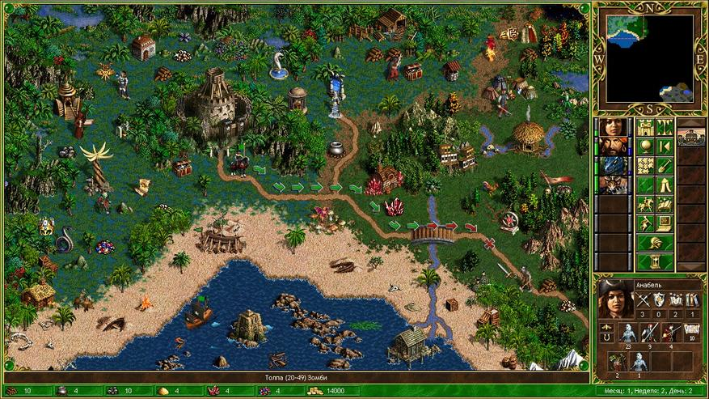
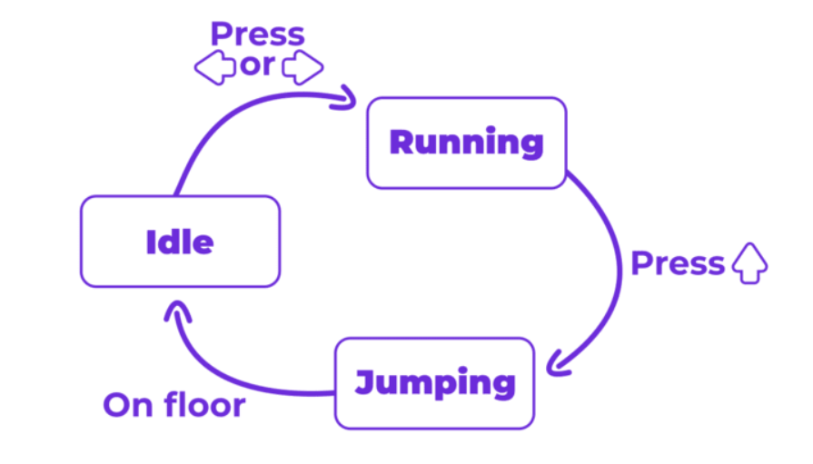

## Время

> [!TIP]
> Время в играх, как и пространство, может быть структурировано по-разному. Выделяют дискретное и непрерывное время игрового процесса.

`Дискретное время` – это время, разбитое на отдельные шаги, ходы или такты. В пошаговых играх время прогрессирует рывками: каждый ход – отдельная единица времени, а между ходами «времени нет» с точки зрения механики. Например, партия в шахматы или Heroes of Might and Magic: игроки по очереди выполняют действия, и игра не моделирует события между ходами. Даже в цифровом движке дискретное время означает, что состояния обновляются кадрово или по шагам, например 30 раз в секунду – между этими тиками изменений не происходит (в контексте симуляции). В дискретном времени игрок может обдумывать ход сколько угодно – пока он не совершён, игровое состояние стационарно(неподвижно).

`Непрерывное время` – время течёт постоянно, и события происходят непрерывно. Это типично для игр реального времени: шутеры, экшены, гонки. Пока игра запущена, её состояние всё время обновляется (обычно каждый кадр), и если игрок ничего не делает, мир все равно может изменяться (враги двигаются, таймеры тикают). В таких играх часто есть привязка к реальному времени: скажем, игровая секунда соответствует примерно секунде реальной (иногда с ускорением или замедлением). Пример – любой шутер: враг будет стрелять и попадать в вас, даже если вы отложите контроллер, потому что время не ждёт.

Многие игры сочетают оба типа. Классический пример – соревнования по шахматам: сами шахматы дискретны (ходы), но каждому игроку даётся общий таймер времени на раздумья (непрерывное время). Это вводит фактор спешки в пошаговую игру. Другой пример – тактическая игра с активной паузой: по умолчанию идёт в реальном времени, но игрок может ставить игру на паузу, фактически переходя в дискретный режим планирования.

### Масштабы игрового времени

Время в игре можно рассматривать на разных масштабных уровнях – от мгновений геймплея до глобальных циклов:

`Микровремя` – самые короткие отрезки времени, измеряемые секундами или даже кадрами. Это время реакций и мельчайших действий. Сюда относятся, например, окна для парирования или контратаки в слэшерах (длительностью в десятки миллисекунд), анимации отдельных ударов (сколько длится удар мечом в кадрах) или время перезарядки оружия в шутере (может быть 2-3 секунды – на этом уровне это ощутимо). Примеры микровремени: кадры неуязвимости после получения удара в файтингах (игрок имеет, скажем, 0,5 секунды, чтобы отреагировать), тайминг комбо (нажатия кнопок в определённом ритме). Микровремя – область рефлексов: успешный геймплей требует от игрока молниеносных решений на этих небольших отрезках.

`Макровремя` – длительные отрезки, минуты или часы, которые обычно соответствуют целым уровням, матчам или сессиям игры. Это время, которое тратит игрок на завершение значимой части игры. Например, матч в MOBA длится ~30-50 минут – это макровременной интервал, за который развивается вся партия. В платформере уровень может занимать несколько минут, а вся игра – пару часов. В RPG – цикл «день/ночь» или длительность квеста. Макровремя отражает структуру игры: когда мы говорим «эта миссия длится около 20 минут», мы имеем в виду макровремя. На этом уровне важны стратегии планирования: распределение ресурсов по ходу всей миссии, темп продвижения.

`Метавремя` – сверхдлительные промежутки: дни, недели, месяцы реального времени или их игровые аналоги, которые отражают долгосрочную прогрессию и жизненный цикл игры. Сюда относятся, например, сезоны в онлайн-играх (боевой пропуск в течении 3 месяцев – это мета-цикл, побуждающий игрока возвращаться регулярно), ежедневные задания («заходи каждый день за бонусом» – строится на суточном цикле). Также метавременем можно считать внутриигровое время мира, если оно значительно: например, в Fallout может пройти 200 лет по лору, или в Animal Crossing время синхронизировано с реальным календарём. Метавремя влияет на удержание игрока и долгосрочные цели. Примеры: сезоны в Diablo III (несколько месяцев – за это время игрок «прокачивается» заново ради наград), календарные события (ивенты на праздники в MMO, доступные ограниченное время).

Учёт всех трех масштабов времени делает игру глубже. Хороший геймдизайн синхронизирует их: микро обеспечивает интерес момент-к-моменту (махать мечом весело каждую секунду), макро даёт чувство достижения (прошёл уровень за 10 минут – молодец), мета удерживает в долгую (через месяц получу редкий артефакт, если буду играть по чуть-чуть каждый день).

### Время и геймплей: отношения

Роль времени в механике проявляется в разных аспектах геймплея:

`Ограничение по времени` – мощный инструмент, создающий у игрока стресс и напряжение, но при правильном применении повышающий увлечённость. Таймеры заставляют принимать решения быстрее, добавляют адреналина. Пример – режим бомбы в Counter-Strike: когда террористы устанавливают бомбу, у спецназа есть ~40 секунд на обезвреживание. Этот тикающий таймер драматически повышает накал финала раунда. Другой пример – головоломки с ограничением по времени (Portal 2 имеет испытания, где нужно решить задачу за отведённые секунды). Дедлайны (жёсткие сроки) могут быть и на уровне мета: например, в Dead Rising вся игра ограничена 72 игровыми часами – если не успел спасти выживших до определенного момента, будет другая концовка. В survival-играх время тоже враг: индикаторы голода/жажды/температуры падают непрерывно, вынуждая спешить с поиском ресурсов. Всё это – `временное давление`: игрок ощущает ценность каждой секунды, что делает принятие решений более напряженным.

Однако важно балансировать: слишком жёсткие временные ограничения могут вызывать больше раздражения, чем интереса. Если игрок не успевает едва ли не идеально действовать – это фрустрация. Поэтому некоторые игры предлагают варианты без таймеров или позволяют регулировать сложность.

#### Ритм и темп
Каждая игра обладает своим темпом – скоростью, с которой происходят события. `Быстрый темп` означает постоянную активность, минимум пауз. Пример – bullet hell шутеры (пули летят непрерывным потоком, игрок все время занят их уклонением) или файтинги на высоком уровне, где каждый миг – либо атака, либо уклонение. Такие игры держат в тонусе, но могут утомлять. `Медленный темп` – напротив, предполагает размеренность и возможность подумать. Пошаговые стратегии (Civilization) или менеджеры (SimCity) позволяют ставить игру на паузу, долго обдумывать ходы – игрок расслабленно планирует. Это не хуже, просто другой вид удовольствия – стратегическое, созерцательное. `Переменный темп` – возможно, лучший вариант, когда чередуются интенсивные отрезки и спокойные. Многие сюжетные игры (Resident Evil, Last of Us) мастерски чередуют экшен-сцены с тихими эпизодами, чтобы игрок успел перевести дух и затем снова ощутил всплеск адреналина. 

Правильный ритм удерживает интерес: постоянный экшен без передышек может притупить эмоции, а слишком медленная игра – наскучить. Дизайнер обычно выстраивает кривую напряжения, чередуя пики и спады.

### Синхронизация действий

Время может стать самой сутью механики, требующей синхронизации. Пример – музыкальные игры (ритм-игры) вроде Guitar Hero, Beat Saber: здесь геймплей заключается в том, чтобы в такт музыке нажимать кнопки или размахивать контроллерами. Успех полностью зависит от точного следования ритму – по сути, от чувства времени у игрока. В кооперативных режимах синхронность тоже важна: в MMO-рейдах на босса часто вся команда должна одновременно выполнить действие (скажем, спрятаться в щит или нанести удар в одну фазу). Это превращается в «ритуальный танец» по таймеру – игроки пользуются таймер-addon’ами, отсчитывающими секунды до следующей способности босса, и действуют единовременно. Тактические командные шутеры (CS:GO, Valorant) тоже строятся на тайминге: одновременный выход игроков из укрытий («размены»), синхронные атаки с двух сторон – всё требует договорённости во времени. Таким образом, время выступает координирующим фактором, и успешная синхронизация приносит удовлетворение от командной работы.

### Механики управления временем

Игры дают игроку уникальную возможность – управлять временем, чего нет в реальной жизни. Механики, связанные со временем, бывают очень разнообразны:

`Пауза и остановка времени.` Самый простой способ – нажать «Пауза». В видеоиграх это обычно полностью останавливает игровой процесс, позволяя отдохнуть или подумать. Некоторые игры вводят тактическую паузу как часть механики: например, в Baldur’s Gate или Dragon Age: Origins игрок может поставить бой на паузу, чтобы раздать приказы отряду – время замирает, давая возможность стратегического планирования. Другой вариант – «меню времени»: интерфейсы, которые не останавливают игру. В The Witcher 3, например, открытие колесика выбора знаков или предметов лишь замедляет время, но не стопорит его полностью – враги двигаются очень медленно. Это компромисс: игрок получает передышку, но не может злоупотреблять бесконечной паузой. Отдельного упоминания заслуживает bullet time – эффект замедления времени для драматического преимущества. Популяризован в Max Payne, bullet time позволяет игроку на короткий период замедлить весь мир, в то время как сам игрок (или его прицел) действует с нормальной скоростью, что даёт возможность эффектно расправиться с врагами. Такая механика требует ограничений (например, запас энергии на замедление), чтобы не сделать игру слишком лёгкой.

`Ускорение и перемотка вперёд.` Некоторые игры позволяют ускорять время, особенно в стратегиях или симуляторах, когда ждать реальное время скучно. В SimCity и других городских симуляторах есть кнопки ×2, ×4 скорости – строительство города или ожидание ресурсов происходит быстрее. Это удобно на рутинных этапах. Перемотка вперёд часто используется в пошаговых и менеджерских играх, где, например, пропускаются дни без событий. Однако ускорение – палка о двух концах: игрок может пропустить что-то важное. Поэтому хорошие игры сопровождают ускоренный режим возможностью мгновенно вернуться к нормальной скорости при событии. Замедление мы уже обсудили (bullet time), но бывают и более тонкие применения: например, Superhot – шутер, в котором время двигается только когда двигается игрок. Это особая механика: сам по себе Superhot – головоломка, где замедление времени (вплоть до остановки) встроено в геймплей.

`Петли времени и возрождение.` Time loop – популярный сюжетный и геймплейный приём. В Majora’s Mask герой переживает одни и те же три дня, после чего время откатывается, но он сохраняет некоторые ключевые предметы и знания, чтобы постепенно изменить исход. Здесь игрок исследует, что произойдёт с миром в разные моменты и как предотвратить катастрофу – механика узнавания и подготовки. Другой аспект – респавн (возрождение). В мультиплеерных шутерах, когда персонажа убивают, через N секунд он возвращается – по сути это тоже манипуляция временем: для убитого игрока матч как бы откручивается чуть назад, давая новую попытку. Сохранения и чекпоинты – механика контроля времени в повествовании игры. Игрок, сохраняя игру, создает «точку во времени», к которой он может вернуться. Проиграл бой с боссом – загрузил сохранение и попробовал заново, отмотав время назад. В платформерах традиционные чекпоинты работают схожим образом: они фиксируют прогресс, и смерть возвращает игрока к последней точке, а не к началу игры. Без таких механизмов большинство игр были бы неуютно хардкорными – потеря нескольких часов из-за одной ошибки мало кому понравится. Наконец, игры жанра roguelike сделали из постоянной смерти (и возврата к началу) особый цикл: каждое новое прохождение немного отличается (часто процедурно сгенерировано), игрок узнаёт больше, совершенствует навык, чтобы зайти дальше. Это цикл «рождения – смерти – перерождения» персонажа, и он пронизывает весь геймплей.

### Нарративные аспекты времени

#### Хронология событий
Большинство сюжетов линейны – события показаны в порядке происхождения (Uncharted). Однако игры могут использовать **флешбеки** – возврат к прошлым событиям для показа предыстории (Assassin's Creed через Анимус переживает воспоминания предков). **Предвосхищение** – показ кусочка будущего события (пролог Quantum Break демонстрирует финал, затем ведет к нему).

#### Временные парадоксы
В сюжетах с путешествиями во времени возникают **парадоксы** – изменения прошлого влияют на будущее. В Back to the Future: The Game игрок меняет события 1930-х, чтобы исправить настоящее. **Альтернативные временные линии** – несколько концовок в зависимости от момента победы над боссом (Chrono Trigger) или путешествия между параллельными вселенными (BioShock Infinite, Life is Strange с выборами, влияющими на сюжет).

### Психология восприятия времени

Восприятие времени игроком субъективно и может меняться под влиянием геймплея:

`Состояние потока (flow state)`. Когда игра полностью захватывает внимание, игрок может потерять ощущение времени. Час игры кажется минутой – это признак того, что достигнут «поток», оптимальное состояние увлеченности. В таком состоянии у игрока высокое сосредоточение, задачи достаточной сложности, но посильные навыкам, и возникает чувство удовольствия от процесса. Исследования показывают, что в состоянии потока человек утрачивает осознание себя и времени – именно поэтому затягивающие игры славятся тем, что «сядешь на час, а опомнишься – уже ночь». Дизайнеры стремятся ввести игрока в flow, балансируя сложность и вовлекая механиками. Это положительный эффект – время «летит незаметно» в хорошем смысле.[2]

`Скука и ожидание`. Обратная сторона – если игра слишком монотонна или пассивна, игроку может стать скучно, и тогда время субъективно тянется дольше. Минуты кажутся часами. Например, если квест заставляет ждать 5 реальных минут, пока что-то случится (и нечего делать в это время), эти 5 минут могут показаться мучительно долгими. Скука – враг вовлеченности. Поэтому разработчики пытаются либо избегать длительных принудительных ожиданий, либо скрашивать ожидание различными приемами. Например, загрузочные экраны часто снабжают анимациями, советами или мини-играми, чтобы отвлечь внимание – это уменьшает ощущение длительности загрузки. Если игрок чем-то занят, он меньше замечает ход времени. Даже ложные индикаторы прогресса могут сработать: известен случай, когда пользователи предпочли 55-секундное ожидание с показом подробностей процесса, чем 25-секундное с обычной полоской. Другой пример – анимации открытия лутбоксов или сундуков: они специально сделаны красочными и чуть затянутыми, чтобы усилить anticipation (предвкушение) и в то же время незаметно «убить» пару секунд ожидания результата.

`Стресс и напряжение`. При сильном напряжении восприятие времени тоже может исказиться. В стрессовой ситуации (например, финальная битва на последних каплях здоровья, таймер тикает) у некоторых игроков время замедляется субъективно – каждая секунда ощущается очень остро. Это адреналиновый эффект. В контексте геймдизайна, такое замедленное восприятие может быть и плюсом (яркие эмоции, воспоминание «тот бой длился вечно, я столько пережил»), и минусом (если стресс затянулся, игрок выдохся). Поэтому важна кривая напряжения, о которой говорилось: после пика нужно дать релаксацию.

`Эффект "почти выигрыш"`. Отдельно стоит упомянуть психологический трюк в азартных механиках: «практически победил». Например, в автоматах-слотах часто выпадают комбинации, где двум барабанам не хватило одного символа до джекпота. С точки зрения игрока создается иллюзия, что удача была близка, и это стимулирует играть ещё. К восприятию времени это относится следующим образом: серия почти-выигрышей может продлить пребывание игрока в игре (по его ощущениям, «ещё пару попыток, я же чуть-чуть не дожал»). Время сеанса удлиняется, хотя игрок не планировал. В обычных играх схожий эффект – показывать прогресс до цели, внушая, что цель близка. Напр., босс остался на 5% здоровья, вы погибли – у игрока возникает желание сразу повторить, не откладывая (что удлиняет игровую сессию). Это манипулирование восприятием: игроку кажется, что до успеха один шаг, нельзя бросать.

`Иллюзия прогресса и загрузки`. Вспомним загрузочные экраны: бывает фиктивный прогресс-бар, который доходит до 95% очень быстро, а потом медленно добирает оставшиеся. Или наоборот, доходит до 50%, перезагружается и идёт заново – сбивая игрока с толку. Эти штуки не случайны: разработчики экспериментируют, как сделать ожидание менее неприятным. Исследования UX показывают, что люди субъективно меньше раздражаются, если видят хоть какую-то активность – крутящийся индикатор, сменяющиеся советы, анимацию и т.п.. Игра может даже «врать» о времени ожидания, лишь бы игрок не чувствовал, что время тратится зря. Это своего рода временная иллюзия: игроку кажется, что загрузка идёт быстрее, если есть движуха.

### Технические аспекты времени

Помимо геймдизайна, время имеет и сугубо техническую сторону в игровых движках и сетевом коде:

`Синхронизация в мультиплеере`. Когда игроки играют по сети, важно, чтобы у всех была более-менее согласованная картина происходящего. Проблема – задержки и разный пинг. Решаются это технологиями: лаг-компенсация – сервер учитывает задержку клиента и корректирует попадания (например, в Counter-Strike при высоком пинге вам может казаться, что попали по противнику, и игра засчитает урон благодаря лаг-компенсации, хотя на сервере события немного рассинхронизированы). Частота тиков (tick rate) – сколько раз в секунду сервер обновляет игровое состояние. Например, 64 Hz или 128 Hz: чем выше, тем точнее и плавнее мультиплеер, но тем выше требования к сети и серверу. Прогнозирование на клиенте (client-side prediction) – техника, когда клиент не дожидается подтверждения сервера, а сам предсказывает ближайшее будущее (например, что движение персонажа продолжится по инерции) и отображает сразу. Если сервер потом подтверждает – всё ок, если нет – корректирует. Без этого онлайн-игры ощущались бы «резиновыми». Все эти хитрости направлены на то, чтобы разница во времени сетевого отклика не портила геймплей. Игрок ведь не должен замечать, что его выстрел долетел до сервера через 0,2 секунды – для него все должно выглядеть мгновенно.

`Производительность и игровой цикл`. В движке игры часто время представляется как delta time – промежуток между текущим и прошлым кадром. Это используется для того, чтобы расчёты физики и движения шли с одинаковой скоростью на разных компьютерах. Например, если игра вдруг просела до 30 FPS, персонаж не должен двигаться медленнее – вместо этого двигать его нужно на большее расстояние за кадр, пропорционально delta time. Таким образом достигается независимость логики игры от частоты кадров. Time scaling – масштабирование времени – применяется для эффектов замедления/ускорения (например, при bullet time движок просто умножает delta time на фактор <1 для игровых объектов, делая их медленнее). Temporal aliasing – интересный термин, обозначающий артефакты, возникающие, когда время дискретно. Например, если объект движется слишком быстро и проходит более 1 пикселя за кадр, может казаться, что он «телепортируется» (пропускает положения) – это временная алиасинг. Для борьбы с ним применяют более высокие FPS или интерполяцию движения (motion blur). Разработчики также внимательно следят за порядком обновления логики и рендеринга, чтобы игровой цикл (loop) был четким: считывание ввода – обновление мира с учётом delta time – отрисовка – ожидание до следующего кадра. Точный тайминг этого цикла влияет и на производительность, и на отклик управления.

Наконец,   `сохранения` – тоже аспект работы со временем: snapshots состояния игры, которые позволяют вернуться к нему, фактически «прыгнув во времени». Системы автосохранения (чекпоинты) программируются так, чтобы сохранять не слишком редко (чтобы не потерять много прогресса при неудаче) и не слишком часто (иначе каждое сохранение может прерывать поток игры). В некоторых играх (особенно ретро) есть механика сохранения только в определенных местах – это тоже дизайн времени: разработчики хотели, чтобы между сохранениями игрок провёл определённый непрерывный отрезок времени игры, чтобы ощутить напряжение или ответственность.

## Объекты, свойства, состояния и механики действий в игровом движке
Игровой движок – это программная платформа, которая обеспечивает создание и функционирование видеоигр. В основе любого игрового движка лежат объекты, их свойства и состояния, а также механики действий, которые определяют взаимодействие игрока с игровым миром. Понимание этих концепций важно для геймдизайнеров и разработчиков, так как они формируют основу игрового процесса.
### Объекты
> [!TIP]
> В играх объекты – это всё, с чем игрок может взаимодействовать или что влияет на игровой процесс. Это могут быть персонажи, предметы, элементы окружения и т.д. У каждого объекта есть свои свойства и состояния, которые определяют его поведение в игре. Существительное нашей игры. Объекты в игре могут обладать различными свойствами и состояниями, которые влияют на игровой процесс. Свойства определяют, как объект взаимодействует с окружающим миром, а состояния – его текущее положение в этом мире. 

Объекты – это любые сущности игрового мира (игрок, NPC, предмет, дверь и т.д.), которыми управляет игровой движок. В движке объект обычно представлен идентификатором (Entity) и набором компонентов (Components), каждый из которых содержит данные — свойства объекта. Такой подход (ECS – Entity-Component-System) отделяет идентичность (сущность), данные (компоненты) и логику (системы).Компоненты не содержат поведения — они лишь хранят значения (например, здоровье или скорость), а системы обрабатывают эти данные. Свойства объектов хранятся именно в компонентах: например, в Unity GameObject имеет компонент Transform (позиция, масштаб) и другие скрипты-компоненты, через которые можно редактировать поведение объекта.Иными словами, компоненты содержат настраиваемые параметры (свойства), которые определяют поведение и внешний вид объекта.

### Свойства

>[!TIP]
> Свойство это характеристика объекта, которая определяет его поведение или внешний вид. Состояние – это текущее положение объекта, которое может изменяться в зависимости от действий игрока или событий в игре. Свойство – это характеристика объекта, которая определяет его поведение или внешний вид. Например, у персонажа могут быть свойства, такие как здоровье, скорость передвижения, сила атаки и т.д. У предметов – вес, стоимость, редкость и т.д. Свойство это прилагательное.

Свойства объектов могут быть статическими (фиксированными) или динамическими (меняющимися во время игры). Примеры статических свойств: масса, размер, форма, базовая модель или текстура. Примеры динамических свойств: текущее здоровье, очки опыта, запас боеприпасов и т.д. Свойства обычно моделируются полями компонентов в коде (например, поле health в компоненте здоровья). В ECS-архитектуре каждый тип свойства (HP, скорость, урон и т.д.) часто оформлен как отдельный компонент данных. Например, компонент Health содержит текущее и максимальное здоровье, а компонент Movement – скорость и направление. Системы (логика) затем читают эти компоненты и обновляют их в зависимости от событий (например, получение урона уменьшает health). Если объект обладает этими компонентами, то системы (физика, рендер, ИИ и т.д.) используют их при обработке. Свойства могут включать:

+ Физические характеристики – масса, размер, форма, текстуры/модели (определяются компонентами, например Transform, Collider и т.д.).
+ Поведенческие характеристики – например, агрессивность NPC, восприимчивость к взаимодействию или список анимаций; это часто задается через скриптовые компоненты или флаги состояний.
+ Игровые характеристики – здоровье, энергия, уровень, прокачка, сила атаки, скорость передвижения и т.п.; хранятся в соответствующих компонентах и могут меняться по событиям.
+ Инвентарные свойства – вес предмета, стоимость, тип снаряжения, редкость и т.д. (обычно задаются константами или настраиваются в редакторе).

Все эти свойства настраиваются в среде разработки (Unity, Unreal и др.) или через конфигурацию ECS. Игровой движок в цикле игры каждый кадр обновляет их: сначала считывает ввод игрока, затем обновляет логику и физику (здесь изменяются состояния и динамические свойства), а затем рендерит сцену. Например, при понижении здоровья в компоненте Health движок переназначает свойства (уменьшает значение), а на этапе вывода изменяет текстуру (раненый монстр выводится с другой моделью)

### Состояния объектов
>[!TIP]
> Состояние объекта – это его текущее положение или ситуация, в которой он находится, и которое может меняться. В отличие от свойств, состояние часто описывает отношение объекта к событиям: например, «активен/неактивен», «открыт/закрыт», «идёт/остановлен». Состояния моделируются через переменные или автоматы поведения. Например, у персонажа могут быть состояния «здоров», «ранен», «мертв», у двери – «открыта», «закрыта», «заблокирована», у предмета – «в инвентаре», «на земле», «использован» и т.д. Соответствующие компоненты (например, HealthComponent) будут определять, в каком из этих состояний объект находится в текущий момент, а системы (ИИ, физика) будут реагировать на эти состояния.

Для реализации переключения состояний часто используются конечные автоматы (state machines). FSM (Finite State Machine) разбивает поведение объекта на набор состояний и переходов между ними. В каждый момент автомат может находиться только в одном состоянии, и выполняется только код этого состояния. Например, простой автомат анимации персонажа может выглядеть так: переходя в состояние «бег» (Running) при нажатии клавиши движения и в «прыжок» (Jumping) при нажатии прыжка. На диаграмме ниже показана схема такого автомата:

Таким образом, состояние определяет глагольную характеристику объекта – что он делает или как себя ведёт сейчас. В коде это реализуется через переменные или специальные объекты-состояния. Например, можно иметь перечисление enum State { Idle, Running, Jumping, Falling } и переменную state, хранящую текущее состояние, а в игровом цикле менять state в зависимости от условий. При входе в состояние выполняются определённые действия (смена анимации, обнуление скорости, запуск спецэффекта). Такой подход значительно упрощает добавление новых состояний: достаточно добавить новый узел автомата и задать переходы.

Состояние объекта тесно связано с его свойствами: например, в состоянии «ранен» свойство isInvulnerable может стать true на короткий срок, и текстуры могут меняться. Когда все параметры здоровья падают до нуля, состояние изменится на «мертв» – это приведёт к изменению визуала и блокировке дальнейших действий с объектом.

**Механики действия** – это способы взаимодействия игрока с игровыми объектами (то есть «глаголы» игры). В движке действия игрока обрабатываются на этапе ввода и логики. Например, при нажатии клавиши «влево» движок обрабатывает это событие и вызывает метод перемещения персонажа (moveLeft()), который изменяет его позицию и состояние (начинает анимацию бега).

Механики действия

Механики действия – это способы взаимодействия игрока с игровыми объектами (то есть «глаголы» игры). В движке действия игрока обрабатываются на этапе ввода и логики. Например, при нажатии клавиши «влево» движок обрабатывает это событие и вызывает метод перемещения персонажа (moveLeft()), который изменяет его позицию и состояние (начинает анимацию бега)

Действия игрока условно делятся на:

+ Базовые действия – непосредственные команды в реальном времени: перемещение персонажа, прыжок, атака, взаимодействие с объектом (открыть дверь, подобрать предмет), использование предмета из инвентаря и т.д. Эти механики требуют быстроты реакции и навыков: например, преодолеть препятствие прыжком или вовремя уклониться от удара. Подобные action mechanics часто описывают непосредственные физические действия героя.

+ Стратегические/системные действия – опосредованные механики, требующие планирования: строительство базы, прокачка навыков, управление ресурсами, тактическое планирование атаки и т.п. Эти действия выполняются в игровом мире (например, через меню или интерфейс) и влияют на глобальный геймплей, а не являются мгновенными рефлексивными реакциями.

Игровой движок переводит ввод игрока (от клавиатуры, мыши, геймпада и т.д.) в конкретные игровые действия через систему обработки ввода. Например, в Unity новая Input System позволяет задать Input Actions – абстрактные действия (Jump, Fire, Move) и связать их с конкретными клавишами или контроллерами. При срабатывании такого действия движок вызывает привязанную функцию (скрипт), которая меняет состояние объекта. В Unreal Engine схожим образом InputComponent связывает привязки (ActionMappings, AxisMappings) с методами персонажа. То есть на этапе обработки ввода движок конвертирует физическое нажатие (например, клавишу W) в логическое событие «MoveForward», затем вызывает функцию MoveForward() вашего персонажа.

Поскольку action mechanics требуют, чтобы объекты реагировали немедленно, игровые объекты обычно имеют методы-обработчики или слушатели событий. Например, при коллизии с врагом движок вызывает метод, уменьшающий здоровье. Или при нажатии «взаимодействие» у дверей вызывается метод OpenDoor(). Такие методы реализуются в коде (компонентах) объекта. Системы (например, физика, столкновения, анимация) следят за событиями и обновляют свойства/состояния. Таким образом в движке:

- ввод игрока превращается в события (Input -> события),

- события передаются нужным объектам/скриптам (EventSystem),

- объекты обрабатывают события и изменяют свои свойства/состояния (например, health -= 10, state = Running),

- затем движок рендерит изменения на экране.

Количество и разнообразие механик действия зависит от жанра игры, но в целом любой движок предоставляет механизм связи ввода и объектных методов. Action Mechanics – это быстрые действия игрока (от прыжка до стрельбы), которые реализуются мгновенными изменениями состояния/свойств объектов. Strategy Mechanics (например, планирование, экономические решения) обычно модифицируют ресурсы или более абстрактные параметры (такие как «отношение фракций» или «рейтинг уровня»), а движок через UI и системы обеспечивает вычисления последствий.

### Свойства объектов

Свойства могут быть статическими (постоянными) или динамическими (изменяющимися в ходе игры). Например, у персонажа могут быть такие свойства, как здоровье, скорость передвижения, сила атаки и т.д. У предметов – вес, стоимость, редкость и т.д.

Свойства объектов могут включать в себя:

- **Физические характеристики**: масса, размер, форма, текстура и т.д.
- **Поведенческие характеристики**: как объект реагирует на действия игрока или другие объекты (например, NPC может атаковать игрока или убегать от него).
- **Состояние здоровья**: уровень здоровья объекта, наличие эффектов (например, отравление, замедление).

### Состояния объектов

Состояния объектов могут меняться в зависимости от действий игрока или событий в игре. Например:

- **Состояние активности**: объект может быть активным (например, NPC, который реагирует на игрока) или неактивным (например, мертвый NPC).
- **Состояние взаимодействия**: объект может быть доступен для взаимодействия (например, дверь, которую можно открыть) или недоступен (например, заблокированная дверь).
- **Состояние анимации**: объект может находиться в различных анимационных состояниях (например, бег, прыжок, атака).

## Механики действия
Действия - глаголы в игре - это то, что игрок может делать с объектами в игровом мире. Механики действия определяют, как игрок взаимодействует с объектами и как эти взаимодействия влияют на игровой процесс.

Что может делать игрок:
1. **Базовые действия**: перемещение, прыжок, атака, использование предметов и т.д.
2. **Стратегические действия**: планирование, строительство, управление ресурсами и т.д.

## Заключение
Пространство и время – фундаментальные компоненты игровой механики, формирующие структуру и динамику игрового опыта. Грамотно спроектированное пространство дает игроку интересный мир для исследования и тактических маневров, а продуманное время задает ритм, напряжение и прогрессию игры. Понимая свойства пространства (от измерений и топологии до психологических эффектов окружения) и времени (от микросекунд реакции до многомесячных игровых циклов), геймдизайнер может создавать глубокие, увлекательные системы. Эти два элемента тесно связаны: пространство предлагает сцену, а время – драматургию действий на ней. Балансируя свободу и ограничения, чередуя темп и паузы, разработчик добивается того, что игрок полностью погружается в игровой мир – и уже не важно, сколько прошло часов в реальности. Главное, что для самого игрока это было захватывающее приключение.